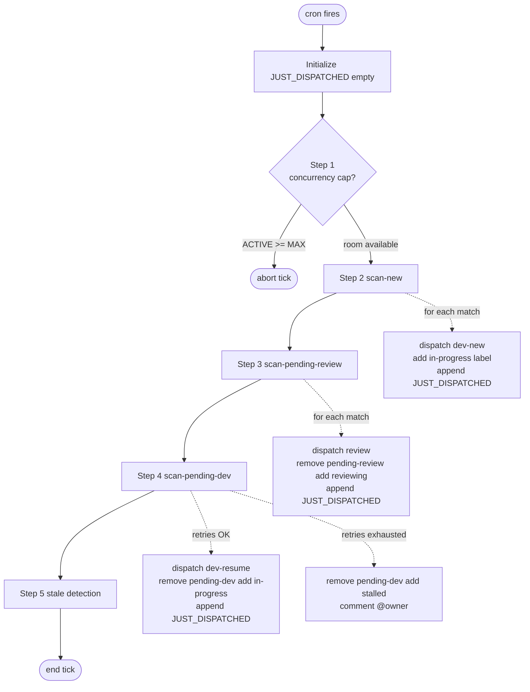

# Dispatcher Flow (per cron tick)

The dispatcher runs as a cron job (default every 5 minutes) and is **stateless across ticks**. Each tick reads the current label set on every `autonomous` issue, reads PID files for any wrappers it might be tracking, makes decisions, dispatches subprocesses, and updates labels. There is no in-memory carry-over from the previous tick.

The behavior described here lives in `skills/autonomous-dispatcher/SKILL.md` (the prompt the dispatcher agent reads + executes). PR-3 will move this logic into a `dispatcher-tick.sh` script + `lib-dispatch.sh`; for now the SKILL.md is the source of truth.

## Tick lifecycle



`JUST_DISPATCHED` is the only piece of state the tick maintains in memory — and it dies when the tick ends.

## Step 1: concurrency gate

```
ACTIVE = count of issues labeled autonomous AND (in-progress OR reviewing)
if ACTIVE >= MAX_CONCURRENT: abort tick
```

`MAX_CONCURRENT` defaults to 5. Counts both kinds of active wrappers because both consume Opus / Sonnet quota and local PID slots.

If the cap is hit, the tick aborts entirely — no Step 2/3/4/5. This is intentional: dispatching new work while at the cap would just produce wrappers that immediately collide with `acquire_pid_guard` or starve on quota.

## Step 2: scan-new

Find issues labeled `autonomous` with **no other active state label** (no `in-progress`, `pending-review`, `reviewing`, `pending-dev`, `stalled`, `approved`).

For each match, in order:

1. **Dependency check.** Read the issue body for a `## Dependencies` section. Extract every `#N` reference. For each, call `gh issue view N --json state` and require state `CLOSED` or `MERGED` ([INV-11](invariants.md#inv-11-dependency-state-includes-merged) — PRs report `MERGED`, not `CLOSED`). If any dependency is still open, **skip silently** — no comment, no label change. The issue picks up next tick once dependencies clear.
2. **Add `in-progress` label.**
3. **Comment**: "Dispatching autonomous development..."
4. **Dispatch**: `bash $PROJECT_DIR/scripts/dispatch-local.sh dev-new <issue>`
5. **Append issue to `JUST_DISPATCHED`.**
6. **Re-check concurrency** before processing the next match.

The issue is now in `in-progress`; the dev wrapper is launching via `nohup`. Step 5 must skip this issue this tick ([INV-09](invariants.md#inv-09-just_dispatched-skip-rule)).

## Step 3: scan-pending-review

Find issues labeled `autonomous` AND `pending-review` AND NOT `reviewing`.

For each match, in order:

1. **Atomic label swap**: `gh issue edit --remove-label pending-review --add-label reviewing` in a single call. (Two separate `gh issue edit` calls would create a `pending-review` + `reviewing` window — see [Forbidden transitions](state-machine.md#forbidden-transitions).)
2. **Comment**: "Dispatching autonomous review..."
3. **Dispatch**: `bash $PROJECT_DIR/scripts/dispatch-local.sh review <issue>`
4. **Append to `JUST_DISPATCHED`.**

## Step 4: scan-pending-dev

Find issues labeled `autonomous` AND `pending-dev`.

For each match, in order:

### Step 4a: retry counter check

This is the most subtle gate in the dispatcher. Two failure events count toward the retry budget, **but only if they occurred after the most recent `Marking as stalled` comment**. This makes "remove the `stalled` label" a reset (a maintainer's gesture of "try again") instead of a cumulative-retry bomb. See [INV-05](invariants.md#inv-05-retry-counter-cutoff-rule).

Failure events:

- **`Agent Session Report (Dev)` comments with non-zero exit code.** Posted by the dev wrapper trap on agent failure ([INV-03](invariants.md#inv-03-dev-session-report-comment-format)).
- **Dispatcher-detected crash comments matching the regex `Task appears to have crashed \(no PR found\)|process not found`.** This regex anchors only on Step 5b-DEAD-no-PR comments and explicit "process not found" wording. It MUST NOT match the forward-progress phrases — see [INV-06](invariants.md#inv-06-crashed--process-not-found-keyword-contract).

Pseudocode:

```
LAST_STALLED_AT = timestamp of last comment matching "Marking as stalled" (else epoch)
AGENT_FAILURES = count of Dev Session Reports with non-zero exit AFTER LAST_STALLED_AT
DISPATCHER_CRASHES = count of comments matching the crash regex AFTER LAST_STALLED_AT
RETRY_COUNT = AGENT_FAILURES + DISPATCHER_CRASHES

if RETRY_COUNT >= MAX_RETRIES (default 3):
  remove pending-dev, add stalled
  comment "Marking as stalled. @owner please investigate manually."
  skip
```

### Step 4b: extract session-id

Find the most recent comment matching `Dev Session ID: \`<id>\`` (note: `Review Session ID: ...` is a separate trailer and MUST NOT match — they share the word "Session" so the regex anchors on `Dev Session ID:` specifically, see [INV-03](invariants.md#inv-03-dev-session-report-comment-format)).

If no session-id can be extracted, the resume cannot proceed. Today, the dispatcher dispatches a new dev session anyway (the wrapper's `--mode resume` path falls back to `--mode new` when `SESSION_ID` is empty — see [`dev-agent-flow.md`](dev-agent-flow.md#mode-normalization)).

### Step 4c: dispatch resume

1. **Atomic label swap**: `gh issue edit --remove-label pending-dev --add-label in-progress`.
2. **Comment**: "Resuming development (session: <id>)..."
3. **Dispatch**: `bash $PROJECT_DIR/scripts/dispatch-local.sh dev-resume <issue> <session-id>`
4. **Append to `JUST_DISPATCHED`.**

## Step 5: stale detection

Find issues labeled `in-progress` OR `reviewing`.

For each match:

1. **Skip if in `JUST_DISPATCHED`** ([INV-09](invariants.md#inv-09-just_dispatched-skip-rule)).
2. **Locate PID file**:
   - `in-progress` → `/tmp/agent-${PROJECT_ID}-issue-<N>.pid` ([INV-01](invariants.md#inv-01-pid-file-naming))
   - `reviewing` → `/tmp/agent-${PROJECT_ID}-review-<N>.pid`
3. **Liveness probe**: `kill -0 $(cat <pid-file>)`. PID file is also re-checked for the symlink-attack defense ([INV-02](invariants.md#inv-02-pid-file-is-not-a-symlink)).
4. Branch on liveness:
   - **ALIVE + `in-progress`** → Step 5a (below). Reviewers in `reviewing` are not subject to the 5a SIGTERM logic — review wrappers are bounded by their own internal polling.
   - **DEAD + `in-progress`** → Step 5b in-progress branch.
   - **DEAD + `reviewing`** → Step 5b reviewing branch.

### Step 5a: ALIVE in-progress + PR ready for review (#54, #56)

The dev wrapper might have finished its real work — pushed a passing CI build — and then hung in some auxiliary code (polling loop, stuck stdio). Without intervention the issue stays `in-progress` forever and no review fires.

All these gates must hold before sending SIGTERM (any one failing → leave alone):

| Gate | What | If false |
|---|---|---|
| **PR exists** | `gh pr list` finds an open PR whose body references `#N` | Agent still developing; leave alone. |
| **CI green** | `gh pr checks <pr>` returns ≥1 check, all `SUCCESS` | CI pending or failed; agent still working. |
| **Idle** | `now - PR.updatedAt > 300s` (strict `-gt`, [INV-10](invariants.md#inv-10-5-minute-idle-gate-before-sigterm)) | Recent activity; agent may be cleaning up. |
| **PID still alive on recheck** | `kill -0 $PID` after the prior gates | Wrapper exited between the original probe and the SIGTERM decision; defer to next tick which will hit Step 5b DEAD. |

When all gates hold:

1. `kill $PID` (SIGTERM, NOT SIGKILL — wrapper trap needs to clean up).
2. Comment: "Dev process still alive but PR #N is ready (all CI checks passed, idle Ns). Sent SIGTERM to PID. Moving to pending-review."
3. `gh issue edit --remove-label in-progress --add-label pending-review`.

**Known imperfection** ([INV-15](invariants.md#inv-15-step-5a-sigterm-race-is-non-deterministic)): the wrapper trap fires on SIGTERM with bash exit 143, takes the failure branch, and writes `+pending-dev` — different from the dispatcher's `+pending-review`. The race outcome is whichever `gh issue edit` lands last; in practice the trap's edit lands ~1s later (it posts the Session Report comment first), so the typical outcome is the issue ending up at `pending-dev`. The PR is preserved; the next dispatcher tick recovers via dev-resume. Review is delayed by one tick. See [`state-machine.md` § Wrapper trap vs. dispatcher Step 5](state-machine.md#wrapper-trap-vs-dispatcher-step-5).

#### Robustness against malformed responses

The Step 5a code does fail-closed on malformed inputs, by design:

- `gh pr list` returns malformed JSON or empty → log WARN, leave issue alone.
- `gh pr checks` errors (token expiry, transport) → treat as "CI not green" (since we cannot prove it green). Captures stderr to a `mktemp` file (not a fixed `/tmp` path — concurrent dispatcher instances would collide; CWE-377).
- `date -d` (GNU) and `date -j -f` (BSD/macOS) both fail → log WARN, leave alone (otherwise `IDLE_SECONDS = NOW - 0` would always exceed 300s and unconditionally fire SIGTERM).

### Step 5b: DEAD branches

The wrapper has exited; its own trap has already (or attempted to) update labels. The dispatcher reads the post-trap state and reconciles.

#### DEAD + `in-progress`

Look for a PR linked to the issue (same query Step 5a uses):

- **PR found, current `headRefOid` differs from last `Reviewed HEAD: \`<sha>\`` trailer** ([INV-04](invariants.md#inv-04-reviewed-head-trailer-format))
  → comment "Dev process exited (PR found). Moving to pending-review for assessment.", `−in-progress +pending-review`.
- **PR found, current SHA = last reviewed SHA**
  → comment "Dev process exited (no new commits since last review at \`<sha>\`). Moving to pending-dev for retry.", `−in-progress +pending-dev`.
- **PR found, no prior trailer** (empty `LAST_REVIEWED_HEAD`) → routes to `pending-review`. Two distinct causes converge here ([INV-07](invariants.md#inv-07-empty-reviewed-head-trailer-routes-to-pending-review)):
  - Review never ran successfully against this PR yet (the safe first-review case).
  - Trailer post failed (token expiry, 403, rate limit). Operator sees `WARNING: Failed to post Reviewed HEAD trailer` in the review log; cycling pending-review without new commits is the symptom.
- **No PR found** → comment "Task appears to have crashed (no PR found). Moving to pending-dev for retry.", `−in-progress +pending-dev`.

The wording in the "PR found" branches deliberately avoids the keywords `crashed` and `process not found` so the Step 4a retry-counter regex does not count these as failures ([INV-06](invariants.md#inv-06-crashed--process-not-found-keyword-contract)).

#### DEAD + `reviewing`

Comment: "Review process appears to have crashed. Moving to pending-dev for retry."
Labels: `−reviewing +pending-dev`.

(No SHA-comparison shortcut here — the review wrapper's own trap should have already done this transition for genuine crashes; this 5b branch is the safety net for the case where the wrapper died so abruptly that even its trap didn't fire.)

## Failure modes by step

| Failure | Where | Behavior |
|---|---|---|
| GH App token expired mid-tick | any step | gh calls fail loudly. Tick aborts; next cron retries. Mitigated by `gh-token-refresh-daemon` for the wrappers (dispatcher's own token is generated at tick start). |
| jq returns `null` for malformed PR JSON | Step 5a | Validated before use (`PR_NUM =~ ^[0-9]+$ && PR_UPDATED_AT non-empty`). On failure: WARN, leave issue alone. |
| `date` parse fails on PR.updatedAt | Step 5a | WARN, leave alone (fail-closed — see above). |
| Concurrent dispatcher instance | tick-tick | `mktemp` for CI-error capture file (CWE-377 mitigation). Concurrent ticks otherwise serialize on `gh issue edit` — the second one's edits race but converge. |
| `JUST_DISPATCHED` not maintained | Step 5 | Step 5 evaluates a freshly-dispatched issue, sees no PID file yet, diagnoses DEAD-no-PR, increments crash counter, eventually marks stalled. **This was the root of #34, #41 — the array exists specifically to prevent this.** |
| Resume against a completed session | Step 4 | Currently the wrapper hangs indefinitely on the streaming socket. Tracked by [#59](https://github.com/zxkane/autonomous-dev-team/issues/59); fix in PR-5 will add a session-terminal-state check before resume ([INV-12](invariants.md#inv-12-resume-only-against-unfinished-sessions)). |
| Agent invocation hangs in CLI | wrapper, not dispatcher | Bounded by future wall-clock timeout ([#60](https://github.com/zxkane/autonomous-dev-team/issues/60), [INV-13](invariants.md#inv-13-wall-clock-cap-on-agent-invocations)). Until then the dispatcher's Step 5a is the only way to clear it. |

## Cross-references

- [`state-machine.md`](state-machine.md) — the label transitions each step performs.
- [`dev-agent-flow.md`](dev-agent-flow.md), [`review-agent-flow.md`](review-agent-flow.md) — what the dispatched wrapper does next.
- [`handoffs.md`](handoffs.md) — Step 5 is the most race-prone handoff.
- [`invariants.md`](invariants.md) — INV-01 through INV-11 are all referenced from this file.
