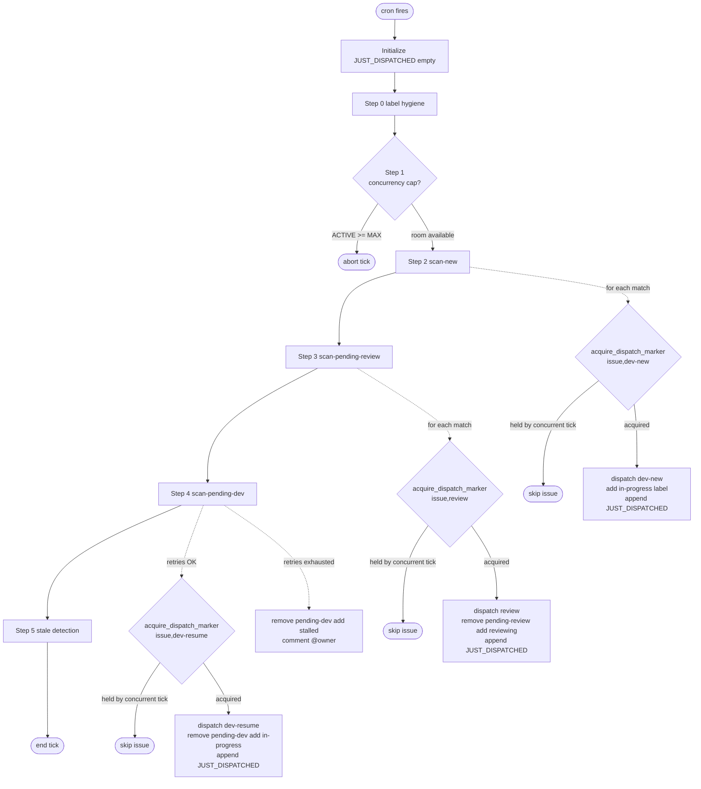

# Dispatcher Flow (per cron tick)

The dispatcher runs as a cron job (default every 5 minutes) and is **stateless across ticks**. Each tick reads the current label set on every `autonomous` issue, reads PID files for any wrappers it might be tracking, makes decisions, dispatches subprocesses, and updates labels. There is no in-memory carry-over from the previous tick.

The behavior described here is implemented by `skills/autonomous-dispatcher/scripts/dispatcher-tick.sh` (the per-project entry point) backed by `skills/autonomous-dispatcher/scripts/lib-dispatch.sh` (composable helpers — one function per gh/jq query). The dispatcher agent reads `SKILL.md` and runs `bash "$PROJECT_DIR/scripts/dispatcher-tick.sh"`; that script does everything described below in one process. Function names cited below (e.g. `count_active`, `check_deps_resolved`) are defined in `lib-dispatch.sh`.

## Multi-project outer loop (PR-8, #62)

For deployments that scan more than one repository per cron, `dispatcher-multi-tick.sh` wraps `dispatcher-tick.sh` in an outer iteration over a `PROJECTS=()` array declared in a separate `dispatcher.conf` file. Each iteration runs `dispatcher-tick.sh` in a subshell, so per-project state cannot leak between iterations.

Each `PROJECTS[]` entry is one of two shapes (PR-9, #62 axis 2):

- **Local project — file path**: a path to a per-project `autonomous.conf` on this dispatcher box. The wrapper sources it via the `AUTONOMOUS_CONF` priority-1 path. Used when the dispatcher and project source live on the same machine.
- **Remote project — inline metadata block**: a multi-line string of bash assignments (REPO, EXECUTION_BACKEND=remote-aws-ssm, SSM_INSTANCE_ID, SSM_REMOTE_PROJECT_DIR, etc.). Used when the project source lives on a remote dev EC2 — the dispatcher box does NOT have the project's `autonomous.conf`. The wrapper validates the block (KEY=VALUE lines only — defense-in-depth against accidental injection), eval's it in the subshell, and auto-derives `REPO_OWNER`/`REPO_NAME` from `REPO`.

The outer loop intentionally does NOT carry shared state (no global concurrency cap, no cross-project JUST_DISPATCHED). Each project's tick is independent — concurrency is enforced per-project against that project's `MAX_CONCURRENT`. Per-project failures are logged but do not abort sibling projects.

## Backend routing (PR-9, #62 axis 2)

`dispatcher-tick.sh` defines a `dispatch()` helper that routes wrapper-spawn requests by `EXECUTION_BACKEND`:

| Backend | Driver script | What happens |
|---|---|---|
| `local` (default) | `scripts/dispatch-local.sh` (in `$PROJECT_DIR/scripts/`) | Same as PR-8 single-machine flow: nohup-spawn the wrapper on this box. |
| `remote-aws-ssm` | `scripts/dispatch-remote-aws-ssm.sh` (in the skill scripts dir) | Build a `sudo -u $SSM_REMOTE_USER $SSM_REMOTE_SHELL -l -c '<outer-wrapper>'` command via `lib-ssm.sh`'s `_ssm_build_full_cmd` ([#454]: the inner command is base64-encoded and decoded+`eval`'d remotely, never interpolated verbatim inside the outer single-quote wrap — a heredoc comment's apostrophe can no longer break the transport), JSON-escape the result via `jq -n --arg cmd`, and `aws ssm send-command` to `$SSM_INSTANCE_ID`. The inner command runs `dispatch-local.sh` on the remote box. SSM is purely transport — PID/process management still belongs to `dispatch-local.sh` on whatever box runs it. `_ssm_build_full_cmd` fails closed (rc=1, no stdout) if local base64-encoding fails, so a missing `base64` binary can't silently produce a FULL_CMD with an empty payload that "sends successfully" but executes nothing remotely — all three callers (`dispatch-remote-aws-ssm.sh`, `liveness-check-remote-aws-ssm.sh`, `session-log-probe-remote-aws-ssm.sh`) check its return code and exit 1 on failure. The generated inner command also fails closed on the REMOTE side (codex review of the #454 follow-up): it decodes into a variable first (`_d=$(... | base64 -d) || exit 1`) and only `eval`s after that decode succeeds, so a remote host missing `base64` gets a real nonzero exit instead of `eval`'s silent no-op on an empty command substitution. |
| anything else | — | Logged as ERROR; that step skips the dispatch (issue stays in its current label state). Step 5b will re-evaluate next tick. |

The rest of this document describes the per-project tick in isolation; everything below applies whether `dispatcher-tick.sh` is invoked directly (single-project), by the multi-tick wrapper (one of N projects), and whether the dispatch goes via `local` or `remote-aws-ssm`.

### Local vs remote backend (#137, [INV-30])

This section was previously documenting a known gap: `pid_alive` was
blind under `EXECUTION_BACKEND=remote-aws-ssm` because the PID file
lives on Box B but the dispatcher runs on Box A. **Closed in #137.**

Since #137, `pid_alive` consults a backend-specific liveness transport
(today: `liveness-check-remote-aws-ssm.sh`) BEFORE any local probe
when `EXECUTION_BACKEND != local`. The transport reaches the wrapper
box via SSM, runs the equivalent of [INV-29]'s three-tier check there,
and returns ALIVE / DEAD / indeterminate. Indeterminate biases toward
ALIVE so transport faults never produce false crash declarations.

**Effects on Step 5 under remote backend (post-#137)**:

- **Step 5a (ALIVE + PR ready) IS now reachable for remote projects.**
  The proactive "SIGTERM-when-PR-ready" optimization fires correctly;
  review latency stays at "next tick after CI passes" (no growth to
  "next tick after wrapper exits naturally").
- **Step 5b DEAD-branch fires only on actual remote DEAD verdicts**
  (or operator-disabled remote check via `REMOTE_LIVENESS_CHECK_DISABLE=true`).
  No more per-tick false crash comments accumulating to a false stall.

For the full backend interface, configuration knobs, failure-mode
policy, and update-ordering guidance for split-box deployments, see
[`remote-backend.md`](remote-backend.md).

The rest of this document treats `dispatch()` and `pid_alive` as
backend-agnostic; everything below applies regardless of which backend
is in use.

## Per-issue agent log retention ([INV-68](invariants.md#inv-68-a-routine-re-dispatch-preserves-the-prior-runs-per-issue-log-single-generation-rotation-only-the-inv-12--inv-35-recovery-branches-truncate-it-deliberately))

Every wrapper spawn writes stdout+stderr to a per-issue log on the box that runs `dispatch-local.sh`:

| Type | Log path |
|---|---|
| `dev-new` / `dev-resume` | `/tmp/agent-${PROJECT_ID}-issue-${ISSUE}.log` |
| `review` | `/tmp/agent-${PROJECT_ID}-review-${ISSUE}.log` |

Before spawning, `dispatch-local.sh` prepares this log via `prepare_agent_log()`. The log is created `0600` because agent output may contain secrets (hardening from #22). The wrapper itself redirects with `>>` (append) for the duration of one run.

**Retention on re-dispatch (single-generation rotation).** Because a wrapper crash/abort + re-dispatch (retry, resume, operator label flip) is routine, `prepare_agent_log()` MUST NOT zero an existing log — that would destroy the prior (often crashed) run's forensic evidence before the new run starts. Instead it **rotates**:

1. If `…-${ISSUE}.log` already exists, `mv -f` it to `…-${ISSUE}.log.1` (overwriting any older `.1`).
2. `chmod 600 "…-${ISSUE}.log.1"` — the rotated generation is also `0600`, so prior-run output never becomes world-readable across rotation.
3. `install -m 600 /dev/null "…-${ISSUE}.log"` — fresh `0600` current log for the new run.

Disk is bounded to one extra generation per `(issue, type)` — `mv -f` discards run *N-2* when it rotates run *N-1*, so only the current log and the single immediately-preceding run's log ever exist. A first dispatch (no existing log) creates only the fresh `0600` current log; no `.1` is produced.

To triage a crashed run after it has been re-dispatched, read `…-${ISSUE}.log.1` (the immediately-preceding run); `…-${ISSUE}.log` holds the latest run.

**The only deliberate truncates are the recovery branches.** [INV-12](invariants.md#inv-12-resume-only-against-unfinished-sessions) (`prompt_too_long`, `dispatcher-tick.sh`) and [INV-35](invariants.md#inv-35-review-aware-resume-routing-for-completed-sessions) (`failed-substantive`, `lib-dispatch.sh`) intentionally `: > "$log"` the **current** per-issue log mid-cycle so the next tick's terminal-state gate doesn't re-read a stale `{"type":"result"}` line and dispatch dev-new forever. INV-68 does not change them — and because they clear `…-${ISSUE}.log` only (never `…-${ISSUE}.log.1`), even on the recovery path the immediately-prior run's log survives in the rotated generation.

## Tick lifecycle



The `acquire_dispatch_marker` gates ([INV-108](invariants.md#inv-108-every-dispatcher-tick-dispatch-site-acquires-a-controller-side-per-issuemode-marker-atomically-before-any-side-effect--a-losing-acquire-skips-cleanly-never-dispatches-the-marker-expires-via-ttl-never-wedging-the-issue-the-dispatch-token-gains-a-run-field-for-post-hoc-attribution), 302b, #361) are omitted from Step 4's PTL / `failed-substantive` fresh-dev sub-branches above for diagram clarity — see [§ Controller-side dispatch dedup](#controller-side-dispatch-dedup-inv-108-302b-361) for the full per-branch detail.

`JUST_DISPATCHED` is the only piece of state the tick maintains in memory — and it dies when the tick ends.

## Consumer install topology — stable entry points ([INV-65], #227)

A consumer project bootstraps against this skill set by symlinking the dispatcher's **STABLE ENTRY scripts** into `<project>/scripts/`. As of #227 the rule is *"everything that is NOT `lib-*.sh`, MINUS the `*-aws-ssm.sh` helpers"*: wrapper entry points (`autonomous-dev.sh`, `autonomous-review.sh`), dispatcher entry points (`dispatch-local.sh`, `dispatcher-tick.sh`, `dispatcher-multi-tick.sh`, `setup-labels.sh`), the `gh-*` auth scripts, and the agent-callable utilities (`post-verdict.sh`, `mark-issue-checkbox.sh`, `reply-to-comments.sh`, `resolve-threads.sh`, `gh-as-user.sh`, `upload-screenshot.sh`, and the `gh` wrapper symlink). `install-project-hooks.sh` materializes these symlinks. The two `*-aws-ssm.sh` helpers are **excluded** (see the resolution caveat below) — they are dispatcher-host-internal and the dispatcher invokes them from the skill tree, never via a project-side symlink.

`lib-*.sh` are **NOT** symlinked. Each entry script computes two dirs from its own `${BASH_SOURCE[0]:-$0}` ([INV-65]): the **CONF dir** (unresolved → the project's `scripts/`, where `autonomous.conf` lives) and the **LIB dir** (`readlink -f` → the real skill tree). All `source "${LIB_DIR}/lib-*.sh"` resolve from the skill tree, so an upstream PR can add or remove a `lib-*.sh` and **no consumer re-run is required** for lib sourcing to keep working — this structurally removes the missing-lib-symlink crash class (the drift sibling of #153, where a new lib with no project symlink killed the wrapper on its first `source`).

> **`*-aws-ssm.sh` resolution caveat.** `dispatch-remote-aws-ssm.sh` and `liveness-check-remote-aws-ssm.sh` source their shared `lib-ssm.sh` from their OWN unresolved dir (`${BASH_SOURCE[0]%/*}` — `readlink -f` is deliberately avoided so the PATH-scrubbed `TC-EB-008` keeps passing). Since `lib-ssm.sh` is no longer symlinked project-side, these two MUST be invoked **from the skill tree**, not via a project-side symlink. They are: `dispatch()` calls `dispatch-remote-aws-ssm.sh` via `$LIB_DIR`, and `liveness-check-remote-aws-ssm.sh` is reached through `lib-dispatch.sh`'s own skill-tree `BASH_SOURCE`. Therefore `install-project-hooks.sh` **excludes** the two `*-aws-ssm.sh` helpers from the project-side manifest and **prunes** any pre-#227 symlink to them — otherwise a direct `bash scripts/dispatch-remote-aws-ssm.sh` (through the project-side symlink) would resolve `lib-ssm.sh` in `<project>/scripts/`, which is now absent, and crash with `lib-ssm.sh: No such file or directory` (#227 P1). The exclusion is mechanically tied to the symlink-creation rule (`is_entry_script` rejects `*-aws-ssm.sh`), so the prune set and the create set can never diverge.

`install-project-hooks.sh` gains two operator affordances:

- `--doctor` — read-only health report: broken/missing entry symlinks, stale per-lib symlinks (which it suggests pruning), `autonomous.conf` presence + 0600 permissions, and entry-resolution sanity (does the real skill tree hold `lib-config.sh`?). Exits 0 clean / 1 on problems.
- `--dry-run` — prints the planned create/repoint/prune set and touches nothing.

It also **prunes stale per-lib symlinks** a pre-#227 install left behind (harmless dead weight, since lib sourcing no longer reads `<project>/scripts/`).

## Pre-step: opportunistic lane GC ([INV-117](invariants.md#inv-117-a-periodic-box-wide-gc-reclaims-dead-lane-process-residue-under-a-decision-table-that-fails-toward-leak-never-toward-false-kill--dry-run-by-default), #380)

Before `kill_stale_wrapper` runs, `dispatch-local.sh` opportunistically invokes `adt-gc.sh --quick || true` — Pass 1 (registry-driven) only, flock-guarded (`flock -w 3`, never `-n`, so a quick call queues briefly behind a concurrent full run instead of starving), dry-run by default. This means a busy box self-cleans dead-lane process residue on every dispatch even when no periodic timer (`install-gc-timer.sh`) has been installed on the host. `|| true` — GC is best-effort; a missing/broken `adt-gc.sh` (stale skill tree) never blocks or delays a dispatch.

## Pre-step: wrapper exec-bit self-heal (closes #97)

Before sourcing config, `dispatcher-tick.sh` self-heals the execute bit on the two scripts that `dispatch-local.sh` invokes directly via `nohup`:

- `autonomous-dev.sh`
- `autonomous-review.sh`

Some installs strip `+x` (a 644-mode upstream commit, the skills CLI's content-only hashing, or a consumer-side `git clone` under a restrictive umask). Without `+x`, the wrapper exits before the agent starts, no Session Report is posted, and Step 5b counts the issue as a crash.

The self-heal is **scoped narrowly** — only the two directly-executed scripts. Sourced-only siblings (`lib-*.sh`) are deliberately not touched; flipping their mode would propagate the wrong contract.

Defense in depth: the same heal also runs in every `install-*-hooks.sh` via `lib-installer.sh::ensure_dispatcher_scripts_executable`, so consumers re-running the installer get the heal even if their installed skill version still has the broken mode (the skills CLI's `computedHash` is content-only, not mode-aware).

## Pre-step: `gh` CLI minimum-version validation

Implementation: `dispatcher-tick.sh`, immediately after the `EXECUTION_BACKEND` check and before `REVIEW_BOTS` — same slot, same reasoning: a broken dependency must never reach a side effect.

The GitHub-provider ITP/CHP leaves (`providers/itp-github.sh`, `providers/chp-github.sh`) call `gh api --paginate --slurp` to fetch issue/PR comments. `--slurp` was added in gh v2.48.0 (2024-04-17); on an older (or absent) `gh`, the call prints `unknown flag: --slurp` to stderr and the pipeline returns empty. Left unchecked, that empty result surfaces much later and opaquely — e.g. a `-ge` integer comparison over an empty retry count trips `set -euo pipefail` and aborts the tick mid-run, well past Step 4, with Step 5 (stale detection) never executing that tick.

`gh_version_ok "$GH_MIN_VERSION"` (`providers/lib-github-transport.sh`, `GH_MIN_VERSION="2.48.0"` — the same `gh --version` capability probe self-sourced by both `providers/itp-github.sh` and `providers/chp-github.sh`, mirroring the `lib-gitlab-transport.sh` pattern, and reachable from `dispatcher-tick.sh` because `lib-dispatch.sh` transitively sources the GitHub ITP/CHP leaves) parses the first `X.Y.Z` token out of `gh --version`'s first line and numeric-sorts it (`sort -V`) against the minimum. Gated on `github_seam_active` (`lib-auth.sh`) — a `gitlab`/`gitlab` topology never calls `gh` and must not be blocked by a `gh` version it doesn't need. Kept under `providers/` (not the provider-neutral caller layer) because it is itself a raw `gh` invocation, subject to the same [INV-91] cutover-guard scan as every other GitHub-CLI call site.

**Failure mode**: a missing `gh`, an unparseable `--version` output, or a version below the minimum aborts the ENTIRE tick rc≠0 with the `ADT_CFG_GH_VERSION_TOO_OLD` [INV-72] error envelope, surfaced as a dispatcher alert. No `gh` API call happens before this check runs (`gh --version` itself is a local, no-network invocation).

## Pre-step: `ISSUE_FILTER` / `ISSUE_SCAN_LIMIT` validation (issue #436, [INV-121])

Implementation: `dispatcher-tick.sh`, immediately after the `EXECUTION_BACKEND`/`gh`-version/`REVIEW_BOTS` upfront checks and **before** the GitHub App token mint (the next pre-step below) — same slot, same reasoning: a poisoned config must never reach a side effect.

`issue_filter_validate "${ISSUE_FILTER:-}"` (`lib-issue-filter.sh`, sourced transitively via `lib-dispatch.sh`) runs three checks in order, any of which fails closed:

1. **Compile + dry-run evaluation** — the boolean expression over `label:<v>` / `assignee:<v>` / `assignee:none` atoms (`and`/`or`/`not`, parentheses) must parse and evaluate against `[]` without error.
2. **Reserved-label gate** — no atom may reference a pipeline state label (`in-progress`, `reviewing`, `pending-review`, `pending-dev`, `stalled`, `approved`) or the `autonomous` baseline label. Slice membership keyed on a state label would mutate as the state machine runs.
3. **Assignee capability gate** — if the compiled filter contains any `assignee:` atom, the provider's `.caps` file must declare `assignees=1` (PR-A/#435). Without this gate, a provider leaf that omits `assignees` would make every issue look unassigned, silently WIDENING the slice via `assignee:none`/`not assignee:X` — the exact failure `ISSUE_FILTER` exists to prevent.

`ISSUE_SCAN_LIMIT` (default `100` when unset) is validated separately, immediately after: it must be a positive integer.

**Failure mode**: any of the four checks failing aborts the ENTIRE tick rc≠0 with the `ADT_CFG_ISSUE_FILTER_INVALID` (checks 1-3) or `ADT_CFG_ISSUE_SCAN_LIMIT_INVALID` (scan-limit check) [INV-72] error envelope, surfaced as a dispatcher alert (no per-issue context yet — this is a tick-global config check). **There is no unfiltered fallback** — falling back to unfiltered scanning would silently violate the multi-dispatcher disjointness contract ([INV-121]) and double-dispatch against sibling instances, which is worse than refusing to run the tick. No `gh` call, no token mint, no label edit, no dispatch marker happens before this check runs.

An empty/unset `ISSUE_FILTER` and an unset/valid `ISSUE_SCAN_LIMIT` clear this slot with no envelope — byte-identical to pre-#436 behavior.

## Pre-step: GitHub authentication (closes #91)

`dispatcher-tick.sh` resolves auth before any `gh` call so the dispatcher's
issue comments and label changes appear under the configured identity.

Behavior:

| `GH_AUTH_MODE` | Setup | Token source for `gh` |
|---|---|---|
| `app` | sources `gh-app-token.sh::get_gh_app_token`, exports `GH_TOKEN` | Installation token scoped to one repo, valid 1h. A single token covers the whole tick (typically <1 min) — no refresh daemon. |
| `token` (default) | none | `GH_TOKEN` env or `gh auth login` token |

Required when `GH_AUTH_MODE=app`: `DISPATCHER_APP_ID`, `DISPATCHER_APP_PEM`,
`REPO`, `REPO_OWNER`. `REPO_NAME` is auto-derived from `REPO` if unset (older
path-entry confs sometimes omit it).

Failure modes — all exit 1 with `FATAL`, before any `gh` call:

- Missing `DISPATCHER_APP_ID` or `DISPATCHER_APP_PEM` while `GH_AUTH_MODE=app`.
- `get_gh_app_token` returns non-zero (network / API error / bad PEM / app not
  installed for repo).
- Token returned is empty.

There is no silent fallback to user auth — silently impersonating the
operator was the bug closed by #91.

## Step 0: label hygiene pass ([INV-25], closes #115 Bug B)

Implementation: `lib-dispatch.sh::run_hygiene_pass`, `list_hygiene_residue`, `hygiene_strip_residual_labels`, `hygiene_post_audit_comment`, `_has_terminal_label`.

Find autonomous issues whose label set violates the state-machine "Forbidden transitions" rules — i.e. an issue carries a sticky terminal label (`approved` or `stalled`) AND any transitional label (`in-progress`, `reviewing`, `pending-review`, `pending-dev`).

For each match:

1. **Strip atomically**: a single `gh issue edit --repo --remove-label A --remove-label B ...` removes every transitional label in one API call. The terminal label is preserved.
2. **Post a one-shot audit comment**: idempotency-keyed on the sorted set of labels stripped via marker `<!-- INV-25-hygiene:<sorted-labels> -->`. If a comment with the same marker already exists, the strip still happens but the comment is skipped — so a wedged residue cleans up on every tick without spamming the issue timeline.
3. **Log to dispatcher stdout**: human-readable line for ops audit.

Step 0 runs **unconditionally** — even when concurrency is saturated. Hygiene is pure label edits, no agent dispatch, no retry counting, so capacity is not the right gate. Deferring cleanup by a tick when the system is busy is exactly the wrong tradeoff: residue is most likely to land during high-traffic ticks, and the goal is to heal it before any selector reads labels.

The four existing `list_*` selectors (Steps 2–5) already inline an `approved` subtraction (Bug A precedent in PR #116). INV-25 makes that defense-in-depth — a missed inline subtraction in a future selector is no longer a Bug-A-class infinite-loop bug, just a wasted `gh issue list` query that returns nothing actionable. Future selectors should still call `_has_terminal_label()` for symmetry.

**Producers of residue this heals** (non-exhaustive):
- [INV-15] SIGTERM race on Step 5a (convergent in PR-6 but historical residue can persist).
- Wrapper crash between two `gh issue edit` calls (e.g. process-killed mid-cleanup).
- Manual operator label edits during reconciliation.
- Future bug producers we haven't found yet — Step 0 closes the class regardless of producer.

**`ISSUE_FILTER` conjunction (issue #436, [INV-121]).** `list_hygiene_residue` pipes its result through `issue_filter_apply` — with a non-empty filter, this instance only heals residue on issues matching its own slice. Residue on an issue outside every configured instance's slice is left for whichever instance's filter does match it, or for the operator, per the [INV-25] scope amendment and [INV-121] rule 7. Empty/unset filter is unaffected (heals every match, as before #436).

## Step 1: concurrency gate

Implementation: `lib-dispatch.sh::count_active`.

```
ACTIVE = count of issues labeled autonomous AND (in-progress OR reviewing)
if ACTIVE >= MAX_CONCURRENT: abort tick
```

`MAX_CONCURRENT` defaults to 5. Counts both kinds of active wrappers because both consume Opus / Sonnet quota and local PID slots.

If the cap is hit, the tick aborts entirely — no Step 2/3/4/5. This is intentional: dispatching new work while at the cap would just produce wrappers that immediately collide with `acquire_pid_guard` or starve on quota.

**`ISSUE_FILTER` conjunction (issue #436, [INV-121]).** With an empty/unset filter, `count_active` is unchanged — it routes through `itp_count_by_state` (server-side count, capped at `${ISSUE_SCAN_LIMIT:-100}`). With a non-empty filter, it switches to an enumerate-then-filter-then-count path: `itp_list_by_state` (same limit) piped through `issue_filter_apply`, then the same any-of-transitional-label count is re-derived caller-side over the filtered array. Both paths fail closed on a leaf error (never coerce to 0 — see [Failure modes by step](#failure-modes-by-step)). The practical effect: **`MAX_CONCURRENT` becomes a per-dispatcher-instance-slice limit** when a filter is set, not a repo-wide limit — the desired semantics for multi-instance operation (design §3.2).

## Step 2: scan-new

Implementation: `lib-dispatch.sh::list_new_issues`, `check_deps_resolved`, `label_swap`.

Find issues labeled `autonomous` with **no other active state label** (no `in-progress`, `pending-review`, `reviewing`, `pending-dev`, `stalled`, `approved`).

For each match, in order:

1. **Dependency check.** Read the issue body for a `## Dependencies` section. Extract refs from list-item lines only — `#N` and `owner/repo#N` are recognized; prose and blockquotes are ignored ([INV-39](invariants.md#inv-39-dependency-parsing-is-list-item-scoped-and-supports-cross-repo-refs)). For each ref, look up state and require `CLOSED` or `MERGED` ([INV-11](invariants.md#inv-11-dependency-state-includes-merged) — PRs report `MERGED`, not `CLOSED`; the same rule applies to cross-repo refs). Same-repo `#N` refs use the ambient dispatcher token; **cross-repo `owner/repo#N` refs use a token scoped to the *target* repo, minted per dep repo via the `itp_resolve_dep` verb** (GitHub leaf `itp_github_resolve_dep`; `resolve_dep_state` is now a thin caller-side wrapper, #284) ([INV-83](invariants.md#inv-83-cross-repo-dependency-lookups-use-a-per-dep-repo-scoped-read-token-the-app-must-be-installed-on-the-dep-repo)) — the ambient token is scoped to the dispatching repo only and 404s on any other repo (the #269 bug). The cross-repo `owner/repo#N` shorthand is gated on the provider's `cross_ref_shorthand` capability (`=1` for GitHub). The scoped token is **cached by `owner/repo` for the whole tick** (AC #2), so multiple new issues depending on the same external repo mint only once; the mint + cache are provider-internal and the tick clears that cache exactly once, before this step, via the **`itp_begin_tick`** lifecycle hook (which the GitHub provider maps to its own `_DEP_TOKEN_CACHE` reset). The App must be installed on the dep repo. If any dependency is still open, **skip silently**. A cross-repo ref that cannot be resolved (App not installed / private / deleted) blocks via the fail-safe, with a sharpened WARNING and a once-per-issue-per-ref comment so the persistent block is visible. The issue picks up next tick once dependencies clear.
2. **Acquire the controller-side dispatch marker** ([INV-108](invariants.md#inv-108-every-dispatcher-tick-dispatch-site-acquires-a-controller-side-per-issuemode-marker-atomically-before-any-side-effect--a-losing-acquire-skips-cleanly-never-dispatches-the-marker-expires-via-ttl-never-wedging-the-issue-the-dispatch-token-gains-a-run-field-for-post-hoc-attribution), 302b, #361): `acquire_dispatch_marker <issue> dev-new`. A losing acquire (a concurrent tick already holds it) skips this issue silently — no label edit, no token, no dispatch — and moves to the next match. This runs BEFORE the label edit below; see [§ Controller-side dispatch dedup](#controller-side-dispatch-dedup-inv-108-302b-361) for the full contract.
3. **Add `in-progress` label.**
4. **Post dispatch token** ([INV-18](invariants.md#inv-18-cold-start-grace-period-before-stale-detection), [INV-108](invariants.md#inv-108-every-dispatcher-tick-dispatch-site-acquires-a-controller-side-per-issuemode-marker-atomically-before-any-side-effect--a-losing-acquire-skips-cleanly-never-dispatches-the-marker-expires-via-ttl-never-wedging-the-issue-the-dispatch-token-gains-a-run-field-for-post-hoc-attribution)): write `<!-- dispatcher-token: <id> at <iso> mode=dev-new run=<run-id> -->` followed by the human-readable "Dispatching autonomous development..." line. The HTML comment encodes the dispatch timestamp for Step 5's grace-period check; `run=<run-id>` (#361 R2) is this tick process's identity, for post-hoc attribution of a duplicate-dispatch incident.
5. **Dispatch**: `bash $PROJECT_DIR/scripts/dispatch-local.sh dev-new <issue>`
6. **Confirm the dispatch marker launched**: `dispatch_marker_confirm_launched <issue> dev-new` — a wrapper is now running, so the marker from step 2 is left in place to live out its TTL rather than being swept by the tick's EXIT-trap release.
7. **Append issue to `JUST_DISPATCHED`.**
8. **Re-check concurrency** before processing the next match.

The issue is now in `in-progress`; the dev wrapper is launching via `nohup`. Step 5 must skip this issue this tick ([INV-09](invariants.md#inv-09-just_dispatched-skip-rule)) and for the duration of the dispatch-token grace period ([INV-18](invariants.md#inv-18-cold-start-grace-period-before-stale-detection)).

**`ISSUE_FILTER` conjunction (issue #436, [INV-121]).** `list_new_issues` requests fields via `issue_filter_fields` (widens to include `assignees` only when a filter is set) and pipes its result through `issue_filter_apply` AFTER the existing state-label subtraction above — this instance only picks up issues in its own slice.

## Step 3: scan-pending-review

Implementation: `lib-dispatch.sh::list_pending_review`, `label_swap`.

> **Provider-neutral topology note (#420 P3-5).** The `gh issue edit` shown below is the conceptual leaf; the atomic label swap is emitted by the `itp_transition_state` verb. GitHub leaf shown for reference — see [provider-spec.md §3.4](provider-spec.md#34-repo-stays--as-the-github-providers-config-namespace) for the config-namespace surface behind the seam.

Find issues labeled `autonomous` AND `pending-review` AND NOT (`reviewing` OR `approved` OR `stalled`). The `approved`/`stalled` exclusion is defense-in-depth on top of [INV-25](invariants.md#inv-25-terminal-labels-approved-stalled-are-sticky-transitional-residue-is-healed-at-tick-start) Step 0 hygiene — Step 0 strips `pending-review` from terminal issues at tick start, but if Step 0 fails (rate-limit, API outage), the inline filter still keeps the selector from spawning a review against an already-approved/stalled issue.

For each match, in order:

1. **Acquire the controller-side dispatch marker** ([INV-108](invariants.md#inv-108-every-dispatcher-tick-dispatch-site-acquires-a-controller-side-per-issuemode-marker-atomically-before-any-side-effect--a-losing-acquire-skips-cleanly-never-dispatches-the-marker-expires-via-ttl-never-wedging-the-issue-the-dispatch-token-gains-a-run-field-for-post-hoc-attribution), 302b, #361): `acquire_dispatch_marker <issue> review`. A losing acquire skips this issue silently (no label swap, no token, no dispatch).
2. **Atomic label swap**: `gh issue edit --remove-label pending-review --add-label reviewing` in a single call. (Two separate `gh issue edit` calls would create a `pending-review` + `reviewing` window — see [Forbidden transitions](state-machine.md#forbidden-transitions).)
3. **Post dispatch token** ([INV-18](invariants.md#inv-18-cold-start-grace-period-before-stale-detection), [INV-108](invariants.md#inv-108-every-dispatcher-tick-dispatch-site-acquires-a-controller-side-per-issuemode-marker-atomically-before-any-side-effect--a-losing-acquire-skips-cleanly-never-dispatches-the-marker-expires-via-ttl-never-wedging-the-issue-the-dispatch-token-gains-a-run-field-for-post-hoc-attribution)): `<!-- dispatcher-token: <id> at <iso> mode=review run=<run-id> -->` + "Dispatching autonomous review...".
4. **Dispatch**: `bash $PROJECT_DIR/scripts/dispatch-local.sh review <issue>`
5. **Confirm the dispatch marker launched**: `dispatch_marker_confirm_launched <issue> review`.
6. **Append to `JUST_DISPATCHED`.**

**`ISSUE_FILTER` conjunction (issue #436, [INV-121]).** `list_pending_review` applies `issue_filter_apply` AFTER the terminal-state subtraction above — same standard evaluation-point pattern as every other selector.

## Step 4: scan-pending-dev

Implementation: `lib-dispatch.sh::list_pending_dev`, `count_retries`, `mark_stalled`, `extract_dev_session_id`, `label_swap`.

> **Provider seam ([INV-87](invariants.md#inv-87-provider-dispatch-is-spec-defined--callers-route-every-issuecode-host-op-through-itp_chp_-never-a-raw-gh-in-the-caller-layer), #283/#282/#285).** Step 4's two entangled orchestrators — `mark_stalled` (the retry-cap terminal, Step 4a) and `handle_completed_session_routing` (the completed-session router, Step 4b.5.1) — now route ALL their leaf I/O through ITP/CHP verbs: comment dedup reads via `itp_list_comments`, comment posts via `itp_post_comment` (the [INV-89](invariants.md#inv-89-every-machine-marker--agent-and-dispatcher-inv-18inv-39-included--is-posted-only-through-the-declared-marker_channel-the-read-side-capture-regex-branches-on-channel) marker choke-point), the `pending-dev → stalled`/`pending-review`/`in-progress` label moves via `label_swap` (→ `itp_transition_state`), and the PR lookup via `fetch_pr_for_issue` (→ `chp_find_pr_for_issue`). The [INV-26](invariants.md#inv-26-stall-decision-excludes-dispatcher-induced-terminations-and-defers-on-live-wrappers)/[INV-30](invariants.md#inv-30-pid_alive-is-authoritative-under-all-execution-backends)/[INV-35](invariants.md#inv-35-review-aware-resume-routing-for-completed-sessions)/[INV-85](invariants.md#inv-85-the-completed-session-failed-substantive-route-is-bounded-to-one-dev-new-per-unchanged-head-a-no-progress-or-bot-unfixable-finding-escalates-to-stalled-never-loops) timing + routing decision, the liveness gates (`pid_alive`/`get_pid`), the retry counters, the `: > $log` truncate, and `dispatch dev-new` stay **provider-neutral** caller-side (§7.1(b)). The `gh issue edit`/`gh issue comment` shown in the pseudocode below is the conceptual leaf — the actual emit is the verb. The byte-identical verb argv is gated by `tests/unit/test-mark-stalled-golden-trace.sh` and `tests/unit/test-handle-completed-routing-golden-trace.sh` (#285).

Find issues labeled `autonomous` AND `pending-dev` AND NOT (`approved` OR `stalled`). The terminal-label exclusion is defense-in-depth on top of [INV-25](invariants.md#inv-25-terminal-labels-approved-stalled-are-sticky-transitional-residue-is-healed-at-tick-start) Step 0 hygiene; without it, an `approved + pending-dev` residue would trigger Step 4's `pending-dev → in-progress` swap and spawn dev-resume against an approved issue (the actual mechanism behind the wedge that motivated #115).

**`ISSUE_FILTER` conjunction (issue #436, [INV-121]).** `list_pending_dev` applies `issue_filter_apply` AFTER the terminal-state subtraction above — same standard evaluation-point pattern as every other selector.

For each match, in order:

### Step 4a: retry counter check

This is the most subtle gate in the dispatcher. Two failure events count toward the retry budget, **but only if they occurred after the most recent `Marking as stalled` comment**. This makes "remove the `stalled` label" a reset (a maintainer's gesture of "try again") instead of a cumulative-retry bomb. See [INV-05](invariants.md#inv-05-retry-counter-cutoff-rule).

Failure events:

- **`Agent Session Report (Dev)` comments with non-zero exit code, EXCLUDING SIGTERM (143) and SIGKILL (137).** Posted by the dev wrapper trap on agent failure ([INV-03](invariants.md#inv-03-dev-session-report-comment-format)). Exits 143 / 137 are excluded ([INV-26](invariants.md#inv-26-stall-decision-excludes-dispatcher-induced-terminations-and-defers-on-live-wrappers)) because they are almost exclusively caused by `dispatch-local.sh::kill_stale_wrapper` — counting the dispatcher's own kill as an agent failure consumes retry budget the agent never spent. Wall-clock-timeout exit 124 still counts (catches genuine hangs).
- **Dispatcher-detected crash comments matching the regex `Task appears to have crashed \(no PR found\)|process not found`.** This regex anchors only on Step 5b-DEAD-no-PR comments and explicit "process not found" wording. It MUST NOT match the forward-progress phrases — see [INV-06](invariants.md#inv-06-crashed--process-not-found-keyword-contract). **Only counts when the agent has confirmed startup** in this retry cycle (a `Dev Session ID:` comment exists post-cutoff) — see [INV-19](invariants.md#inv-19-retry-counter-requires-confirmed-agent-startup).

Pseudocode:

```
LAST_STALLED_AT = timestamp of last comment matching "Marking as stalled" (else epoch)
AGENT_FAILURES = count of Dev Session Reports with non-zero exit AFTER LAST_STALLED_AT
DISPATCHER_CRASHES = count of comments matching the crash regex AFTER LAST_STALLED_AT
SESSION_SEEN = count of "Dev Session ID: ..." comments AFTER LAST_STALLED_AT (INV-19)
RETRY_COUNT = AGENT_FAILURES + (SESSION_SEEN > 0 ? DISPATCHER_CRASHES : 0)

if RETRY_COUNT >= MAX_RETRIES (default 3):
  if pid_alive(issue, issue_num):                  # INV-26 liveness deferral
    if no INV-26-stall-deferral marker for this PID:
      comment "Stall decision deferred: dev wrapper PID <N> is still alive..."
    skip                                            # let the live wrapper finish
  else:
    remove pending-dev, add stalled
    comment "Marking as stalled. <counter breakdown including suppressed false positives> @owner please investigate manually."
    skip
```

Both gates ([INV-26](invariants.md#inv-26-stall-decision-excludes-dispatcher-induced-terminations-and-defers-on-live-wrappers)) protect the `stalled` signal: the counter only sees genuine failures, and the transition only fires when the wrapper has actually exited. Without (1), `kill_stale_wrapper`-induced SIGTERMs let the counter overcount; without (2), the transition lies about a wrapper that's still making progress and produces the `approved + stalled` co-existence wedge documented in #121's reproduction.

### Step 4a.5: PR-exists short-circuit (#99 Bug 3, #106)

Before extracting the session-id and dispatching a resume, the helper `handle_pending_dev_pr_exists` (in `lib-dispatch.sh`) checks `fetch_pr_for_issue` for a PR **closing** this issue (authoritative close linkage via `closingIssuesReferences`, with a branch-name fallback — [INV-86](invariants.md#inv-86-prissue-binding-is-authoritative-via-closingissuesreferences-never-a-bare-n-body-mention-and-no-pr-is-mutated-without-verified-linkage); NOT a bare `#N` body mention). If such a PR is already open, the agent had finished publishing — any subsequent crash that landed it in `pending-dev` (e.g. cleanup-trap fired with non-zero exit after `gh pr create` succeeded) does not warrant re-developing.

The helper consults `last_reviewed_head` to distinguish "first review (or new commits)" from "stale verdict on unchanged HEAD" (#106):

| State | Action |
|---|---|
| PR exists, `current_head == last_reviewed_head` (FAILED verdict against unchanged HEAD) | **Delegate, do not park unconditionally** ([INV-98](invariants.md#inv-98-the-step-4a5-same-head-pr-exists-park-is-not-terminal--a-completed-session-delegates-to-the-inv-35-router-only-the-residual-cases-park), #351): resolve the dev session id and check `is_session_completed`. **If a session id resolves AND the session is `completed`** (`terminal_reason=completed`, i.e. `stop_reason=end_turn`), call `handle_completed_session_routing` (the SAME router as Step 4b.5.1) so the INV-35 / INV-85 / INV-92 verdict-routing runs (bounded `dev-new` / non-substantive re-review / non-actionable stall); return 0. **If `terminal_reason=prompt_too_long`**, return **1** so the caller falls through to Step 4b's INV-12 PTL branch (PTL keeps its own recovery — never routed through INV-35). **If a session id resolves but is NOT `completed`** ([INV-125](invariants.md#inv-125-a-resolved-dev-session-id-whose-completion-is_session_completed-cannot-confirm-a-non-terminal-stop-reason-such-as-api_error-a-non-claude-dev-cli-or-an-unreadable-log-with-no-live-wrapper-gets-the-same-bounded-verdict-aware-recovery-as-the-inv-111-self-heal-branch--and-every-marker-present-same-head-fall-through-escalates-to-mark_stalled-never-the-residual-park), #466) **OR no session id resolves at all** ([INV-111](invariants.md#inv-111-the-dev-wrappers-session-report-is-the-first-durable-write-in-cleanup-gh-resolution-is-re-armed-per-write-against-a-vanished-auth-shim-and-a-same-head-review-fail-with-no-resolvable-session-id-self-heals-via-a-bounded-fresh-dev-new-instead-of-parking-forever), #402) — in EITHER case, only when no dev wrapper is alive (`may_stall_now`): call the shared `_same_head_verdict_aware_recovery` helper, which classifies the newest post-review verdict via `classify_recent_review_verdict` (the SAME classifier `handle_completed_session_routing` uses, called with an empty `session_end_iso`) BEFORE deciding what to do: `passed` (race) → no-op; `dev-actionable=false` → `mark_stalled` (own per-cause marker: `self-heal-non-actionable:<head>` or `crashed-session-non-actionable:<head>`), NOT a `dev-new`; `failed-non-substantive` → `label_swap pending-dev → pending-review`, bounded via the **shared** `self-heal-non-substantive:<head>` marker (one namespace regardless of cause) — a repeat hit on the SAME marker escalates to `mark_stalled` instead of a second flip; `failed-substantive`(dev-actionable=true)/`none` → dispatch exactly one fresh `dev-new`, gated on a **shared** budget check across BOTH `self-heal-lost-session:<head>` AND `crashed-session-retry:<head>` — either marker present escalates to `mark_stalled` (never a second `dev-new`, never the park); otherwise dispatch, gated behind `acquire_dispatch_marker`/[INV-108](invariants.md#inv-108-every-dispatcher-tick-dispatch-site-acquires-a-controller-side-per-issuemode-marker-atomically-before-any-side-effect--a-losing-acquire-skips-cleanly-never-dispatches-the-marker-expires-via-ttl-never-wedging-the-issue-the-dispatch-token-gains-a-run-field-for-post-hoc-attribution), posting the cause-specific marker (`self-heal-lost-session:<head>` or `crashed-session-retry:<head>`) only after a confirmed launch. A losing `acquire_dispatch_marker` (concurrent tick, [INV-108]) is the ONE case that still falls through to the residual park below (a transient race, not a marker-present exhaustion) — every OTHER marker-present/budget-exhausted arm calls `mark_stalled` directly. **Otherwise** (a wrapper IS still alive per `may_stall_now`, regardless of which of the two preconditions above matched): post the idempotent `stale-verdict:<sha>` notice (fail-closed via `grep -q '^0$'`), keep `pending-dev`, return 0. Append to `JUST_DISPATCHED` on return 0. `is_session_completed` here is backend-aware ([INV-101](invariants.md#inv-101-is_session_completed-is-authoritative-under-all-execution-backends--terminal-state-detection-consults-a-backend-specific-log-probe-mirroring-inv-30s-pid_alive-shape), #356) — under `EXECUTION_BACKEND=remote-aws-ssm` this delegation is reachable for the first time; before #356 the remote read always missed and this row parked unconditionally regardless of session state. |
| PR exists, `current_head != last_reviewed_head` (new commits to assess) | Post Bug 3 transition comment, `label_swap pending-dev → pending-review`, append to `JUST_DISPATCHED`. |
| PR exists, no prior `Reviewed HEAD:` trailer (first review) | Same as the new-commits branch. |
| Empty `current_head` from PR JSON (schema drift / partial response) | Defensive: treat as new-commits branch, transition to `pending-review`. |
| No PR | Helper returns 1; caller falls through to session-id extraction (Step 4b). |

> **Corrected fallback claim ([INV-125], #466)**: this table previously stated that a non-claude dev CLI (whose log has no `{"type":"result"}` line, so `is_session_completed` returns false by design) parks with "Step 5b stale-detection is the slower fallback." That fallback is **unreachable**: Step 5b only scans issues currently labeled `in-progress`/`reviewing` (see [Step 5b](#step-5b-dead-branches) below) — once the wrapper's own cleanup trap has already flipped the label back to `pending-dev`, Step 5b never looks at that issue again. [INV-125] closes this gap directly (a resolved-but-unprovable session id with no live wrapper now gets the SAME bounded recovery as [INV-111]'s self-heal branch) rather than relying on a fallback that never actually fires.

This is the Step 4 mirror of Step 5b's "DEAD + in-progress + PR exists" branch — it covers the case where the cleanup trap got there first and the issue is already on `pending-dev` when the next tick arrives. The `last_reviewed_head` check prevents the prior-review-FAILED-on-unchanged-HEAD *re-review* loop where every tick would otherwise re-dispatch review against identical code.

#### Resolving the 4a.5-vs-4b.5.1 contradiction ([INV-98](invariants.md#inv-98-the-step-4a5-same-head-pr-exists-park-is-not-terminal--a-completed-session-delegates-to-the-inv-35-router-only-the-residual-cases-park), #351)

Historically this table's same-HEAD row said "park, keep `pending-dev`" **unconditionally**, which directly contradicted [§ Step 4b.5.1](#step-4b51-review-aware-routing-for-completed-sessions-inv-35)'s `failed-substantive` row ("ONE `dev-new` per unchanged HEAD"). Because a PR *always* exists after a review FAIL, Step 4a.5 ran first and `continue`d past ALL session routing — so the ENTIRE INV-35 verdict-routing table (`failed-substantive → bounded dev-new`, `failed-non-substantive → re-review`, `dev-actionable=false → stall`) was **unreachable** and every issue that failed one review round deadlocked in `pending-dev` until a human moved the PR HEAD (#351, observed live on six issues 2026-06-30 → 07-01).

Per **Pipeline Documentation Authority**, the INV-35 / INV-85 routing is the load-bearing design (it exists precisely to act on review feedback with a bounded loop). The fix (the delegate-from-4a.5 shape) re-scopes the 4a.5 same-HEAD park to only the cases 4b.5.1 **cannot** handle:

- **`completed` session** → delegate to `handle_completed_session_routing` (the router owns the full verdict table including the INV-85 no-progress bound and the INV-92 non-actionable escalation — so the loop is bounded exactly as if 4b.5.1 had been reached directly).
- **`prompt_too_long`** → return 1; the tick's INV-12 PTL branch (§ Step 4b.5) does the log reset + fresh `dev-new`. PTL is never silently routed through INV-35.
- **no session id resolvable at all** ([INV-111](invariants.md#inv-111-the-dev-wrappers-session-report-is-the-first-durable-write-in-cleanup-gh-resolution-is-re-armed-per-write-against-a-vanished-auth-shim-and-a-same-head-review-fail-with-no-resolvable-session-id-self-heals-via-a-bounded-fresh-dev-new-instead-of-parking-forever), #402) **or a session id resolves but is NOT `completed`** ([INV-125](invariants.md#inv-125-a-resolved-dev-session-id-whose-completion-is_session_completed-cannot-confirm-a-non-terminal-stop-reason-such-as-api_error-a-non-claude-dev-cli-or-an-unreadable-log-with-no-live-wrapper-gets-the-same-bounded-verdict-aware-recovery-as-the-inv-111-self-heal-branch--and-every-marker-present-same-head-fall-through-escalates-to-mark_stalled-never-the-residual-park), #466) — either way, only when no dev wrapper is alive → **the shared verdict-aware recovery helper**: classify the verdict first, then dispatch exactly one fresh `dev-new` ONLY for a `failed-substantive`/`none` verdict — bounded per-HEAD via a budget SHARED across both preconditions. A `failed-non-substantive` or `dev-actionable=false` verdict routes to re-review / `mark_stalled` instead (see the sub-bullet table below), never a `dev-new`. This is the case 4b.5.1's `completed`-session branch can never reach — either there is no session id to resolve (the dev wrapper's session-report comment was itself lost), or a session id resolved but its completion is unprovable (a non-terminal stop reason, a non-claude dev CLI, or an unreadable log). Without this branch, either shape deadlocks the issue identically to the pre-#351 shape (every review-FAIL tick a no-op), just via a different root cause.
- **residual** (a wrapper IS still alive per `may_stall_now`, for either precondition above; a concurrent tick holds the `dev-new` dispatch marker, [INV-108]; or the helper's own comment-read preflight failed — PR #471 review follow-up, see below) → the `stale-verdict:<sha>` park stays. All three are genuinely transient. This is narrower than the pre-[INV-125] park: a marker-present budget-exhausted case (the self-heal/crash-recovery `dev-new` already ran for this HEAD, or the shared non-substantive re-review budget is spent) now calls `mark_stalled` directly instead of falling here (Part 2 of [INV-125] — see below). `is_session_completed` needs a readable `{"type":"result"}` line from the dev wrapper's per-issue log, which the **claude** dev adapter produces via `--output-format json`; for non-claude dev CLIs it returns false by design (see its per-CLI scope) — but as of [INV-125] that no longer means an unconditional park, only that the `crashed-session` cause of the shared helper engages instead of `self-heal`. The log read itself is backend-aware ([INV-101](invariants.md#inv-101-is_session_completed-is-authoritative-under-all-execution-backends--terminal-state-detection-consults-a-backend-specific-log-probe-mirroring-inv-30s-pid_alive-shape), #356): under `local` it's a direct `/tmp/agent-${PROJECT_ID}-issue-N.log` read; under `EXECUTION_BACKEND=remote-aws-ssm` it's the same read run on the execution host via `session-log-probe-remote-aws-ssm.sh` over SSM (mirroring [INV-30]'s `pid_alive` shape) — a remote transport fault collapses to the same "not completed" path, never a fabricated completion.

An alternative shape — reorder Step 4 so completed-session routing runs *before* the PR-exists check — was rejected: it would resurrect #99 Bug 3's re-develop-after-crash surface for *non-completed* sessions. The delegate-from-4a.5 shape preserves both the #99/#106 crash-recovery guard and the INV-35 verdict routing.

#### Shared verdict-aware recovery: lost session report ([INV-111](invariants.md#inv-111-the-dev-wrappers-session-report-is-the-first-durable-write-in-cleanup-gh-resolution-is-re-armed-per-write-against-a-vanished-auth-shim-and-a-same-head-review-fail-with-no-resolvable-session-id-self-heals-via-a-bounded-fresh-dev-new-instead-of-parking-forever), #402) and crashed/unprovable session ([INV-125](invariants.md#inv-125-a-resolved-dev-session-id-whose-completion-is_session_completed-cannot-confirm-a-non-terminal-stop-reason-such-as-api_error-a-non-claude-dev-cli-or-an-unreadable-log-with-no-live-wrapper-gets-the-same-bounded-verdict-aware-recovery-as-the-inv-111-self-heal-branch--and-every-marker-present-same-head-fall-through-escalates-to-mark_stalled-never-the-residual-park), #466)

The residual park above once assumed `extract_dev_session_id` returning empty, OR a resolved session id whose `is_session_completed` check failed, meant "a live/crashed wrapper we can't yet classify — Step 5 will eventually declare it dead and the operator or a future tick recovers it." That assumption breaks in two distinct ways, both closed by the SAME shared helper (`_same_head_verdict_aware_recovery`, `lib-dispatch.sh`):

- **Lost session report** ([INV-111], #402): the dev wrapper actually ran to completion, opened the PR, but lost its `Agent Session Report (Dev)` comment mid-`cleanup()` (e.g. its per-run auth shim dir vanished before the report post — see [`dev-agent-flow.md`](dev-agent-flow.md#exit-trap-cleanup) for the wrapper-side fix). There is no session id to ever resolve for that issue again.
- **Unprovable completion** ([INV-125], #466): a session id DID resolve, but `is_session_completed` returned false — a non-terminal stop reason (`api_error`, a Bedrock 5xx mid-response, etc.), a non-claude dev CLI (claude-only by design), or an unreadable/missing log. **This is NOT a "the session crashed" determination** — completion is merely unprovable; the session may have finished normally. The recovery is justified narrowly: same reviewed HEAD + no live wrapper + no new commits = no progress, so one bounded retry is safe regardless of *why* completion is unprovable.

In both cases the [INV-98] delegation is permanently unreachable (no resolvable-and-`completed` session id exists), and the residual park would hold `pending-dev` forever without this branch.

**Comment-fetch-failure preflight (PR #471 review follow-up).** Every check downstream of the two preconditions — `classify_recent_review_verdict`'s verdict read, and the `self-heal-lost-session`/`crashed-session-retry`/`self-heal-non-substantive` marker-present probes — reads `itp_list_comments` and treats an EMPTY result as a legitimate negative (`verdict=none`, "marker absent"). A rate-limit/auth/transport blip on that SAME read produces the identical empty shape, so without a guard it would misclassify: the marker checks default fail-CLOSED (`${_budget_spent:-1}` / `${_ns_present:-1}` — an empty read is treated as marker PRESENT) straight into `mark_stalled`, or the verdict classifier fails OPEN into `failed-substantive`/`none` and dispatches an unwarranted fresh `dev-new` — against an otherwise-healthy issue, in exactly the transient window this park exists to cover. `_same_head_verdict_aware_recovery` now preflights `itp_list_comments` once at entry, before touching any classifier or marker probe; a non-zero rc returns 1 immediately so the caller falls through to the unchanged residual park. This same-HEAD branch is only reached after a review-FAILED verdict has already posted a comment, so a genuinely empty comment list can never be legitimate here.

The shared helper closes that gap with the SAME guard rails the rest of the INV-35/INV-85 machinery uses, **plus a verdict-classification step that runs before any of them**: `classify_recent_review_verdict` (called with an empty `session_end_iso` — there is no session to anchor to, and every ISO-8601 timestamp sorts greater than `""`, so the classifier still returns the newest qualifying trailer) is consulted first so a `failed-non-substantive` (bot/CI/transport hiccup) or `dev-actionable=false` ([INV-92]) verdict never burns a `dev-new` it can't use — those route to `pending-review` / `mark_stalled` instead. The `dev-actionable=false` marker is per-cause (`self-heal-non-actionable:<head>` / `crashed-session-non-actionable:<head>` — it never dispatches, so there's no shared budget to protect); the `failed-non-substantive` re-review marker is **shared** across both causes (`self-heal-non-substantive:<head>`, one namespace — a re-review costs the same regardless of which cause requested it). Only a `failed-substantive` (dev-actionable=true) or unclassifiable (`none`) verdict reaches the `dev-new` dispatch, which keeps its existing guard rails: `may_stall_now` liveness (never race a wrapper that might still post its own id), `acquire_dispatch_marker`/[INV-108] controller-side dedup (this is a THIRD dev-new entry point, alongside `dispatcher-tick.sh`'s own sites and [INV-98]'s delegation), and a **shared** per-HEAD dev-new budget check across both `self-heal-lost-session:<head>` AND `crashed-session-retry:<head>` — either marker present means this HEAD already consumed its one self-heal/crash-recovery `dev-new` with no progress, regardless of which cause is asking now. A fresh dispatch posts only its OWN cause-specific marker (never both).

**Part 2 ([INV-125]): closing the counting hole.** Every marker-present / budget-exhausted arm above (the non-substantive re-review budget spent, or the shared dev-new budget spent) now calls `mark_stalled` **directly** — it no longer falls through to the residual `stale-verdict:<sha>` park. A park posts only an idempotent one-shot notice, which `count_retries` never counts (no dispatch → no countable comment), so a marker-present fall-through that parked instead of stalling would freeze `count_retries` forever with `MAX_RETRIES` never able to trip — the marker itself is already sufficient evidence that the one bounded recovery for this HEAD was spent with no progress.

### Step 4b: extract session-id

Find the most recent comment matching `Dev Session ID: \`<id>\`` (note: `Review Session ID: ...` is a separate trailer and MUST NOT match — they share the word "Session" so the regex anchors on `Dev Session ID:` specifically, see [INV-03](invariants.md#inv-03-dev-session-report-comment-format)).

If no session-id can be extracted, the resume cannot proceed at the wrapper level — but the wrapper's `--mode resume` path falls back to `--mode new` when `SESSION_ID` is empty (see [`dev-agent-flow.md`](dev-agent-flow.md#mode-normalization)). Both transport drivers (`dispatch-local.sh` and `dispatch-remote-aws-ssm.sh`) tolerate empty `SESSION_ID` in the `dev-resume` branch and forward the call without `--session`, so the wrapper-side fallback is reachable for first-time `pending-dev` pickup (#107). Prior to this fix, both drivers rejected empty session with `exit 1`, leaving the issue stuck in `in-progress` until Step 5 stale-detection swapped it back one tick later.

### Step 4b.5: terminal-state gate ([INV-12](invariants.md#inv-12-resume-only-against-unfinished-sessions))

Before dispatching a resume, call `is_session_completed <issue> _reason` (in `lib-dispatch.sh`). The helper reads the dev wrapper's per-issue log — locally (`/tmp/agent-${PROJECT_ID}-issue-<N>.log`) under `EXECUTION_BACKEND=local`, or via the `session-log-probe-remote-aws-ssm.sh` SSM driver under `remote-aws-ssm` ([INV-101](invariants.md#inv-101-is_session_completed-is-authoritative-under-all-execution-backends--terminal-state-detection-consults-a-backend-specific-log-probe-mirroring-inv-30s-pid_alive-shape), #356) — finds the last `{"type":"result", ...}` JSON object, and returns 0 in two cases. The optional second arg captures `terminal_reason` so the caller can branch on which case fired:

| `terminal_reason` | Meaning | Dispatcher action |
|---|---|---|
| `completed` | Normal end-of-turn (`stop_reason=end_turn` too). Resuming would attach to a closed SSE stream and hang. | Branch on most recent post-completion review verdict — see Step 4b.5.1 below. |
| `prompt_too_long` | JSONL transcript exceeded the model's input window. Headless `claude -p` has no auto-compaction, so resuming re-feeds the whole transcript and crashes again. | Auto-recover: **acquire the controller-side dispatch marker** ([INV-108](invariants.md#inv-108-every-dispatcher-tick-dispatch-site-acquires-a-controller-side-per-issuemode-marker-atomically-before-any-side-effect--a-losing-acquire-skips-cleanly-never-dispatches-the-marker-expires-via-ttl-never-wedging-the-issue-the-dispatch-token-gains-a-run-field-for-post-hoc-attribution), `acquire_dispatch_marker <issue> dev-new`) BEFORE the notice/truncate below — a losing acquire skips the ENTIRE branch (no notice, no truncate, no dispatch); a concurrent tick already owns this recovery — then post `INV-12-prompt-too-long:<sid>` notice (idempotent), **reset the per-issue log** via `_reset_session_log` — backend-aware ([INV-101], #356): a local truncate under `local`, or an SSM truncate command against the execution host under `remote-aws-ssm` (never a controller-local write, which would leave the execution host's stale result line to be re-detected every tick). **If the truncate fails, `release_dispatch_marker <issue> dev-new` runs immediately** (#361 review [P1]) so the very next tick can retry right away rather than waiting out the marker's TTL. On success: `label_swap pending-dev → in-progress`, `post_dispatch_token dev-new` (now carrying `run=<run-id>`, #361 R2), `dispatch dev-new`, then `dispatch_marker_confirm_launched <issue> dev-new`. The next tick mints a fresh session id with a smaller seed prompt that re-derives state from git/issue/PR. |

The PTL branch's `INV-12-prompt-too-long:<sid>` notice is posted at most once per session-id: the idempotency-dedup READ routes through `itp_list_comments` (the [INV-90] normalized array; #321 migrated this off a raw `gh issue view --json comments -q`) with a caller-side `[.[].body | select(contains(<marker>))] | length` string-compared `= "0"` — `contains()` is a literal substring test, engine-agnostic. **Fail-closed**: an empty/error fetch leaves the count ≠ `"0"`, so the notice is NOT re-posted (the same posture as the prior `grep -q '^0$'`). The `dispatcher-tick.sh` Step-2 TTHW timeline read (a separate second-tier item, out of #321's scope) is migrated behind the `itp_label_event_ts` ITP verb in #323 ([INV-93]) — `dispatcher-tick.sh` now holds ZERO raw `gh`.

The PTL branch hard-fails if the log truncate fails (perm drift, ENOSPC): post an operator-actionable comment and `continue` without dispatching. Without this guard, the next tick would re-read the same stale PTL log, the idempotency-marker check would suppress a fresh notice (it's keyed on the old session_id), and the dispatcher would silently dispatch dev-new every tick forever.

#### Step 4b.5.1: review-aware routing for `completed` sessions ([INV-35](invariants.md#inv-35-review-aware-resume-routing-for-completed-sessions))

When `is_session_completed` returns `completed`, call `classify_recent_review_verdict <issue> <session-end-ts>` (in `lib-dispatch.sh`). The helper reads issue comments, picks the newest comment that (a) is authored by `BOT_LOGIN` (or a comment matching the session-id-binding fallback when the bot identity is unavailable), (b) was created strictly after `<session-end-ts>`, and (c) contains an HTML-comment trailer of the form `<!-- review-verdict: ... -->`. It returns one of: `none`, `passed`, `failed-substantive`, `failed-non-substantive` (with cause token captured in an out-var). Comments missing the trailer are conservatively treated as `failed-substantive` (so pre-INV-35 in-flight verdicts route to the safe fresh-dev branch rather than silently no-op).

| Verdict | Dispatcher action |
|---|---|
| `none`, **PR exists** for the issue (or `fetch_pr_for_issue` fails transiently — treated the SAME as PR-exists, fail closed) | Operator handoff (original INV-12 behavior, unchanged): post `INV-12-completed:<sid>` notice (idempotent on the marker), leave in `pending-dev`. A review SHOULD have run against this PR and something prevented it (crashed review wrapper, actor-predicate mismatch) — a human should look. |
| `none`, **no PR exists** ([INV-123](invariants.md#inv-123-the-completed-session-verdictnone-route-is-bounded--a-no-pr-completed-session-retries-via-dev-new-under-max_retries-branch-c-mirror-no-escalation-ladder-and-a-pr-exists-none-no-qualifying-review-comment-found-still-fails-closed-to-the-inv-12-operator-handoff), #456/#461) | The dev agent hasn't produced anything for review to look at yet — mirror `failed-substantive`'s Branch C EXACTLY (see that row below), substituting only the marker text (`INV-12-no-pr-fresh-dev:<sid>`, not `INV-35-fresh-dev:<sid>` — no review failed) and **dropping the per-HEAD attempt marker** (there is no HEAD to key one on). No escalation ladder (Branches A/B/B′/B″ all require an artifact or a verdict trailer that structurally cannot exist pre-PR) — `MAX_RETRIES` alone is the bound, made real by the `count_no_pr_attempts()` companion counting fix (see [INV-123]). Consumes `MAX_RETRIES`. |
| `passed` (race window) | No-op + log a WARN line. Step 0 hygiene ([INV-25](invariants.md#inv-25-terminal-labels-approved-stalled-are-sticky-transitional-residue-is-healed-at-tick-start)) reconciles next tick. |
| `failed-non-substantive`, flip count for this session < `REVIEW_RETRY_LIMIT` (default 2) | `label_swap pending-dev → pending-review` + post `<!-- review-aware-flip:non-substantive cause=<x> --> Re-routing to review (last review failed for non-substantive reason: <x>).` Step 3 picks it up next tick. Does NOT consume `MAX_RETRIES`. |
| `failed-non-substantive`, flip count ≥ `REVIEW_RETRY_LIMIT` | `mark_stalled` with operator @-mention citing the persistent non-substantive cause. |
| `failed-substantive`, **no-progress / bot-unfixable** ([INV-85](invariants.md#inv-85-the-completed-session-failed-substantive-route-is-bounded-to-one-dev-new-per-unchanged-head-a-no-progress-or-bot-unfixable-finding-escalates-to-stalled-never-loops)) | **Escalate, do NOT dispatch dev-new.** Both forms require `current PR headRefOid == last Reviewed HEAD: trailer` (HEAD has NOT advanced): EITHER (a) `dev_report_bot_unfixable` — a PR-metadata `403 Resource not accessible by integration` signature reported *by the dev agent in the current attempt* (a DEV-AUTHORED comment, author resolved from the `Agent Session Report (Dev)` comment, so a reviewer/maintainer/owner/human quoting the 403 doesn't count; scan lower-bounded at the current attempt's `dispatcher-token … mode=dev-*` comment — NOT a `Reviewed HEAD:` trailer (persists across same-HEAD cycles) nor the cleanup-time `Dev Session ID:` trailer (posted after the agent's 403) — so a prior same-HEAD attempt's 403 expires at the next dispatch); OR (b) a `no-progress-substantive-attempt:<head>` marker already exists (a prior `dev-new` ran for this HEAD and produced no commit). Post a one-time `no-progress-substantive:<head>` notice with @owner mention, then `mark_stalled` (NOT `--at-cap` — review-no-progress state, not retry-budget-exhausted). Per-issue log is NOT truncated. |
| `failed-substantive` + `dev-actionable=true`, **non-convergence** ([INV-105](invariants.md#inv-105), #297) — Branch B″, evaluated AFTER Branch B′ and BEFORE the dev-new fall-through | **Detect + halt a non-converging loop.** When `current PR headRefOid == last Reviewed HEAD:` (frozen) AND ≥ `CONVERGENCE_STALL_THRESHOLD` (default 3) completed AUTHENTIC zero-commit rounds have been observed on this frozen head — counted from the durable per-round `no new commits since last review at ` `<head>` dispatcher comments, each joined to the review verdict it was reacting to and counted only for the ACTIVE `{verdict}|{cause}|{dev-actionable}` case — so stale non-substantive / `dev-actionable=false` history on the same SHA neither trips early nor suppresses forever; authenticity = `authorKind != "human"` (gated on `BOT_LOGIN` being set) + the body EXACTLY EQUALS the fixed Step-5b sentence (round-15 [BLOCKING]: tightened from `startswith`, which also authenticated a human's verbatim quote with commentary appended after it — the entire gate when `BOT_LOGIN` is empty, the call site's permanent reality), so quoted status lines never count — AND `may_stall_now` reports no live dev PID: `label_swap pending-dev → stalled` FIRST (the declared movement — NOT `mark_stalled`, so exactly ONE terminal comment, no dual-post; round-10: transition-first closes a TOCTOU), then post ONE structured `reason=non-convergence` report (PR ref + frozen SHA + per-round timestamps + verbatim repeated finding + `cause=`/`dev-actionable` hint + human-action checklist + `<!-- dispatcher-convergence-breaker: issue=<N> head=<sha> trailer=<hash> session=<sid> -->` marker + "**remove `stalled` to resume**"). Idempotent per `{issue, head, trailer-hash, session_id}` (round-12 [BLOCKING]: the session-id component lets a re-armed episode re-trip instead of being suppressed forever by a prior trip's marker); the dedupe read is gated on `authorKind != "human"` so a human quoting the marker can never suppress the halt. A live dev PID → post NOTHING, defer. Biased to MISS: `MAX_RETRIES` is the backstop for everything it misses. |
| `failed-substantive`, otherwise (first attempt at this HEAD, HEAD advanced, or no PR yet) | **Acquire the controller-side dispatch marker FIRST** ([INV-108](invariants.md#inv-108-every-dispatcher-tick-dispatch-site-acquires-a-controller-side-per-issuemode-marker-atomically-before-any-side-effect--a-losing-acquire-skips-cleanly-never-dispatches-the-marker-expires-via-ttl-never-wedging-the-issue-the-dispatch-token-gains-a-run-field-for-post-hoc-attribution), `acquire_dispatch_marker <issue> dev-new`) — a losing acquire skips this entire row's recovery (no notice, no truncate, no dispatch); this router has TWO entry points into this row (this Step 4b.5.1 call AND [Step 4a.5](#step-4a5-pr-exists-short-circuit-99-bug-3-106)'s same-HEAD delegation, [INV-98]), so the guard lives in `handle_completed_session_routing` itself, not just at a `dispatcher-tick.sh` call site. Then the same recovery as the PTL branch above: post `INV-35-fresh-dev:<sid>` notice (idempotent), **reset the per-issue log** via the same backend-aware `_reset_session_log` ([INV-101], #356; fail-closed if the reset fails — same operator-actionable error pattern, and now also `release_dispatch_marker <issue> dev-new` — #361 review [P1] — so the marker doesn't sit for the full TTL when no wrapper launched), `label_swap pending-dev → in-progress`, `post_dispatch_token dev-new` (now carrying `run=<run-id>`, #361 R2), `dispatch dev-new`, `dispatch_marker_confirm_launched <issue> dev-new` — then, *only after the dispatch succeeds*, record a `no-progress-substantive-attempt:<head>` marker (when a HEAD is known). Consumes `MAX_RETRIES` via the existing retry-comment count. This is the ONE allowed `dev-new` per unchanged HEAD. |

The **convergence circuit-breaker** (Branch B″, [INV-105](invariants.md#inv-105), #297) is the deterministic ≥N **belt** to INV-85's single-shot-marker **suspenders**. INV-85 bounds the route to one `dev-new` per unchanged HEAD via a per-HEAD attempt marker, but that marker resets on every log-truncating `dev-new` and can be missed when the crash-recovery path (Step 5b) re-routes without writing it — so the #286 shape (a `failed-substantive` verdict the dev agent cannot satisfy — a self-contradictory acceptance spec — that churns dev-resume for 6+ rounds against a frozen head) can slip past it. The breaker counts the **durable** per-round `no new commits since last review at ` `<head>` comments (which fire once per completed zero-commit round and embed the frozen head) rather than the fragile marker, JOINS each round to the AUTHENTICATED review-verdict trailer immediately preceding it (round-11 [P1], corrected round-13 [BLOCKING], tightened round-14 [Critical]: the candidate verdict is gated by a STRUCTURAL anchor — the body MUST fully match the exact trailer shape `emit_verdict_trailer` posts, anchored at BOTH ends (`^...$`, not merely `startswith`) — mirroring how that function posts the trailer as its own bare comment with no human text and nothing else. A human/other-bot comment merely quoting a trailer (prose before it) or a forged comment with content appended AFTER a pasted trailer both fail the anchor and can never be joined against — round-14 closed the trailing-content forgery a bare `startswith` alone would have accepted. `.author == BOT_LOGIN` is layered on top as an ADDITIONAL check on the rare path where BOT_LOGIN happens to be set; it is never the sole gate — round-11's original `authorKind != "human"` BOT_LOGIN-empty fallback rejected every genuine verdict in `GH_AUTH_MODE=token`, since that is the ALWAYS-TAKEN branch at this call site and the review wrapper's own verdict shares the dispatcher's PAT identity there too), and trips after ≥ `CONVERGENCE_STALL_THRESHOLD` (default 3) such AUTHENTIC, matching-canonical rounds on a frozen head. It is `#298`-precedence-ordered (a `dev-actionable=false` round is owned by Branch B′ and never counts), gated behind the shared `may_stall_now` live-PID pre-gate (extracted from `mark_stalled`, so both share ONE liveness source of truth; a live dev PID → post NOTHING, defer — the TOCTOU-safe eligibility-first ordering), idempotent per `{issue, head, trailer-hash, session_id}` (`trailer-hash` = a hash of `{verdict}|{cause}|{dev-actionable}` from the classify out-vars — a NEW trailer OR a NEW session on the same frozen head re-evaluates, round-12 [BLOCKING]: the session-id component is what makes a re-armed episode re-trippable instead of one-shot-forever; the dedupe read is also gated on `authorKind != "human"` so a human quote of the marker can never suppress the halt), and biased to MISS (a false-trip discards a converging loop's work + removes autonomy; a missed trip is caught by `MAX_RETRIES`). The terminal action is the declared `pending-dev → stalled` `label_swap` — running FIRST (round-10 [P1]: atomic with the report, closing a TOCTOU where a failed transition could leave an orphan marker) — followed by exactly ONE `reason=non-convergence` report; NOT `mark_stalled` (which would dual-post its "@owner retry exhausted" comment) and NOT a new `autonomous → stalled` edge (`autonomous` is RETAINED throughout the issue's active lifecycle — never removed by this movement or by `mark_stalled`'s; no `transitions.json` / `state-machine.md` edit for a new edge). `stalled` is reused; resume is the operator REMOVING the `stalled` label (`autonomous` is retained; removal re-arms via Step 2 and resets the retry counter, INV-05).

The `REVIEW_RETRY_LIMIT` counter is per-session-id (counted by grepping `<!-- review-aware-flip:non-substantive -->` markers on the issue and intersecting with the current `Dev Session ID:` trailer). When the underlying dev session changes (PTL or substantive-fresh-dev mints a new session_id), the counter resets — that's intentional: a new dev session is also a new opportunity for the review side to succeed.

> **Two entry points into this router** ([INV-98](invariants.md#inv-98-the-step-4a5-same-head-pr-exists-park-is-not-terminal--a-completed-session-delegates-to-the-inv-35-router-only-the-residual-cases-park), #351). `handle_completed_session_routing` is reached from EITHER (1) the tick's Step 4b.5 terminal-state gate (the historical path — reached only when Step 4a.5 found **no** PR), OR (2) [Step 4a.5](#step-4a5-pr-exists-short-circuit-99-bug-3-106)'s same-HEAD branch **delegating** when a PR exists and the session is `completed`. Path (2) is what makes this table reachable after a review FAIL at all — a review FAIL always leaves a PR, so before #351 Step 4a.5 short-circuited before the tick ever reached path (1). The router is identical for both entry points; the delegating caller passes the same `<issue> <session-id> <session-end-ts>` triple the tick would.

The `failed-substantive` branch's truncate-fails-closed behavior preserves the [INV-12 PTL guard](#step-4b5-terminal-state-gate-inv-12) — without it, the next tick would re-read the same stale `end_turn|completed` log line, hit this same branch, the idempotency marker would suppress a fresh notice, and the dispatcher would silently dispatch dev-new every tick forever.

The **no-progress / bot-unfixable guard** ([INV-85](invariants.md#inv-85-the-completed-session-failed-substantive-route-is-bounded-to-one-dev-new-per-unchanged-head-a-no-progress-or-bot-unfixable-finding-escalates-to-stalled-never-loops), #274) is the symmetric counterpart to the #106 `last_reviewed_head` guard that already protects the *crash-recovery* PR-exists branch ([`handle_pending_dev_pr_exists`](#step-4a5-pr-exists-short-circuit-99-bug-3-106)). Before this guard, the `failed-substantive` row minted `dev-new` unconditionally — so a finding the dev agent could not resolve (its scoped token can't edit the PR body per [INV-79](invariants.md#inv-79-in-app-mode-the-agent-process-gets-only-a-scoped-token-the-wrapper-keeps-full-write-and-is-the-sole-approvemergepr-create-path), or a post-merge-only acceptance criterion) looped every ~5 min: no new commit → identical re-review against the unchanged HEAD → another `dev-new`. The guard bounds the route to ONE `dev-new` per unchanged HEAD (tracked by the `no-progress-substantive-attempt:<head>` marker, recorded only *after* a `dev-new` is actually dispatched so a transiently-aborted dispatch cannot leave a false marker), then escalates to `stalled` with a human signal. Both checks are fail-closed toward *more* `dev-new`, never a false stall: a `gh` transport error or absent signature falls through to the bounded-retry path, which still terminates after one attempt. Both escalation forms (bot-unfixable AND attempt-marker) require `current_head == last_reviewed_head`; a dev push that advances HEAD makes `current_head != last_head`, so a stale 403 or an old-HEAD attempt marker never fires and a fresh attempt against the new HEAD proceeds exactly as before (no regression). The bot-unfixable scan is additionally scoped to a **dev-authored** comment in the **current dev attempt**: (i) an author allow-list — the 403 must be in a comment by the dev agent (author resolved from the `Agent Session Report (Dev)` comment), so a reviewer/maintainer/owner/human quoting `Resource not accessible by integration` is excluded regardless of wording (#274 review [P1] round-5 — a maintainer quote is not a review-agent comment, so the review-marker exclusion alone could not drop it); and (ii) lower-bounded at the current attempt's `dispatcher-token … mode=dev-*` comment (posted *before* the agent runs, so it precedes the agent's completion 403 — round-4 finding 2 stays fixed; and it advances on every re-dispatch, so a prior same-HEAD attempt's 403 expires — round-6 finding). NOT a `Reviewed HEAD:` trailer (review-side, persists across same-HEAD cycles) nor the cleanup-time `Dev Session ID:` trailer (posted after the agent's 403). The review-marker exclusion is retained as belt-and-suspenders. If the dev author can't be resolved, the scan returns NOT-unfixable (fail-open). So neither a prior attempt's 403 nor any non-dev comment quoting the signature can stall an attempt that did not itself hit the 403. The guard's PR-head fetch requests `number,headRefOid,body` and reads `.headRefOid` (round-4 finding 1; under [INV-86](invariants.md#inv-86-prissue-binding-is-authoritative-via-closingissuesreferences-never-a-bare-n-body-mention-and-no-pr-is-mutated-without-verified-linkage), `fetch_pr_for_issue` binds by `closingIssuesReferences`, not `.body`, so `body` is no longer load-bearing for resolution — but it stays in the field list and the echoed object, harmless, and the source-pin grep test is unchanged). The attempt-marker write is **never silently swallowed** (round-3 finding 2): it is retried once and, on persistent GitHub rejection, a loud operator notice is posted (without the literal marker grep token, so the notice can't false-trigger branch B next tick) — a lost marker degrades the tight N=1 bound but the issue stays bounded by `MAX_RETRIES`.

This branch composes with the auto-merge-failure recovery from #146: the dev-resume prompt's "rebase onto main" prepend fires whenever the most recent PR comment matches `Auto-merge failed:`, regardless of whether the next dispatch is dev-resume or dev-new — so a substantive failure caused by an auto-merge-blocking rebase need still gets the rebase guidance via `resume_agent`'s prompt-prepend logic.

This is a conservative gate: it only fires when the helper is certain the prior session reached one of the two terminal states. False negatives (claiming "not terminal" when it was) just keep the prior behavior — Step 4c attempts the resume, and the wall-clock timeout from [INV-13](invariants.md#inv-13-wall-clock-cap-on-agent-invocations) bounds the damage to `AGENT_TIMEOUT` (default `4h`).

### Step 4c: dispatch resume

1. **Acquire the controller-side dispatch marker** ([INV-108](invariants.md#inv-108-every-dispatcher-tick-dispatch-site-acquires-a-controller-side-per-issuemode-marker-atomically-before-any-side-effect--a-losing-acquire-skips-cleanly-never-dispatches-the-marker-expires-via-ttl-never-wedging-the-issue-the-dispatch-token-gains-a-run-field-for-post-hoc-attribution), 302b, #361): `acquire_dispatch_marker <issue> dev-resume`. A losing acquire skips this issue silently (no label swap, no token, no dispatch).
2. **Atomic label swap**: `gh issue edit --remove-label pending-dev --add-label in-progress`.
3. **Post dispatch token** ([INV-18](invariants.md#inv-18-cold-start-grace-period-before-stale-detection), [INV-108](invariants.md#inv-108-every-dispatcher-tick-dispatch-site-acquires-a-controller-side-per-issuemode-marker-atomically-before-any-side-effect--a-losing-acquire-skips-cleanly-never-dispatches-the-marker-expires-via-ttl-never-wedging-the-issue-the-dispatch-token-gains-a-run-field-for-post-hoc-attribution)): `<!-- dispatcher-token: <id> at <iso> mode=dev-resume run=<run-id> -->` + "Resuming autonomous development...".
4. **Dispatch**: `bash $PROJECT_DIR/scripts/dispatch-local.sh dev-resume <issue> <session-id>`
5. **Confirm the dispatch marker launched**: `dispatch_marker_confirm_launched <issue> dev-resume`.
6. **Append to `JUST_DISPATCHED`.**

## Controller-side dispatch dedup ([INV-108], 302b, #361)

Every dispatch site above (Step 2, Step 3, Step 4's PTL recovery row, Step 4b.5.1's `failed-substantive` fresh-dev row, and Step 4c) begins with `acquire_dispatch_marker <issue> <mode>` — a check that must succeed BEFORE any other side effect (label edit, notice comment, log truncate, dispatch-token post, or `dispatch()` call) for that dispatch.

**Why this exists.** `JUST_DISPATCHED` ([INV-09](invariants.md#inv-09-just_dispatched-skip-rule)) is a tick-LOCAL in-memory bash array — it protects a single tick's OWN Step 5 pass from re-classifying an issue that same tick just dispatched. It has no visibility into a SECOND, overlapping tick concurrently running Steps 2-4 against the same issue (e.g. a slow tick still mid-flight when the next cron-triggered tick starts). On #298, every dispatched mode emitted TWO `<!-- dispatcher-token: -->` comments roughly 1 second apart — two overlapping controller ticks each independently read "not just dispatched" and both proceeded to dispatch, producing duplicate wrapper runs.

**The marker.** `acquire_dispatch_marker` creates `dispatch-marker-<issue>-<mode>` under `pid_dir_for_project()`'s per-user runtime dir via a single `mkdir` syscall — atomic (`EEXIST` on collision), the literal primitive the issue specifies. Return 0 means "acquired, proceed"; return 1 means "a concurrent tick already holds this (issue, mode) — skip cleanly, no error, no side effect." **A held-marker skip in `dispatcher-tick.sh` additionally appends the issue to `JUST_DISPATCHED`** (#361 round-14 [P1]): the concurrent winner may have label-swapped but not yet posted its token/PID, and without the append the losing tick's own Step 5 could classify the winner as crashed and flip the issue back — letting a later tick dispatch a second wrapper in a DIFFERENT mode, which the per-`(issue, mode)` marker key cannot catch. Held ⇒ the whole losing tick treats the issue as protected. A marker is never a permanent lock: its mtime age is checked against `DISPATCH_MARKER_TTL_SECONDS` (default `DISPATCH_GRACE_PERIOD_SECONDS`, [INV-18](invariants.md#inv-18-cold-start-grace-period-before-stale-detection), 600s); once expired, the next acquire attempt reclaims it (via an atomic `mv` to a per-caller temp path, then a fresh `mkdir` — not `rmdir`, to avoid the double-reclaim race [INV-103](invariants.md#inv-103-acquire_pid_guard-acquires-the-per-issue-mode-start-slot-atomically--no-check-then-write-toctou-window)'s design note documents for that primitive) — a crashed tick's marker never wedges the issue.

**Release on pre-spawn failure.** A marker acquired but never followed by an actually-launched wrapper must not sit until its TTL — that would turn one transient failure into a ~10 minute false stall on the very next tick. Every dispatch site therefore pairs its `acquire_dispatch_marker` with exactly one of two release paths, whichever applies:

- **`dispatch_marker_confirm_launched <issue> <mode>`**, called immediately after `dispatch()` itself returns — confirms a wrapper is running, so the marker is left alone to live out its TTL (this is what protects Step 5's cold-start grace window).
- **`release_dispatch_marker <issue> <mode>`**, called directly at the two explicit soft-failure branches that `continue`/`return` before ever reaching `dispatch()` — the PTL log-truncate failure and the [INV-35](invariants.md#inv-35-review-aware-resume-routing-for-completed-sessions) fresh-dev log-truncate failure. Releasing immediately here (rather than waiting for the tick to end) lets the very next tick retry right away.

Between `acquire` and either release path, every other step (label edit, notice comment, `post_dispatch_token`) is a bare command under this script's own `set -euo pipefail` — a transient failure in any of them aborts the whole tick before a hand-written `continue` could run. `dispatcher-tick.sh` installs `trap _dispatch_marker_release_pending EXIT` right after sourcing `lib-dispatch.sh` as the backstop for exactly this case: at process exit, it sweeps every `(issue, mode)` that was acquired but never confirmed launched. The trap is idempotent and never itself fails, so it cannot clobber the tick's real exit code.

**Scope — this is a deliberate, documented boundary, not an oversight.** Dedup is scoped to ticks of ONE controller. The remote-SSM topology this project targets runs every onboarded project's ticks from a single OpenClaw gateway process on the controller host — a controller-LOCAL marker (in-process filesystem state) is therefore a correct dedup point for tick-vs-tick races on that host. Cross-host state (SSM, DynamoDB, a distributed lock) is NOT introduced. **Two independent controller processes dispatching the same project is out of contract** and not defended against here.

**This is the belt, not the sole defense.** [INV-103](invariants.md#inv-103-acquire_pid_guard-acquires-the-per-issue-mode-start-slot-atomically--no-check-then-write-toctou-window)'s wrapper-host `acquire_pid_guard` (302a, kernel-held `flock`, no reclaim path at all) is the definitive second line of defense against anything that slips past this controller-side marker — including the narrow residual window this marker's own TTL-reclaim path leaves open (see [INV-108](invariants.md#inv-108-every-dispatcher-tick-dispatch-site-acquires-a-controller-side-per-issuemode-marker-atomically-before-any-side-effect--a-losing-acquire-skips-cleanly-never-dispatches-the-marker-expires-via-ttl-never-wedging-the-issue-the-dispatch-token-gains-a-run-field-for-post-hoc-attribution) for the exact boundary). 302a and 302b close the two halves of the same #298 incident independently — neither depends on the other landing first.

**Forensic attribution (#361 R2).** `post_dispatch_token`'s marker comment now carries a `run=<run-id>` field appended after `mode=`:

```
<!-- dispatcher-token: <id> at <iso> mode=<dev-new|dev-resume|review> run=<run-id> -->
```

`<run-id>` is the dispatching tick process's identity (an externally-injected `DISPATCHER_RUN_ID`, or a `pid+start-ts` fallback minted once per tick process). This is purely additive — every existing reader of the `dispatcher-token` comment (the grace-period age check, the [INV-85](invariants.md#inv-85-the-completed-session-failed-substantive-route-is-bounded-to-one-dev-new-per-unchanged-head-a-no-progress-or-bot-unfixable-finding-escalates-to-stalled-never-loops) bot-unfixable scan's lower bound) keys on the `dispatcher-token:` prefix and `mode=` token, and continues to match both a legacy comment without `run=` and a new one with it. A future duplicate-dispatch incident is now attributable to the specific tick processes that raced, without journald.

## Step 5: stale detection

Implementation: `lib-dispatch.sh::list_stale_candidates`, `was_just_dispatched`, `pid_alive`, `get_pid`, `fetch_pr_for_issue`, `ci_is_green`, `pr_idle_seconds`, `last_reviewed_head`, `label_swap`.

Find issues labeled `in-progress` OR `reviewing` **and not also `approved`**. The `approved` exclusion is critical: an issue in the `approved` terminal state that still carries a transitional label (residue from a wrapper crash between two label edits, or from the [INV-15](invariants.md#inv-15-step-5a-sigterm-race-is-non-deterministic) SIGTERM race) must not be treated as stale. Without the exclusion, Step 5 would swap the active label to `pending-dev`, which re-arms Step 4 on the next tick — an infinite loop burning tokens on a terminally-decided issue (issue #115 Bug A).

**`ISSUE_FILTER` conjunction (issue #436, [INV-121]).** `list_stale_candidates` applies `issue_filter_apply` AFTER the active-state selection above — same standard evaluation-point pattern as every other selector. This instance's stale-detection sweep only touches issues in its own slice.

For each match:

1. **Skip if in `JUST_DISPATCHED`** ([INV-09](invariants.md#inv-09-just_dispatched-skip-rule)).
2. **Skip if within cold-start grace period** ([INV-18](invariants.md#inv-18-cold-start-grace-period-before-stale-detection)) — `is_within_grace_period` reads the most recent `<!-- dispatcher-token: ... -->` marker comment. While its age is below `DISPATCH_GRACE_PERIOD_SECONDS` (default 600 = 10 min), defer all stale-detection branching to a future tick. JUST_DISPATCHED only protects the current tick; this rule extends protection across the cold-start window during which the wrapper has not yet written its PID file. (Empirical wrapper startup is 1–7 sec; 10 min leaves headroom for slow MCP / remote SSM paths.)
3. **Locate PID file** ([INV-01](invariants.md#inv-01-pid-file-naming)):
   - `in-progress` → `${PID_DIR}/issue-<N>.pid`
   - `reviewing` → `${PID_DIR}/review-<N>.pid`
   - `${PID_DIR}` is computed by `lib-config.sh::pid_dir_for_project` (per-user runtime dir, mode 0700).
3. **Liveness probe**: `kill -0 $(cat <pid-file>)`. PID file is also re-checked for the symlink-attack defense ([INV-02](invariants.md#inv-02-pid-file-is-not-a-symlink)).
4. Branch on liveness:
   - **ALIVE + `in-progress`** → Step 5a (below). Reviewers in `reviewing` are not subject to the 5a SIGTERM logic — review wrappers are bounded by their own internal polling.
   - **DEAD + `in-progress`** → Step 5b in-progress branch.
   - **DEAD + `reviewing`** → Step 5b reviewing branch.

### Step 5a: ALIVE in-progress + PR ready for review (#54, #56)

The dev wrapper might have finished its real work — pushed a passing CI build — and then hung in some auxiliary code (polling loop, stuck stdio). Without intervention the issue stays `in-progress` forever and no review fires.

> **Provider-neutral topology note (#420 P3-5).** The `gh pr list` / `gh pr checks` / `gh issue edit` shown in the gates table below are the conceptual leaves; the actual emits route through `chp_find_pr_for_issue` / `chp_ci_status` / `itp_transition_state`. GitHub leaves shown for reference — see [provider-spec.md §3.2](provider-spec.md#32-code-host-provider-chp-verbs) for the provider-neutral verb surface behind the seam.

All these gates must hold before sending SIGTERM (any one failing → leave alone):

| Gate | What | If false |
|---|---|---|
| **PR exists** | `gh pr list` finds an open PR whose body references `#N` | Agent still developing; leave alone. |
| **CI green** | `gh pr checks <pr>` returns ≥1 check, all `SUCCESS` | CI pending or failed; agent still working. |
| **Idle** | `now - PR.updatedAt > 300s` (strict `-gt`, [INV-10](invariants.md#inv-10-5-minute-idle-gate-before-sigterm)) | Recent activity; agent may be cleaning up. |
| **PID still alive on recheck** | `kill -0 $PID` after the prior gates | Wrapper exited between the original probe and the SIGTERM decision; defer to next tick which will hit Step 5b DEAD. |

When all gates hold:

1. `kill $PID` (SIGTERM, NOT SIGKILL — wrapper trap needs to clean up).
2. Comment: "Dev process still alive but PR #N is ready (all CI checks passed, idle Ns). Sent SIGTERM to PID. Moving to pending-review."
3. `gh issue edit --remove-label in-progress --add-label pending-review`.

**Convergence with the wrapper trap** ([INV-15](invariants.md#inv-15-step-5a-sigterm-race-is-non-deterministic)) — fixed in PR-6: the dev wrapper installs `trap on_sigterm TERM` that sets `RECEIVED_SIGTERM=1` and forwards SIGTERM to descendants. Its `cleanup()` rewrites `exit_code 143 → 0` when a PR exists, so the wrapper's own label edit also targets `+pending-review`. Both writers now agree on the target; the dispatcher's edit here is belt-and-suspenders against SIGKILL escalation (where the trap may not fire at all). See [`state-machine.md` § Wrapper trap vs. dispatcher Step 5](state-machine.md#wrapper-trap-vs-dispatcher-step-5).

#### Robustness against malformed responses

The Step 5a code does fail-closed on malformed inputs, by design:

- `gh pr list` returns malformed JSON or empty → log WARN, leave issue alone.
- `gh pr checks` errors (token expiry, transport) → treat as "CI not green" (since we cannot prove it green). Captures stderr to a `mktemp` file (not a fixed `/tmp` path — concurrent dispatcher instances would collide; CWE-377).
- `date -d` (GNU) and `date -j -f` (BSD/macOS) both fail → log WARN, leave alone (otherwise `IDLE_SECONDS = NOW - 0` would always exceed 300s and unconditionally fire SIGTERM).

### Step 5b: DEAD branches

The wrapper has exited; its own trap has already (or attempted to) update labels. The dispatcher reads the post-trap state and reconciles.

#### DEFERRED fast-return ([Lane-GC PR-6, INV-119], #382)

Checked FIRST, immediately upon entering the DEAD branch — BEFORE either of the in-progress/reviewing sub-branches below. `pid_alive` returned 1 (not-alive) above, but this does not necessarily mean a crash: under `EXECUTION_BACKEND=remote-aws-ssm`, `pid_alive`'s remote query can surface a fourth verdict, `DEFERRED`, meaning the wrapper HOST's own back-pressure admission gate (`dispatch-local.sh`) DEFINITELY refused to spawn for this exact dispatch attempt — a known, not an unknown, state, and never a crash. The verdict (plus the defer marker's age in seconds) is carried on a side channel, `PID_ALIVE_LAST_VERDICT`/`PID_ALIVE_LAST_DEFERRED_AGE` (`pid_alive`'s own return contract is boolean, with no third code path for a 4th verdict).

When `PID_ALIVE_LAST_VERDICT = DEFERRED`: log a one-line INFO naming the age, and move to the next candidate. **No comment is posted, no label is flipped, no retry budget is decremented** — exactly the local-backend behavior `handle_dispatch_deferred` already produces synchronously at the `dispatch()` call site (Steps 2-4), extended here to the case where a LATER tick observes the DEAD verdict on a wrapper that was never actually launched by an EARLIER tick's own (now-completed) dispatch attempt under the remote backend, where the earlier tick's own `dispatch()` call returned 0 (SSM accepted the command) the instant it was sent — the remote box's own gate verdict was never observed synchronously there.

This is UNCONDITIONAL for both `kind = issue` and `kind = review` — the fast-return happens before the kind-specific `in-progress`/`reviewing` branching below.

#### DEAD + `in-progress`

Look for a PR linked to the issue (same query Step 5a uses):

- **PR found, current `headRefOid` differs from last `Reviewed HEAD: \`<sha>\`` trailer** ([INV-04](invariants.md#inv-04-reviewed-head-trailer-format))
  → comment "Dev process exited (PR found). Moving to pending-review for assessment.", `−in-progress +pending-review`.
- **PR found, current SHA = last reviewed SHA**
  → comment "Dev process exited (no new commits since last review at \`<sha>\`). Moving to pending-dev for retry.", `−in-progress +pending-dev`.
- **PR found, no prior trailer** (empty `LAST_REVIEWED_HEAD`) → routes to `pending-review`. Two distinct causes converge here ([INV-07](invariants.md#inv-07-empty-reviewed-head-trailer-routes-to-pending-review)):
  - Review never ran successfully against this PR yet (the safe first-review case).
  - Trailer post failed (token expiry, 403, rate limit). Operator sees `WARNING: Failed to post Reviewed HEAD trailer` in the review log; cycling pending-review without new commits is the symptom.
- **No PR found** → before posting the crash comment, the dispatcher consults `dev_near_success` ([INV-27](invariants.md#inv-27-dev-wrapper-dead-detection-requires-both-pid_alive-miss-and-no-near-success-in-flight-signal)). If ANY of the four in-flight signals (recent successful Session Report, recent `Dev Session ID:` startup confirmation, defensive `kill -0` re-check, or process-group walk under the wrapper's PGID via `_pgid_has_agent_process` — added in #137 for parity with [INV-24]'s review-side signal 5) is positive within `DEV_NEAR_SUCCESS_WINDOW_SECONDS` (default 300s), the branch logs and short-circuits — the wrapper either already finished cleanly (PR not yet linked), is racing the probe, or has a live agent subtree under its PGID. Only when ALL four signals are negative does the comment "Task appears to have crashed (no PR found). Moving to pending-dev for retry." fire, with `−in-progress +pending-dev`. Under `EXECUTION_BACKEND=remote-aws-ssm`, [INV-30]'s remote `pid_alive` short-circuit runs upstream of this branch, so signals 3 and 4 here are local-backend defenses (and a defense-in-depth path when [INV-30]'s remote query is indeterminate). This is the dev-side parity gap to [INV-24]'s review-side cross-check, closed by [INV-27].

The wording in the "PR found" branches deliberately avoids the keywords `crashed` and `process not found` so the Step 4a retry-counter regex does not count these as failures ([INV-06](invariants.md#inv-06-crashed--process-not-found-keyword-contract)).

#### DEAD + `reviewing`

Before posting "crashed" or swapping labels, the dispatcher consults `review_near_success` ([INV-24](invariants.md#inv-24-review-wrapper-dead-detection-requires-both-pid_alive-miss-and-no-near-success-pr-signal)). If ANY of the four PR-state signals (recent merge, recent APPROVED review, recent verdict comment, defensive `kill -0` re-check) is positive within `REVIEW_NEAR_SUCCESS_WINDOW_SECONDS` (default 300s), the branch logs and short-circuits — the wrapper has either already finished successfully or is in its post-verdict / merge tail.

Only when ALL four signals are negative does the crash path fire:

Comment: "Review process appears to have crashed. Moving to pending-dev for retry."
Labels: `−reviewing +pending-dev`.

This branch is the safety net for the case where the wrapper died so abruptly that even its trap didn't fire. The `pid_alive` check that gates entry to this branch ALSO honors a heartbeat-based mtime fallback ([INV-24](invariants.md#inv-24-review-wrapper-dead-detection-requires-both-pid_alive-miss-and-no-near-success-pr-signal), extended by [INV-29](invariants.md#inv-29-pid_alive-heartbeat-is-owned-exclusively-by-the-wrapper-not-by-the-pid-file-alone)): a fresh mtime on EITHER the PID file OR the wrapper-owned `<base>.heartbeat` sibling (within `HEARTBEAT_INTERVAL_SECONDS * 3`) keeps the wrapper in the ALIVE bucket, eliminating false alarms from transient races AND from spurious PID-file deletions against still-alive long-running wrappers.

## Step 6: liveness watchdog ([INV-128])

Implementation: `run_liveness_watchdog`/`_liveness_evaluate_issue` (`lib-dispatch.sh`), pure fingerprint/counter/threshold/tier-decision helpers in `lib-liveness.sh`.

Five "permanent silent park" bugs shipped point-fixes in six months (INV-105, INV-111, INV-122, INV-123, INV-125): the label is legal and stable, but the decision layer falls into an absorbing loop that posts one idempotent notice and then no-ops every tick. Step 6 is the class-level backstop, run unconditionally after Step 5 (so `JUST_DISPATCHED` also protects any issue Steps 2-4 dispatched THIS tick) unless `LIVENESS_WATCHDOG_ENABLED=false`.

**Scope**: `pending-dev` and `pending-review` only, via the existing `list_pending_dev`/`list_pending_review` selectors — which already exclude `approved`/`stalled`, so the terminal-label exemption is structural. `in-progress`/`reviewing` are already covered by Step 5b's DEAD-process scans above; extending the watchdog there is deferred (double-escalation risk).

**Fingerprint**: for each candidate issue, `_liveness_fingerprint(label, pr_head_sha_or_empty, non_idempotent_comment_count, marker_digest)` hashes the pipe-delimited canonical string (mirrors INV-105's `convergence_trailer_hash`):

- `non_idempotent_comment_count` — total comments MINUS comments matching any of a fixed pattern list covering every known idempotent-notice/marker grammar this repo's breakers post (so a park's own first notice never resets the clock).
- `marker_digest` — a sorted digest of which of those grammars are PRESENT (authorKind-gated), deliberately excluding the watchdog's OWN marker (which would otherwise flip the digest exactly once and then permanently pollute the fingerprint with a component carrying no further information).

A tick where this fingerprint is unchanged from the prior tick is a **no-op tick**; the running count persists via a `<!-- dispatcher-liveness-watchdog: issue=<N> fingerprint=<hash> count=<n> tier1=<0|1> -->` marker, posted/updated on every evaluated tick (mirrors INV-122's "computed on EVERY round" requirement) as its OWN bare comment — **[operator guidance, PR #472 round 6]** never embedded as the first line of the tier-1/tier-2 report (the pre-round-6 shape). Read back via `_liveness_prior_marker` (`lib-liveness.sh`) — a CUTOFF-then-scan (mirrors `_review_cap_prior_marker`) using a WHOLE-BODY structural anchor (`^<!-- dispatcher-liveness-watchdog: ... -->[[:space:]]*$`, round 6 — the pre-round-6 anchor tolerated trailing report prose because the marker used to be embedded) that excludes any marker at or before the latest tier-2 "Liveness watchdog tripped" report, so an operator resuming a stalled issue (removing `stalled` with the fingerprint otherwise unchanged) starts a fresh episode instead of immediately re-tripping off the trip report's own marker — the round-6 marker-before-report post ORDER guarantees this holds without depending on same-second timestamp coincidence. The read is authenticity-gated via `_liveness_strict_author_flag`: `authorKind != "human"` is required ONLY in `GH_AUTH_MODE=app` (mirrors `classify_recent_review_verdict`'s two-part [#389]/[#393] pattern) — token mode relies on the structural anchor alone, with any residual forgery's blast radius bounded by capping the accepted count at `LIVENESS_STALL_TICKS`.

**Exemptions** (never a false-positive no-op): `was_just_dispatched` ([INV-09]); `is_within_grace_period` ([INV-18]); a live wrapper or fresh dispatch marker (`_liveness_wrapper_alive`, composing the SAME `_dispatch_marker_recent` + `pid_alive` primitives [INV-26]'s `may_stall_now` uses — never a new liveness check); an `itp_list_comments` transient failure (skip the tick entirely, fail-toward-defer).

**Two tiers**:

- **Tier 1** (`count >= LIVENESS_NOTICE_TICKS`, default 6): posts the bare marker (`tier1=1`) as its own comment, THEN a SEPARATE non-idempotent comment — "no observable progress for N ticks" + the fingerprint components + `@REPO_OWNER`. Latches (`tier1=1` in the marker) so it never re-fires while the fingerprint stays unchanged. The report text is excluded from the fingerprint's own comment-count component (`_LIVENESS_IDEMPOTENT_PATTERN`) so it never registers as progress against itself.
- **Tier 2** (`count >= LIVENESS_STALL_TICKS`, default 18): re-checks current labels for `stalled` immediately before acting (mirrors INV-122's already-stalled skip — a specific breaker may have won the race); otherwise `label_swap` to `stalled` runs FIRST atomically (mirrors INV-105/INV-122's TOCTOU fix), THEN posts the bare marker as its own comment, THEN a SEPARATE structured `reason=liveness-timeout` report with the last-known fingerprint, tick counts, and a pointer to the newest session-report/verdict comment.

Both thresholds are read with the same regex-then-fallback-with-stderr-only-warning shape as INV-122's `_gate_breaker_threshold`; `LIVENESS_STALL_TICKS` additionally validates `> LIVENESS_NOTICE_TICKS`. With a 5-minute tick cadence, the defaults give ~30 min to tier 1 and ~90 min to tier 2 — versus the ~23h and 21-round incidents this closes.

An operator can reset the clock at any time by causing ANY observable change (a comment, a label edit, a push) — the same "removal re-arms" posture [INV-05]/[INV-105] already establish.

## Failure modes by step

| Failure | Where | Behavior |
|---|---|---|
| GH App token expired mid-tick | any step | gh calls fail loudly. Tick aborts; next cron retries. Mitigated by `gh-token-refresh-daemon` for the wrappers (dispatcher's own token is generated at tick start). |
| jq returns `null` for malformed PR JSON | Step 5a | Validated before use (`PR_NUM =~ ^[0-9]+$ && PR_UPDATED_AT non-empty`). On failure: WARN, leave issue alone. |
| `date` parse fails on PR.updatedAt | Step 5a | WARN, leave alone (fail-closed — see above). |
| Concurrent dispatcher instance | tick-tick | `mktemp` for CI-error capture file (CWE-377 mitigation). Concurrent ticks otherwise serialize on `gh issue edit` — the second one's edits race but converge. |
| `JUST_DISPATCHED` not maintained | Step 5 | Step 5 evaluates a freshly-dispatched issue, sees no PID file yet, diagnoses DEAD-no-PR, increments crash counter, eventually marks stalled. **This was the root of #34, #41 — the array exists specifically to prevent this.** |
| Resume against a completed session | Step 4b.5 / 4b.5.1 | PR-6 added `is_session_completed` ([INV-12](invariants.md#inv-12-resume-only-against-unfinished-sessions)) — never resume into a closed SSE stream. Step 4b.5.1 ([INV-35](invariants.md#inv-35-review-aware-resume-routing-for-completed-sessions), #149) then routes the `completed` case based on the most recent post-completion review verdict: no verdict → operator handoff (original INV-12 notice); non-substantive failure → label-flip back to `pending-review`; substantive failure → `dev-new` (PTL pattern). Pre-INV-35, every completed-with-failed-review issue stuck indefinitely. The wall-clock timeout ([INV-13](invariants.md#inv-13-wall-clock-cap-on-agent-invocations)) remains the safety net for false negatives. |
| Agent invocation hangs in CLI | wrapper, not dispatcher | Bounded by future wall-clock timeout ([#60](https://github.com/zxkane/autonomous-dev-team/issues/60), [INV-13](invariants.md#inv-13-wall-clock-cap-on-agent-invocations)). Until then the dispatcher's Step 5a is the only way to clear it. |
| Malformed `ISSUE_FILTER` / invalid `ISSUE_SCAN_LIMIT` | pre-step (before token mint) | `issue_filter_validate` (compile + dry-run eval + reserved-label gate + assignee-capability gate) or the scan-limit numeric check fails → tick aborts rc≠0 with `ADT_CFG_ISSUE_FILTER_INVALID` / `ADT_CFG_ISSUE_SCAN_LIMIT_INVALID` ([INV-72], [INV-121] rule 5). No side effects — no token mint, no Step 0, no label edit, no dispatch marker, no agent spawn. **No unfiltered fallback**: falling back to unfiltered scanning would violate the multi-dispatcher disjointness contract. |

## Observe-only metrics emission ([INV-70](invariants.md#inv-70-metrics-emission-is-observe-only--silent-to-pipeline-loud-to-report))

The tick emits (all `metrics_emit … || true`, guarded on `declare -F`):
`issue_labeled` at Step 2 when an issue is first picked up for dev-new (the TTHW
"labeled" endpoint — first dispatch only, not resumes; carries a best-effort
`labeled_at` fetched from the issue-tracker timeline so TTHW counts queued wait
rather than measuring from the dispatch instant — the timeline read routes through
the `itp_label_event_ts` ITP verb ([INV-93](invariants.md#inv-93-the-tthw-labeled_at-timeline-read-routes-through-the-observe-only-itp_label_event_ts-verb--leaf-absent-or-any-failure-yields-empty-and-the-aggregator-falls-back-to-the-dispatch-instant-ts-it-never-blocks-dispatch), GitHub leaf `itp_github_label_event_ts`, #323; observe-only / non-blocking, guarded on the bare `itp_${ISSUE_PROVIDER}_label_event_ts` so a provider with no leaf or any failure simply omits `labeled_at` and the aggregator falls back to the dispatch-instant `ts`)); `dispatch_retry` at Step 4 — on EVERY
below-limit pending-dev re-evaluation (`stalled=false`, so the full retry history
is recorded, not just the final stall) AND once at `MAX_RETRIES` when the issue is
marked stalled (`stalled=true`); and `dispatch_stale` at
Step 5b when the dispatcher declares a dev or review wrapper DEAD *after* the
INV-24 near-success cross-check has already cleared (so the declaration is a real
crash, not a probe race). At the **end of each tick** it also prunes the metrics
log (`metrics_prune ${METRICS_RETENTION_DAYS:-90}`) — the cron cadence is the
steady drumbeat that bounds the log even for a project whose wrappers rarely run,
so retention is enforced by normal collection rather than the opt-in report. A
metrics failure (emit or prune) can never change a label transition, a retry
count, or a stale/DEAD declaration. See [`metrics.md`](metrics.md).

## Cross-references

- [`state-machine.md`](state-machine.md) — the label transitions each step performs.
- [`dev-agent-flow.md`](dev-agent-flow.md), [`review-agent-flow.md`](review-agent-flow.md) — what the dispatched wrapper does next.
- [`handoffs.md`](handoffs.md) — Step 5 is the most race-prone handoff.
- [`invariants.md`](invariants.md) — INV-01 through INV-11 are all referenced from this file; [INV-128](invariants.md#inv-128-any-non-terminal-issue-whose-observable-state-fingerprint-label-pr-head-non-idempotent-comment-count-marker-digest-stays-unchanged-for-liveness_notice_ticks-default-6-consecutive-dispatcher-ticks-gets-one-operator-visible-tier-1-escalation-and-after-liveness_stall_ticks-default-18-further-unchanged-ticks-is-unconditionally-transitioned-to-stalled-with-a-structured-reasonliveness-timeout-report--the-pipelines-first-global-liveness-invariant-every-non-terminal-issue-either-changes-observable-state-or-is-escalated-within-a-bounded-number-of-ticks) is Step 6's full spec.
- [`metrics.md`](metrics.md) — the observe-only event log the tick appends to (INV-70).
