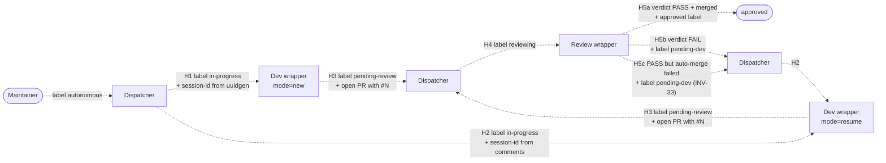

# Handoff Points and Their Invariants

The pipeline has three actors (dispatcher, dev wrapper, review wrapper) but five places where work is handed off. Bugs in this kind of system live almost exclusively at handoff points — the seams where one actor's output becomes another actor's input.

This file enumerates each handoff, the data carriers (label, comment, PID file, PR), the producer-side and consumer-side invariants, and the failure mode if either side breaks contract.

## The five handoffs

| # | Handoff | Producer | Consumer | Carrier |
|---|---|---|---|---|
| **H1** | dispatcher → dev (new) | Dispatcher Step 2 | Dev wrapper, mode=new | `+in-progress` label, dispatched subprocess |
| **H2** | dispatcher → dev (resume) | Dispatcher Step 4 | Dev wrapper, mode=resume | `+in-progress` label, session-id extracted from issue comments |
| **H3** | dev → review | Dev wrapper trap | Dispatcher Step 3 (then Step 3 → review wrapper via H4) | `+pending-review` label, open PR referencing the issue |
| **H4** | dispatcher → review | Dispatcher Step 3 | Review wrapper | `+reviewing` label |
| **H5** | review → dev (send-back) OR review → approved | Review wrapper | Dispatcher Step 4 (FAIL or auto-merge-failed) or terminal (PASS+merged) | `+pending-dev` or `+approved` label, "Review findings:" / "Review PASSED" comment with session-id, optional Reviewed-HEAD trailer; on auto-merge failure also a PR comment with prefix `Auto-merge failed:` ([INV-33](invariants.md#inv-33-review-wrapper-must-not-close-the-linked-issue)) |

## H1: dispatcher → dev (new)

**Trigger**: Step 2 finds an issue labeled `autonomous` only, deps resolved.

**Producer-side invariants** (dispatcher must guarantee):

- Atomic `+in-progress` label set BEFORE `nohup` spawn. Otherwise Step 5 in the same tick could probe a non-existent PID file and falsely diagnose DEAD ([INV-09](invariants.md#inv-09-just_dispatched-skip-rule) is the safety net for this; `JUST_DISPATCHED` only protects against the same-tick race, the label ordering protects against an immediately-following tick).
- `JUST_DISPATCHED` includes the issue.
- Dispatch goes through `dispatch-local.sh dev-new`, never directly invokes `autonomous-dev.sh`. The dispatch script is the only place that does `kill_stale_wrapper` (#57), input validation, and pre-creates the log file with 0600. The `kill_stale_wrapper` pgrep fallback is scoped to `${PROJECT_DIR}/scripts/autonomous-dev.sh` for `dev-*` dispatches (and the review variant for `review` dispatches) per [INV-28](invariants.md#inv-28-pgrep-fallback-must-be-scoped-by-project-and-wrapper-type) — without project + type scoping, multi-project boxes would cross-kill wrappers between projects, and same-project / different-type dispatches would kill each other (#126).

**Consumer-side invariants** (dev wrapper must tolerate):

- Wrapper might find no PID file when it tries to `acquire_pid_guard` — that's fine, `acquire_pid_guard` writes the PID file from scratch.
- Wrapper might find the issue already labeled `pending-review` or `pending-dev` if the dispatcher's previous tick was racing — wrapper trap will overwrite cleanly via `−in-progress +<target>` calls (the `−in-progress` is a no-op when already absent).

**Race window**: between Step 2's `nohup` and Step 5's PID probe in a *later* tick (the same-tick case is handled by `JUST_DISPATCHED`). The wrapper has ~5 minutes of cron interval to write its PID file before being mistaken for DEAD; in practice the file is written within ~50ms of `nohup`.

**Failure modes**:

- Wrapper fails to start *after* arg parsing (e.g. `gh-with-token-refresh.sh` can't find real `gh` per #92, missing required env, auth setup failure) → trap posts `Agent Session Report (Dev) ... Mode: startup-failure` with non-zero exit code AND flips `in-progress` → `pending-dev`. The dispatcher's `count_agent_failures` counter sees it next tick (correct retry counting), and the underlying error is visible on the issue itself instead of buried in `/tmp/agent-*.log`. The dispatcher Step 5b is no longer the primary recovery path for this class of failure — though it remains the safety net for the residual case below.
- Wrapper fails *before* arg parsing (e.g. malformed `--issue` arg before `ISSUE_NUMBER` is set) → trap stays silent (nowhere to post) → next-tick Step 5b sees DEAD-no-PR → bumps the dispatcher-crash counter → eventually `stalled`.
- `dispatch-local.sh` errors out before `nohup` (e.g. `kill_stale_wrapper` refuses because a previous wrapper survived SIGKILL) → returns exit 1 to dispatcher. Dispatcher Step 2 currently doesn't check the return code — issue is already labeled `in-progress` but no wrapper is running. Step 5b next tick sees DEAD-no-PR, recovers. Tracked as a soft-bug; not worth a synchronous check given the recovery path works.

## H2: dispatcher → dev (resume)

**Trigger**: Step 4 finds an issue labeled `pending-dev` with retries below `MAX_RETRIES`.

> **Provider-neutral topology note (#420 P3-5).** The `gh issue edit` shown below is the conceptual leaf; the atomic label swap is emitted through the `itp_transition_state` verb. GitHub leaf shown for reference — see [provider-spec.md §3.1](provider-spec.md#31-issue-tracker-provider-itp-verbs) for the provider-neutral verb.

**Producer-side invariants**:

- Atomic label swap `−pending-dev +in-progress` (single `gh issue edit` call).
- Session-id extracted from the most recent comment matching `Dev Session ID: \`<id>\`` ([INV-03](invariants.md#inv-03-dev-session-report-comment-format)). Crucially, this regex must NOT match `Review Session ID:` — both share the word "Session", so the prefix `Dev` is what disambiguates.
- Retry counter calculated correctly: only count failure events after the most recent `Marking as stalled` comment ([INV-05](invariants.md#inv-05-retry-counter-cutoff-rule)).
- Dispatch via `dispatch-local.sh dev-resume <issue> <session-id>`; the dispatch script validates the session-id matches `[a-zA-Z0-9_-]+`.
- **Future invariant** [INV-12](invariants.md#inv-12-resume-only-against-unfinished-sessions): query session terminal state and skip if `terminal_reason=completed`. Not yet enforced; tracked in [#59](https://github.com/zxkane/autonomous-dev-team/issues/59).

**Consumer-side invariants**:

- Wrapper accepts `--mode resume --session <id>` and tolerates an empty session-id by falling back to `--mode new` (logs WARN). This handles the dispatcher edge case where Step 4b couldn't extract a session.
- Wrapper's resume path falls back to a fresh session if `claude --resume` exits non-zero — defense against sessions the CLI no longer recognizes.

**Race window**: same as H1.

**Failure modes**:

- Resume against a `completed` session hangs indefinitely (#59). Until [INV-12](invariants.md#inv-12-resume-only-against-unfinished-sessions) is enforced, the only mitigation is the future wall-clock timeout ([INV-13](invariants.md#inv-13-wall-clock-cap-on-agent-invocations), [#60](https://github.com/zxkane/autonomous-dev-team/issues/60)) plus the dispatcher's Step 5a SIGTERM after 5 min of CI-green idleness. Step 5a covers the "completed-session-hang-after-PR-already-up" subset cleanly; it does NOT cover hangs that occur before any PR exists.

## H3: dev → review

**Trigger**: dev wrapper exits 0 with a PR referencing `#N`. Trap labels the issue `−in-progress +pending-review`.

**Producer-side invariants**:

- Wrapper trap MUST verify a PR exists before setting `pending-review`. An exit-0 with no PR routes to `pending-dev` instead — see [`dev-agent-flow.md` § Trap contract details](dev-agent-flow.md#trap-contract-details) and [#40](https://github.com/zxkane/autonomous-dev-team/issues/40).
- Trap MUST post the Agent Session Report comment with format described in [INV-03](invariants.md#inv-03-dev-session-report-comment-format) — the dispatcher's Step 4 retry counter parses this format.
- Trap MUST be idempotent against label state ([INV-08](invariants.md#inv-08-wrapper-exit-trap-is-idempotent-against-label-state)): even if the dispatcher's Step 5a already moved the issue to `pending-review` (SIGTERM-mid-trap race), the trap's redundant `+pending-review` is a no-op.

**Consumer-side invariants** (dispatcher Step 3 must tolerate):

- The PR returned by `gh pr list` is the one whose parsed `closingIssuesReferences` contains this issue ([INV-86](invariants.md#inv-86-prissue-binding-is-authoritative-via-closingissuesreferences-never-a-bare-n-body-mention-and-no-pr-is-mutated-without-verified-linkage)). A PR body that merely *mentions* other issues (`Closes #1, related to #2`) does NOT bind those issues — only the close reference does, so a cross-referencing sibling PR can never be mis-selected.
- The Reviewed-HEAD trailer may not yet exist (this is the first review). Step 5b's empty-trailer fallthrough routes to `pending-review` ([INV-07](invariants.md#inv-07-empty-reviewed-head-trailer-routes-to-pending-review)) — same as the new-commits case.

**Race window**: Step 5a's SIGTERM path is the most concurrent case. Dispatcher and wrapper trap both edit labels in a ~few-second window. Both write `pending-review`, both post a comment. Worst case: 2 comments and 2 redundant label edits per ~1% of transitions — bounded and self-healing.

**Failure modes**:

- Wrapper trap fails to post Session Report (token expired, network) → next-tick dispatcher Step 4 cannot find a `Dev Session ID:` to resume from → falls back to new session via the wrapper's mode-normalization. Some context is lost but the pipeline progresses.
- Wrapper trap fails to edit labels (token, perm) → issue stuck in `in-progress`, no PR-ready trailer to drive next decision → next-tick Step 5b probes PID, finds DEAD, sees the PR, routes to `pending-review` correctly. The wrapper's trap is a fast-path; Step 5b is the slow safety net.

## H4: dispatcher → review

**Trigger**: Step 3 finds an issue labeled `autonomous` AND `pending-review` AND NOT `reviewing`.

**Producer-side invariants**:

- Atomic label swap `−pending-review +reviewing`.
- Dispatch via `dispatch-local.sh review <issue>`.
- `JUST_DISPATCHED` includes the issue.

**Consumer-side invariants**:

- Review wrapper must run PR discovery via authoritative close linkage ([INV-86](invariants.md#inv-86-prissue-binding-is-authoritative-via-closingissuesreferences-never-a-bare-n-body-mention-and-no-pr-is-mutated-without-verified-linkage)) — bind the PR whose `closingIssuesReferences` contains this issue (branch-name `issue-<N>` fallback for close-keyword-less partial-fix PRs), then assert the same linkage with `verify_pr_closes_issue` before any PR mutation. If discovery yields no PR (or the guard fails) it exits with `−reviewing +pending-dev` and a clear comment — never reviewing or mutating a foreign PR.
- Review wrapper must filter verdict comments by session-id ([anti-spoofing defense](review-agent-flow.md#verdict-polling)): another commenter could write "Review PASSED" verbatim.
- The wrapper MAY fan out to multiple verdict-reaching agents internally ([INV-40](invariants.md#inv-40-multi-agent-review-attribution-unanimous-aggregation-and-all-unavailable-fallback)) when `AGENT_REVIEW_AGENTS` lists more than one CLI. This does NOT change the handoff carrier: the dispatcher still sets one `+reviewing` label and hands off one issue; the wrapper aggregates the N verdicts under the unanimous-PASS rule and emits exactly one carrier label transition (H5) plus one verdict trailer. The fan-out is invisible to the dispatcher.

**Race window**: Step 5b's DEAD-reviewing path can race with the wrapper's trap. Wrapper trap clears `reviewing`; if dispatcher's probe ran before that, dispatcher also clears `reviewing` and adds `pending-dev`. Both writes converge.

**Failure modes**:

- Concurrent manual `/q review` + auto-merge → wrapper finds `PR.state != OPEN` at approve time → silent `−reviewing` exit ([state-machine § concurrent reviews](state-machine.md#concurrent-reviews-on-the-same-pr), [#31](https://github.com/zxkane/autonomous-dev-team/issues/31)).

## H5: review → dev (send-back) OR review → approved

Two sub-handoffs depending on verdict:

### H5a: review → approved (verdict PASS)

> **Provider-neutral topology note (#420 P3-5).** The `gh pr review --approve` / `gh pr merge` / `gh issue close` mentions below are the conceptual leaves; the actual emits route through `chp_approve` / `chp_merge` and the (deliberately absent) `chp_close_keyword` render. GitHub leaves shown for reference — see [provider-spec.md §3.2](provider-spec.md#32-code-host-provider-chp-verbs).

**Producer-side invariants**:

- Verdict comment posted on the **issue** (not PR), starts with "Review PASSED", contains the session-id trailer.
- `gh pr review --approve` succeeded (else fall-back path: `+approved` label but manual notification).
- Reviewed-HEAD trailer posted (best-effort) so future Step 5b SHA-comparison works.
- Auto-merge-success path: removes `autonomous` AND `reviewing`, adds `approved`, merges PR with `--squash --delete-branch`. The wrapper does NOT call `gh issue close` ([INV-33](invariants.md#inv-33-review-wrapper-must-not-close-the-linked-issue)) — GitHub auto-closes the issue when the merge resolves the PR's `Closes #N` keyword.
- `no-auto-close` path: keeps `autonomous`, removes `reviewing`, adds `approved`, leaves PR open. Maintainer merges manually.

**Consumer-side invariants**: the dispatcher does not look at issues labeled `approved` — it's a terminal state. No active consumer. If any transitional label co-resides with `approved` (residue from a wrapper crash between two label edits, [INV-15] SIGTERM race, or manual reconciliation), Step 0 hygiene strips it on the next tick — see [INV-25](invariants.md#inv-25-terminal-labels-approved-stalled-are-sticky-transitional-residue-is-healed-at-tick-start).

**Failure modes**:

- Auto-merge fails (CI red, branch protection, transient API error) → wrapper posts the `Auto-merge failed:` marker on the **PR** and transitions the issue to `+pending-dev` (autonomous retained), NOT to `+approved` ([INV-33](invariants.md#inv-33-review-wrapper-must-not-close-the-linked-issue)). The next dispatcher tick re-dispatches dev to rebase onto main; on success the merge happens at the next review pass and GitHub closes the issue via `Closes #N`. This is now H5c (separate handoff below).
- Approval API call itself fails → labels are `+approved -reviewing` (autonomous kept) and the wrapper posts a "please approve and merge manually" comment. Maintainer intervention required — this is a permission/config bug, not an auto-merge failure.

### H5b: review → dev (verdict FAIL)

**Producer-side invariants**:

- Verdict comment "Review findings:" with numbered remediation list, ending with session-id trailer.
- For each PR inline review comment the agent wrote, the resume prompt picks them up via `gh api repos/.../pulls/N/comments`. The dev resume prompt instructs the agent to fix-then-reply-then-resolve each thread.
- Reviewed-HEAD trailer posted (so when dev pushes new commits, Step 5b sees a different headRefOid and routes back to `pending-review`; if dev pushes nothing, Step 5b routes to `pending-dev` — a "no progress" loop that the dispatcher detects via the retry counter).
- `−reviewing +pending-dev`.

**Consumer-side invariants** (dispatcher Step 4 must tolerate):

- The "Review findings:" comment is what the dev resume prompt highlights — the dev agent needs it. The wrapper does NOT count it as a dev failure ([INV-06](invariants.md#inv-06-crashed--process-not-found-keyword-contract): only `Agent Session Report (Dev)` exit-non-zero comments and dispatcher crash comments count).
- The session-id in the verdict trailer is the *review* session-id, not the dev session-id. The dispatcher's Step 4b session-id extraction explicitly anchors on `Dev Session ID:`, NOT `Review Session:` — see [INV-03](invariants.md#inv-03-dev-session-report-comment-format).

**Failure modes**:

- Trailer post fails → empty-trailer fallthrough. Next-tick Step 5b can't compare SHAs. If dev pushes new commits, Step 5b goes to `pending-review` (correct). If dev pushes nothing and exits with no PR change, Step 5b sees PR exists, can't read trailer, routes to `pending-review` ([INV-07](invariants.md#inv-07-empty-reviewed-head-trailer-routes-to-pending-review)) — review re-runs on identical code, posts the same findings, and wastes Sonnet quota. This is the documented downside of the empty-trailer-fallthrough; operationally it surfaces as the same review verdict in repeated cycles.

### H5c: review → dev (auto-merge failed) — INV-33

Distinct from H5b: verdict was PASS and PR approval succeeded, but `gh pr merge` itself failed (merge conflict, branch protection, transient API error). Pre-#145 the wrapper called `gh issue close` and posted "please merge manually", terminating the autonomous flow. Post-#145 ([INV-33](invariants.md#inv-33-review-wrapper-must-not-close-the-linked-issue)) the wrapper re-dispatches dev for rebase.

**Producer-side invariants**:

- Verdict was PASS (`Review PASSED` comment with session-id trailer).
- `gh pr review --approve` succeeded.
- `gh pr merge --squash --delete-branch` returned non-zero. `MERGE_OUT` (combined stdout+stderr, truncated to 500 chars) is captured.
- The wrapper posts a comment on the **PR** (not the issue) with prefix `Auto-merge failed:` followed by the captured excerpt and the directive `Re-dispatching dev agent to rebase onto main.`
- The wrapper edits the issue: `−reviewing +pending-dev`. Does NOT remove `autonomous`. Does NOT call `gh issue close`. Does NOT add `+approved`.
- Reviewed-HEAD trailer was already posted (before the merge attempt, in the earlier section of the wrapper).

**Consumer-side invariants** (dev wrapper resume must tolerate):

- The dev resume branch (`autonomous-dev.sh` MODE=resume) queries PR-issue comments via `gh api repos/.../issues/<PR>/comments` with selector `startswith("Auto-merge failed:")`.
- When the marker is present, the resume prompt prepends a `## Pre-implementation: rebase onto main — MANDATORY FIRST STEP` section with `git fetch origin && git rebase origin/main && git push --force-with-lease`.
- When the marker is absent, the resume prompt is unchanged — H5b semantics apply.

**Failure modes**:

- Marker post fails (token expiry, rate limit) → wrapper logs WARNING; label transition to `pending-dev` still proceeds. The dev agent's resume detects the absence of the marker and falls back to standard review-finding behavior; the agent's MANDATORY pre-review Step 0 (mergeability check in `autonomous-review.sh` prompt) catches the unmerged state on the next review pass.
- Rebase encounters semantic conflicts the agent cannot resolve → dev agent posts a `needs human` comment, runs `git rebase --abort`, exits cleanly. The dispatcher's MAX_RETRIES gate caps the retry budget; `+stalled` is the eventual terminal state.
- Auto-merge keeps failing for non-rebaseable reasons (e.g. branch protection requiring an external check that never runs) → MAX_RETRIES → `+stalled` → operator intervention.

## Cross-cutting concerns

These don't belong to any single handoff but cut across multiple:

### Wrapper-trap-vs-dispatcher race (H3 / H4 / H5)

Whenever the dispatcher's Step 5 acts on the same issue as a still-running wrapper's trap, label edits race. The contract: wrappers ALWAYS use `−from +to` in single `gh issue edit` calls, never sequential add-then-remove. The dispatcher does the same.

**Step 5b case (DEAD)**: the wrapper trap has already finished by the time Step 5b probes the PID. So Step 5b sees the post-trap state. No live race.

**Step 5a case (ALIVE+PR ready ⇒ SIGTERM)**: a genuine race with non-deterministic outcome — see [INV-15](invariants.md#inv-15-step-5a-sigterm-race-is-non-deterministic). The dispatcher and trap target **different** final states (`pending-review` vs `pending-dev`). The race is non-fatal — the PR is preserved either way and the next dispatcher tick recovers — but review can be delayed by one tick. This is a known imperfection captured in the invariant; fix is out of scope for the docs PR.

### Trailer empty fallthrough (H3 / H5b)

[INV-07](invariants.md#inv-07-empty-reviewed-head-trailer-routes-to-pending-review) routes empty `Reviewed HEAD` to `pending-review`. Two distinct causes converge here: review-never-ran-yet (the safe first-review case) and trailer-post-failed (a transient bug). Operationally indistinguishable from the dispatcher's view; only the review log can tell them apart.

### Resume-on-completed-session hang (H2)

[INV-12](invariants.md#inv-12-resume-only-against-unfinished-sessions) — not yet enforced; tracked in #59. Combined with the future wall-clock timeout ([INV-13](invariants.md#inv-13-wall-clock-cap-on-agent-invocations), [#60](https://github.com/zxkane/autonomous-dev-team/issues/60)) provides defense in depth.

### Machine markers used within H4/H5 (review round-tracking, issue #449)

An HTML-comment marker (`<!-- marker-name: key=value ... -->`) is the standing convention this repo uses for state that must survive across dispatcher ticks/review rounds without a dedicated label or sidecar file — the full per-invariant detail (rule, fingerprint, trip behavior) lives in [`invariants.md`](invariants.md) and the wrapper-side wiring narrative in [`review-agent-flow.md`](review-agent-flow.md); this subsection is the handoffs-level index of which markers exist and what they carry, since H4 (dispatcher → review) and H5 (review → dev/approved) are where a repeated review round is observed.

| Marker | Producer | Scope / reset rule | Consumed by |
|---|---|---|---|
| `<!-- review-round-counter: issue=<N> head=<sha\|unknown> round=<n> -->` | review wrapper, every decided round | head-AGNOSTIC ([INV-129](invariants.md#inv-129-review_round-is-a-head-agnostic-series-of-consecutive-decided-failed-substantive-rounds--the-severity-ratchets-blocking-floor-loosens-across-an-active-devreview-loop-new-commit-every-round-not-only-against-a-frozen-head), issue #475) — accumulates across consecutive `failed-substantive` rounds regardless of head changes; `head` is forensic-only. Resets via three channels: a `passed`/`failed-non-substantive` `review-verdict` trailer, an INV-127 trip report (both act as scan cutoffs via `_review_round_prior_marker`), or an explicit `round=0` marker posted on every PASS round | the severity-aware blocking ratchet's prompt wording + the pre-aggregation severity filter (both `lib-review-severity.sh`) — see [review-agent-flow.md § Prompt construction](review-agent-flow.md#prompt-construction) |
| `<!-- dispatcher-review-cap-breaker: issue=<N> head=<sha> round=<n> -->` | review wrapper, every `failed-substantive` round | head-AGNOSTIC — accumulates across consecutive `failed-substantive` rounds regardless of head changes (deliberately NOT reset by a new head; see [INV-127](invariants.md#inv-127-a-review-side-divergent-findings-non-convergence-review_convergence_cap-consecutive-failed-substantive-rounds-where-the-severity-ratchet-s-own-p0p1-floor-is-still-failing-is-detected-and-halted--the-breaker-transitions-reviewing--stalled-then-posts-one-structured-reasonreview-round-cap-report-gated-on-an-already-stalled-skip-does-not-gate-on-may_stall_now-mirroring-inv-122s-own-rationale)'s design note); the scan cutoff (`_review_cap_prior_marker`) also resets at the latest intervening `passed`/`failed-non-substantive` `review-verdict` trailer, not only at a prior trip report | INV-127's own trip check (`_review_cap_next_count`/`_review_cap_threshold`, `lib-review-cap.sh`) |
| `<!-- dispatcher-gate-fail-breaker: issue=<N> head=<sha> rc=<rc> count=<n> -->` | review wrapper, every E2E-gate-fail round | `(head_sha, e2e_lane_rc)` — resets on either a new head OR a different rc on the same head | [INV-122](invariants.md#inv-122-a-same-head-repeated-e2e-gate-failure-an-inv-46-fail-verdict-against-an-unchanged-head_sha-e2e_lane_rc-fingerprint-gate_fail_stall_threshold-consecutive-rounds-is-detected-and-halted--the-breaker-transitions-reviewing--stalled-then-posts-one-structured-reasonsame-head-gate-failure-report-gated-on-an-already-stalled-skip-deliberately-not-the-dispatcher-side-may_stall_now-live-pid-pre-gate--see-rationale-below)'s own trip check (pre-existing, listed here for contrast with the two new #449 markers above) |

All three are read via an **unbounded** full-comment-history scan (`itp_list_comments`, no pagination cap) filtered to `authorKind != "human"` — an ordinary collaborator comment can never be read as a forged marker of any of these three kinds (the same authenticity-filter convention [INV-105]'s own marker read established first). All three are posted on EVERY qualifying round, not only on a trip — a marker that only appears when the breaker fires would never let the SECOND occurrence find the FIRST one's count, and the counter could never advance past 1. "Qualifying round" for the first two markers ALSO requires `_aggregate_has_substantive_fail` (`lib-review-aggregate.sh`, [P1] codex review round 4) — a `fail` aggregate produced entirely by [INV-48] timeout vetoes (no agent posted findings text) does not post either marker, since it carries no evidence a real blocking finding exists. The first marker (`review-round-counter`) is the one exception to "fail rounds only": it ALSO posts on a `pass` round, carrying the explicit `round=0` reset value ([INV-129]) — the other two markers have no PASS-round reset channel of their own; they rely solely on the trailer/trip-report cutoff.

### Liveness watchdog self-referential marker (Step 6) — [INV-128](invariants.md#inv-128-any-non-terminal-issue-whose-observable-state-fingerprint-label-pr-head-non-idempotent-comment-count-marker-digest-stays-unchanged-for-liveness_notice_ticks-default-6-consecutive-dispatcher-ticks-gets-one-operator-visible-tier-1-escalation-and-after-liveness_stall_ticks-default-18-further-unchanged-ticks-is-unconditionally-transitioned-to-stalled-with-a-structured-reasonliveness-timeout-report--the-pipelines-first-global-liveness-invariant-every-non-terminal-issue-either-changes-observable-state-or-is-escalated-within-a-bounded-number-of-ticks)

Unlike H1-H5c, producer and consumer are the **same actor across ticks**: Step 6 of one dispatcher tick posts the marker, and Step 6 of the *next* tick is the one that reads it back. There is no wrapper on either side of this handoff — it never leaves the dispatcher process.

**Marker**: `<!-- dispatcher-liveness-watchdog: issue=<N> fingerprint=<hash> count=<n> tier1=<0|1> tripped=<0|1> -->`, where `fingerprint = hash(active_label, pr_head_sha_or_empty, non_idempotent_comment_count, marker_set_digest)`. **[round 8]** `tripped` is a field ADDED to the marker: `1` on the marker posted as part of a tier-2 transition, `0` on every other tick. It replaces a separate, forgeable heading-text cutoff signal — see the consumer-side paragraph below for why.

**Producer-side invariants** (`_liveness_evaluate_issue`, `lib-dispatch.sh`):

- Posted/updated via `itp_post_comment` on **every** evaluated tick, not only when the count advances — mirrors [INV-122](invariants.md#inv-122-a-same-head-repeated-e2e-gate-failure-an-inv-46-fail-verdict-against-an-unchanged-head_sha-e2e_lane_rc-fingerprint-gate_fail_stall_threshold-consecutive-rounds-is-detected-and-halted--the-breaker-transitions-reviewing--stalled-then-posts-one-structured-reasonsame-head-gate-failure-report-gated-on-an-already-stalled-skip-deliberately-not-the-dispatcher-side-may_stall_now-live-pid-pre-gate--see-rationale-below)'s "computed on EVERY round" rule. Without this, the first no-op tick would leave no marker for the second to find, and the counter could never advance.
- **[operator guidance, PR #472 round 6]** The marker is ALWAYS posted as its OWN bare `itp_post_comment` call — NEVER embedded as the first line of the tier-1/tier-2 human-readable report (the pre-round-6 shape). On the `tier1`/`tier2` paths this means TWO `itp_post_comment` calls per evaluation: the bare marker first, then the report. This split is what lets the consumer side use a whole-body structural anchor instead of a "marker line, then optional trailing prose" anchor.
- `count` and `tier1` are computed by the pure helpers in `lib-liveness.sh` (`_liveness_next_count`, `_liveness_next_tier1`) from the **prior** marker, then the new marker is composed and posted in the same evaluation — never a two-phase read-then-write across ticks. `_liveness_next_count` additionally caps its result at `stall_ticks` ([round 6] defense-in-depth against a forged absurd stored count propagating into the tier-action decision and the operator-facing report text — see INV-128's count-cap paragraph).
- The marker's own grammar (`dispatcher-liveness-watchdog:`) is included in `_LIVENESS_IDEMPOTENT_PATTERN` and excluded from `marker_set_digest` (INV-128 above) — a self-referential fingerprint would otherwise flip the digest exactly once, on the first tick the marker is posted (which happens unconditionally on the bare-marker `none` path, not only once tier 1 fires), then permanently pollute the fingerprint with a component that carries no further information. **[round 6]** Since the tier-1/tier-2 reports are now separate comments, their OWN text (`reason=liveness-no-progress`/`reason=liveness-timeout`) is likewise added to `_LIVENESS_IDEMPOTENT_PATTERN` (the count-exclusion list) — otherwise the report's posting would itself register as "a new comment" against the fingerprint's comment-count component on the very next tick, the same self-pollution bug class D3 already fixed for the marker.
- **[codex review, PR #472, round 8 BLOCKING #2]** Every grammar in `_LIVENESS_IDEMPOTENT_PATTERN`/`_LIVENESS_DIGEST_PATTERN` is now matched with a leading wrapper anchor (`` (?:`|<!--[ \t]*) ``, requiring a backtick code span or an HTML-comment opening immediately before the token) — the pre-round-8 bare alternation was a substring test that ANY human comment merely discussing or quoting a token in prose (e.g. "I saw reason=liveness-timeout mentioned somewhere") satisfied identically to a genuine wrapped marker/report, corrupting BOTH the count (under-counting a genuinely-new prose comment as idempotent) and the digest (over-reporting a grammar as present from a bare mention). Every genuine producer already wraps this way, so no real marker/report is affected — only prose mentions are now excluded. **[issue #473]** `_LIVENESS_IDEMPOTENT_PATTERN`/`_LIVENESS_DIGEST_PATTERN` are subsequently REPLACED by `_LIVENESS_GRAMMARS_JSON` (`lib-liveness.sh`) — the wrapper-anchor rounds above narrowed the per-token span but never converted it to a WHOLE-BODY match, so a comment merely quoting a closed, well-formed span still satisfied every anchor. See INV-128's own entry (`invariants.md`) for the full current-state description.
- **[codex review, PR #472, round 9 BLOCKING #2]** A post failure (`itp_post_comment` non-zero) is now retried ONCE via `_liveness_post_marker`/`_liveness_post_report` (`lib-dispatch.sh`), not silently swallowed with a bare `|| true` — the pre-round-9 shape, appropriate for a comment that merely informs a human, was wrong for the MARKER specifically, since it carries the counter/tier1-latch/`tripped`-field persistence (R4). `_liveness_post_marker` additionally posts a loud best-effort `@REPO_OWNER` operator notice on persistent (both-attempts) failure and returns 1, so the `tier1` branch can skip its dependent report post (`_liveness_post_marker ... || return 0`) rather than repeat the same escalation prose every tick while the counter state never actually advances. `_liveness_post_report` retries but does not escalate as loudly — a lost report costs only operator-facing prose, since state lives entirely in the (independently retried) marker posted first in both tier branches. The `tier2` branch does not gate its report on the marker's success, since `label_swap` already committed the irreversible `stalled` transition before either post. **[round 9 follow-up self-review]** Every call site EXCEPT the `tier1` branch's intentional `_liveness_post_marker ... || return 0` MUST append `|| true` — this file and `dispatcher-tick.sh` both run under `set -euo pipefail`, and a bare call to a helper that can return 1 trips `set -e`, aborting not just this issue's evaluation but the entire dispatcher tick. The initial round-9 fix missed this on four call sites; caught by a self-review pass and pinned by TC-LIVENESS-075..078 (which spawn a real `bash -euo pipefail` subshell — the ordinary test harness sources under `set +e` and cannot see this class of bug).

**Consumer-side invariants** (the *next* tick's `_liveness_evaluate_issue`):

- Reads back via `_liveness_prior_marker` (`lib-liveness.sh`), which calls `itp_list_comments`'s result through a CUTOFF-then-scan (mirrors `_review_cap_prior_marker`, [INV-127](invariants.md#inv-127-a-review-side-divergent-findings-non-convergence-review_convergence_cap-consecutive-failed-substantive-rounds-where-the-severity-ratchet-s-own-p0p1-floor-is-still-failing-is-detected-and-halted--the-breaker-transitions-reviewing--stalled-then-posts-one-structured-reasonreview-round-cap-report-gated-on-an-already-stalled-skip-does-not-gate-on-may_stall_now-mirroring-inv-122s-own-rationale)): filters to comments STRUCTURALLY anchored on the marker's own exact grammar — a WHOLE-BODY anchor, `^<!-- dispatcher-liveness-watchdog: ... -->[[:space:]]*$` (the ENTIRE comment body must be the marker) — that fall STRICTLY AFTER the cutoff, sorts by `createdAt`, takes the **last** qualifying match.
- **[codex review, PR #472, round 8 BLOCKING #1 — cutoff redesign]** cutoff = the latest qualifying marker's `createdAt` where that marker's OWN `tripped` field equals `1` (the epoch if none). This replaces THREE successive attempts (rounds 3, 6, 7) to anchor the cutoff to a SEPARATE, hand-typed heading-text pattern (`_LIVENESS_TIER2_HEADING`, first via `contains()`, then `startswith()`): round 7 found `contains()` let any bare mid-comment mention of the phrase register as a forged trip; round 8 found `startswith()` was STILL forgeable in the default `GH_AUTH_MODE=token` topology — an unauthenticated comment that simply OPENS with the exact heading line (trivial to copy) satisfied it identically to a genuine report, moving the cutoff forward and excluding the real earlier marker, permanently resetting a still-frozen series to `count=1`. Each round patched the same underlying flaw (a second, independently-typed text pattern carries no authentication of its own) without fixing it. The round-8 fix eliminates the free-text cutoff signal entirely: `tripped` is a field ON the already-authenticated, whole-body-anchored marker grammar, so the SAME anchor and the SAME `authorKind` filter that govern the prior-marker scan also govern the cutoff — there is no second pattern left to drift out of sync or be forged independently. `_LIVENESS_TIER2_HEADING` remains as the tier-2 report's operator-facing display heading only; no detector reads it anymore.
- Without this cutoff, the tier-2 marker (posted per R4's "every evaluated tick" rule, including the trip tick itself, `tripped=1`) would be read back by the very next evaluation as "the prior marker" — so an operator who fixes the park and removes `stalled` with the fingerprint otherwise unchanged would find the issue immediately re-tripped to `stalled` again instead of starting a fresh liveness episode.
- The `authorKind` filter resolves through `_liveness_strict_author_flag` (`lib-liveness.sh`): **[operator guidance, PR #472 round 6]** app-mode-only — `authorKind != "human"` is applied when `GH_AUTH_MODE=app`, and DROPPED entirely (structural anchor only) otherwise. This replaces the round-2-era `BOT_LOGIN`-presence check with the SAME two-part pattern `classify_recent_review_verdict` already establishes: this handoff is producer AND consumer in the SAME process, which never resolves `BOT_LOGIN` regardless of `GH_AUTH_MODE` (see [INV-105]'s `_frozen_convergence_rounds_json` precedent) — but `authorKind` itself is independently REST-derived from `user.type == "Bot"` ([#393]), so gating on `GH_AUTH_MODE=app` directly (rather than on `BOT_LOGIN` being set, which it never is here) correctly recognizes the dispatcher's own GitHub App identity in app mode while leaving the token-mode structural-only path — the one round 2's BLOCKING finding depends on — completely unchanged. Round 5's BLOCKING finding (a human forging a bare marker in the ambient default/token mode) is NOT closed by this — token mode has no actor signal to add; its blast radius is bounded by the count cap instead. The SAME authenticity filter governs both the cutoff computation and the final marker scan (derived from one filtered row set), so they can never disagree on eligible comments.
- Fingerprint match against the stored marker → `count = min(stored.count + 1, stall_ticks)` (capped, [round 6]), `tier1 = stored.tier1` (latch persists). Fingerprint mismatch → full reset (`count = 1`, `tier1 = 0`) — any observable change re-arms both tiers, REGARDLESS of what count a forged marker on the OLD (now-mismatched) fingerprint claimed.
- A malformed, absent, non-matching, or cutoff-excluded prior marker parses to a stored count of `0`, so the fresh series starts at the composed `count = 1` (bias to MISS, never a crash).

**Failure modes**:

- `itp_post_comment` fails after a tier-2 transition already committed the `stalled` label → the label change is durable (already applied via `label_swap` before either comment post) but the structured report (and/or, independently, the bare marker) is missing; an operator sees `stalled` with no explanation until the next tick's log. Non-fatal, self-healing on the next successful post is moot at that point since the issue is already terminal — this is the one place a lost marker/report has a user-visible (if minor) consequence.
- `itp_list_comments` fails transiently → the tick logs and returns without evaluating this issue at all (no marker write, no count change) — fail-toward-defer, consistent with [INV-125](invariants.md#inv-125-a-resolved-dev-session-id-whose-completion-is_session_completed-cannot-confirm-a-non-terminal-stop-reason-such-as-api_error-a-non-claude-dev-cli-or-an-unreadable-log-with-no-live-wrapper-gets-the-same-bounded-verdict-aware-recovery-as-the-inv-111-self-heal-branch--and-every-marker-present-same-head-fall-through-escalates-to-mark_stalled-never-the-residual-park)'s preflight posture.
- **[codex review, PR #472, round 8 BLOCKING #3]** `fetch_pr_for_issue` fails transiently (a `gh` transport error, not "genuinely no PR bound") → the tick logs and returns without evaluating this issue at all, the SAME fail-toward-defer posture as the `itp_list_comments` preflight above. The pre-round-8 code collapsed a transport failure and a genuine "no PR" into the same `current_head=""` reading — on an issue that DOES have a PR, a transient API blip would silently change the fingerprint's head component to empty, resetting the no-op counter and masking a park exactly on the tick meant to detect it. `resolve_pr_for_issue`/`chp_find_pr_for_issue` are already fail-closed on transport error (nonzero rc); the fix is checking that rc BEFORE assuming "no PR" (rc=0, empty stdout is the only genuine "no PR" case).
- **[round 6]** The marker post (of the tier1/tier2 pair) succeeds but the SUBSEQUENT report post fails → the counter/tier1-latch state is durable (the marker landed) but the operator-facing human-readable text is missing for this tick; the NEXT tick's fingerprint/count computation is unaffected either way, since it depends only on the marker, not the report.
- **[codex review, PR #472, round 8 BLOCKING #4]** `_liveness_notice_ticks`/`_liveness_stall_ticks` invalid-config WARNING is stderr-only by design (routing through `log()` would corrupt the numeric `$(...)` capture — see each function's own docstring). `run_liveness_watchdog` now captures that stderr via a mktemp file and re-emits it through `log()` (mirroring this file's `ci_is_green` capture-then-relog pattern) instead of discarding it to `/dev/null` — a misconfigured `LIVENESS_NOTICE_TICKS`/`LIVENESS_STALL_TICKS` still falls back to its default correctly either way, but pre-round-8 the fallback happened silently, with no trace in the dispatcher's own log output.

## Cross-references

- [`state-machine.md`](state-machine.md) — the label edges these handoffs traverse.
- [`dispatcher-flow.md`](dispatcher-flow.md) — what the dispatcher does at each handoff.
- [`dev-agent-flow.md`](dev-agent-flow.md), [`review-agent-flow.md`](review-agent-flow.md) — what the wrappers do.
- [`invariants.md`](invariants.md) — the rules each side must uphold.
