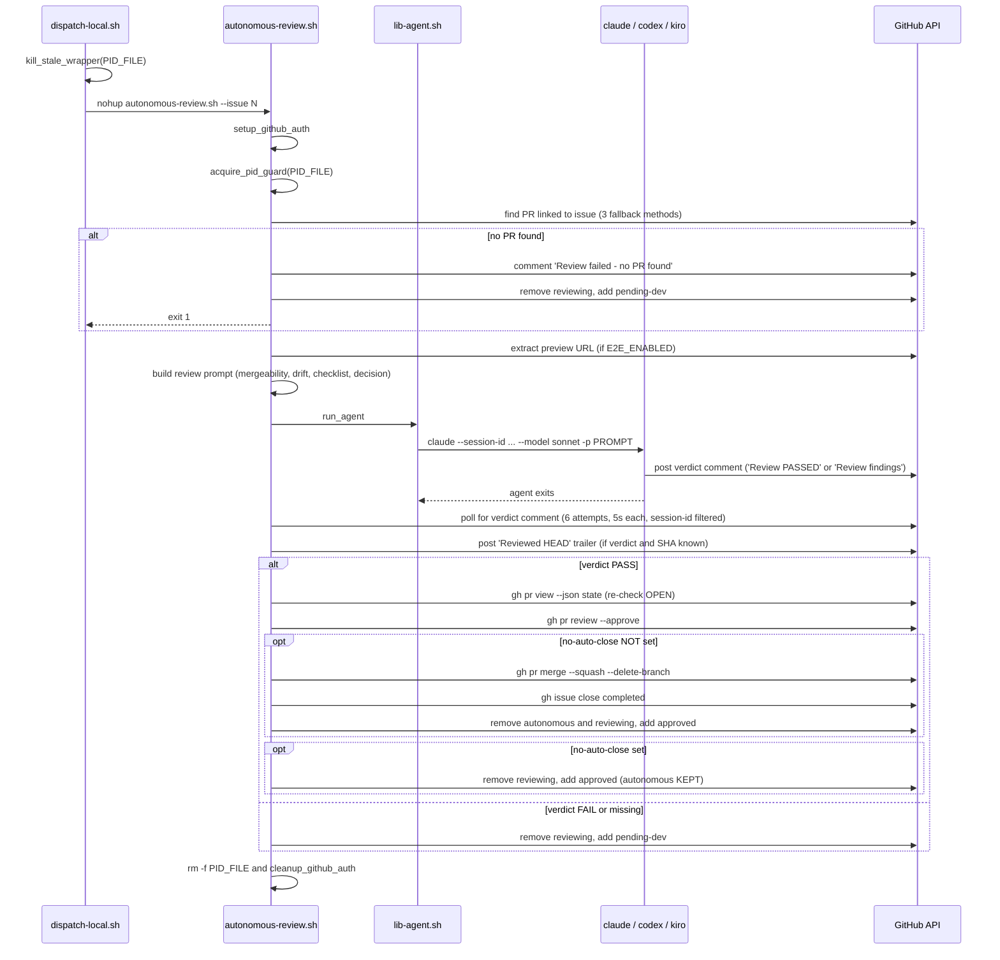
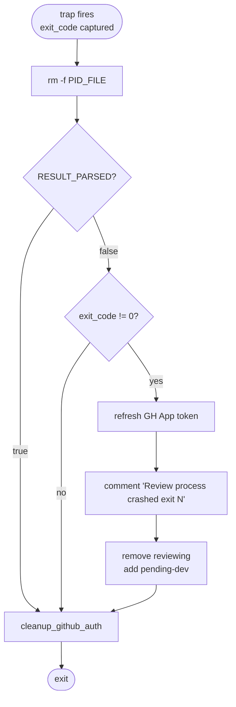

# Review-Agent Wrapper Flow

The review-agent wrapper is `skills/autonomous-dispatcher/scripts/autonomous-review.sh`. The dispatcher launches it via `dispatch-local.sh review <issue>`. The wrapper finds the PR linked to the issue, runs the underlying agent against it, parses the agent's verdict from issue comments, and either approves+merges (PASS) or sends the issue back to dev (FAIL).

The wrapper is the **producer** for two of the five [handoffs](handoffs.md) (review → approved/merged, review → pending-dev) and the **consumer** for one (dispatcher → review).

The default model is Sonnet (vs Opus for dev) — review is checklist-driven and benefits less from the larger model, and using a different model class avoids quota contention with the more expensive dev sessions.

## Lifecycle



## Spawn, PID guard, auth

Same pattern as the dev wrapper — see [`dev-agent-flow.md`](dev-agent-flow.md#spawn-in-dispatch-localsh) — except:

- PID file: `/tmp/agent-${PROJECT_ID}-review-<N>.pid` ([INV-01](invariants.md#inv-01-pid-file-naming)).
- Auth: review-agent app mode uses `REVIEW_AGENT_APP_ID` / `REVIEW_AGENT_APP_PEM` (separate App identity from dev so reviewer comments are attributed correctly).

## PR discovery (3 fallback methods)

1. **Body reference**: `gh pr list --state open --json number,body` and select the one whose body matches `#N` (with a non-digit boundary so `#1` doesn't match `#123`).
2. **Comment-mention extract**: scan issue comments for `(?:PR|pull)[/ #]*<digits>`.
3. **Search**: `gh pr list --search "issue N"` as a last resort.

If all three fail → comment "Review failed: no PR found linked to this issue. Please ensure the PR description contains 'Closes #N'." → `−reviewing +pending-dev` → exit 1.

This is one of the five legitimate ways the wrapper can transition to `pending-dev` even though the agent never ran. The dispatcher's Step 4a retry counter does NOT count this as a dev-failure — only `Agent Session Report (Dev)` comments and the dispatcher's own crash regex feed the counter.

## Preview URL extraction (E2E only)

Only relevant when `E2E_ENABLED=true` AND `E2E_PREVIEW_URL_PATTERN` is configured. The wrapper builds a URL from the pattern (replacing `{N}` with the PR number) and also scans PR comments for the most recent comment containing "Preview" + an `https://` URL. Comment-extracted URL takes priority (it's specific to the actual deploy).

If E2E is enabled but preview URL extraction yields nothing, the agent's review prompt receives `Preview URL: NOT_FOUND`, and the agent is instructed to FAIL the review with "E2E verification failed: PR preview URL not found."

## Prompt construction

The prompt encodes the entire review procedure as numbered steps. The wrapper does NOT execute any of those steps itself — they're all instructions to the underlying agent. The wrapper's job is to construct the prompt, kick off the agent, and parse the verdict.

Major prompt sections:

| Section | Purpose |
|---|---|
| **Step 0: merge-conflict resolution** | Mandatory pre-review. `gh pr view --json mergeable` ⇒ proceed (`MERGEABLE`), rebase (`CONFLICTING`), wait+retry (`UNKNOWN`). On rebase failure the agent FAILs with "[BLOCKING] Merge conflict with main" and step-by-step rebase instructions. |
| **Step 0.5: requirement drift detection** | Read all issue comments before reading the PR diff. Find scope changes posted after implementation began. Drift ⇒ FAIL with "[BLOCKING] Requirement drift". |
| **Review checklist** | Process compliance, code quality, testing, infra. The Kiro path skips `code-simplifier` / `pr-review` items since Kiro doesn't support those. |
| **Acceptance criteria verification** | For each `## Acceptance Criteria` checkbox in the issue body, verify against PR code/tests/build then mark via `bash scripts/mark-issue-checkbox.sh`. ALL must be checked before approving. |
| **Amazon Q Developer trigger** | Mandatory bot-review trigger. Q ignores `/q review` from bot accounts ⇒ wrapper instructs the agent to use `bash scripts/gh-as-user.sh pr comment N --body "/q review"`. Poll up to 3 min for the bot to respond. |
| **E2E verification (if enabled)** | Chrome DevTools MCP procedure: navigate, login, execute happy-path + feature test cases, screenshot+upload each, post structured E2E report on PR. |
| **Decision** | Single line: PASS ⇒ post "Review PASSED ... Review Session: \`<id>\`" on the **issue** (not PR). FAIL ⇒ post "Review findings: ..." with numbered remediation list, ending with the same session-id trailer. |

The session-id trailer is the wrapper's only way to identify which comment is its own verdict — see [Verdict polling](#verdict-polling) below.

## Verdict polling

After the agent exits, the wrapper polls issue comments up to 6 times (5s interval = 30s window) looking for a comment that satisfies BOTH:

- Body matches `Review PASSED|Review findings:` (case-insensitive).
- Body matches `Review Session.*<SESSION_ID>` (the wrapper-generated session-id).

The session-id filter is a **verdict-spoofing defense**: without it, any comment containing "Review PASSED" — including a maintainer's typed message, or a stray comment from another tool — could be picked up as the verdict.

If polling completes without finding a verdict comment, the wrapper proceeds to the FAIL branch (no false-positive PASS).

## Reviewed HEAD trailer

Posted as a separate comment, exactly once, only when:

- A verdict comment was found in polling AND
- `PR_HEAD_SHA` (captured at prompt-build time) is non-empty.

Format ([INV-04](invariants.md#inv-04-reviewed-head-trailer-format)):
```
Reviewed HEAD: `<sha>` (issue #N, session `<id>`)
```

The dispatcher's Step 5b reads the most recent trailer matching `Reviewed HEAD: \`<sha>\`` and compares it to the current `PR.headRefOid`. If they match, the dispatcher sends the issue back to `pending-dev` ("no new commits since last review") instead of bouncing it through review again — see [`dispatcher-flow.md` § Step 5b in-progress](dispatcher-flow.md#dead--in-progress) and [#53](https://github.com/zxkane/autonomous-dev-team/issues/53).

If the trailer post fails (token expiry, 403, rate limit), the wrapper logs `WARNING: Failed to post Reviewed HEAD trailer` and continues — the failed trailer means the dispatcher cannot detect SHA-match, but the empty-trailer fallthrough routes to `pending-review` ([INV-07](invariants.md#inv-07-empty-reviewed-head-trailer-routes-to-pending-review)) which is the safe default.

## Verdict = PASS path

```
1. Re-check PR state: gh pr view --json state
   if state != "OPEN": skip approve+merge silently, just remove `reviewing` and exit 0
2. refresh_token_env (token may have expired during the review)
3. gh pr review --approve --body "All acceptance criteria verified. ..."
   if approve fails (permission issue):
     comment "Review PASSED but formal PR approval failed... please approve and merge manually"
     −reviewing +approved
     exit 0
4. Read no-auto-close label
   if no-auto-close set:
     comment "Review PASSED — this issue has the 'no-auto-close' label..."
     −reviewing +approved (autonomous and no-auto-close kept)
   else (auto-close path):
     gh pr merge --squash --delete-branch
       if merge fails: comment "auto-merge failed, please merge manually" (best effort)
     gh issue close --reason completed
     −autonomous −reviewing +approved
```

### Approval guard (`PR.state != OPEN`)

A maintainer running `/q review` plus a manual `gh pr merge` while the autonomous review wrapper is in flight can cause the PR to be merged before the wrapper reaches step 3. Without the guard, `gh pr review --approve` against a closed PR would fail noisily and the wrapper would fall into the approval-failure branch — incorrect, since the PR was already approved+merged by the human. The guard short-circuits to a silent `−reviewing` (no add) and exit 0. See [`state-machine.md` § Concurrent reviews on the same PR](state-machine.md#concurrent-reviews-on-the-same-pr) and [#31](https://github.com/zxkane/autonomous-dev-team/issues/31).

## Verdict = FAIL or missing path

```
1. If agent exit ≠ 0 AND no verdict comment was found:
     post "Review process encountered an error (agent exit code: N). Moving back to development for investigation."
   (This is the only fallback comment; if a verdict was posted but agent exited non-zero, the verdict already says everything.)
2. −reviewing +pending-dev
```

The next dispatcher tick's Step 4 will pick the issue up. Crucially, this `pending-dev` does NOT count toward the dispatcher's retry counter — only `Agent Session Report (Dev)` failures and the dispatcher's own crash-regex matches do ([INV-05](invariants.md#inv-05-retry-counter-cutoff-rule), [INV-06](invariants.md#inv-06-crashed--process-not-found-keyword-contract)).

## Exit trap (`cleanup`)

Different from the dev wrapper's trap — this one's contract is **only** to handle the case where the wrapper crashed *before* the result-parsing block ran. The trap uses `RESULT_PARSED=true` (set on the last line of the script) as the signal that the verdict-handling code already updated labels and the trap should do nothing label-related.



This means if the script exits 0 (normal completion) but `RESULT_PARSED` was never set (logic bug), the trap silently leaves labels alone — defense-in-depth against a future refactor that forgets to set the flag would manifest as "issue stuck in `reviewing`" rather than "issue corrupted to `pending-dev` for no reason".

## Cross-references

- [`dispatcher-flow.md`](dispatcher-flow.md) — Step 3 is the producer side of the dispatcher → review handoff.
- [`dev-agent-flow.md`](dev-agent-flow.md) — the consumer of the `pending-dev` label this wrapper sets on FAIL.
- [`handoffs.md`](handoffs.md) — invariants for review → approved and review → pending-dev.
- [`invariants.md`](invariants.md) — INV-01, INV-04, INV-05, INV-06, INV-07, INV-08 are all referenced here.
