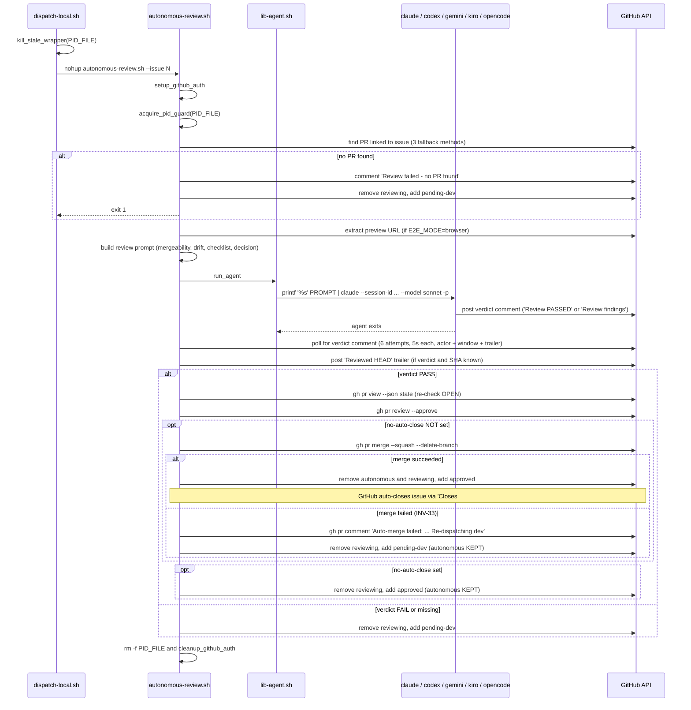

# Review-Agent Wrapper Flow

The review-agent wrapper is `skills/autonomous-dispatcher/scripts/autonomous-review.sh`. The dispatcher launches it via `dispatch-local.sh review <issue>`. The wrapper finds the PR linked to the issue, runs the underlying agent against it, parses the agent's verdict from issue comments, and either approves+merges (PASS) or sends the issue back to dev (FAIL).

The wrapper is the **producer** for two of the five [handoffs](handoffs.md) (review → approved/merged, review → pending-dev) and the **consumer** for one (dispatcher → review).

The default model is Sonnet (vs Opus for dev) — review is checklist-driven and benefits less from the larger model, and using a different model class avoids quota contention with the more expensive dev sessions.

## Lifecycle



## Spawn, PID guard, auth

Same pattern as the dev wrapper — see [`dev-agent-flow.md`](dev-agent-flow.md#spawn-in-dispatch-localsh) — except:

- PID file: `${PID_DIR}/review-<N>.pid` ([INV-01](invariants.md#inv-01-pid-file-naming)) — `${PID_DIR}` resolved by `lib-config.sh::pid_dir_for_project`.
- Auth: review-agent app mode uses `REVIEW_AGENT_APP_ID` / `REVIEW_AGENT_APP_PEM` (separate App identity from dev so reviewer comments are attributed correctly).

## PR discovery (3 fallback methods)

1. **Body reference**: `gh pr list --state open --json number,body` and select the one whose body matches `#N` (with a non-digit boundary so `#1` doesn't match `#123`).
2. **Comment-mention extract**: scan issue comments for `(?:PR|pull)[/ #]*<digits>`.
3. **Search**: `gh pr list --search "issue N"` as a last resort.

If all three fail → comment "Review failed: no PR found linked to this issue. Please ensure the PR description contains 'Closes #N'." → `−reviewing +pending-dev` → exit 1.

This is one of the five legitimate ways the wrapper can transition to `pending-dev` even though the agent never ran. The dispatcher's Step 4a retry counter does NOT count this as a dev-failure — only `Agent Session Report (Dev)` comments and the dispatcher's own crash regex feed the counter.

## E2E mode dispatch (issue #161)

The review wrapper supports three E2E modes via `E2E_MODE` in `autonomous.conf`:

| `E2E_MODE` | Activates when | Prompt block |
|---|---|---|
| `none` (default when unset) | always — no E2E section in the prompt | (none) |
| `browser` | project explicitly opts in | Chrome DevTools MCP UI smoke test (existing) |
| `command` | project explicitly opts in | Project-supplied verify command (new) |

**Fail-loud at startup**: `E2E_ENABLED=true` with `E2E_MODE` unset exits the wrapper non-zero. Projects must opt into a specific mode rather than implicitly inheriting `browser`. This catches the most common upgrade footgun (existing projects had only `E2E_ENABLED`).

The wrapper internally derives `E2E_ACTIVE` (true when mode is `browser` or `command`); downstream prompt language gates off this flag rather than `E2E_ENABLED`.

### Preview URL extraction (browser mode only)

Only relevant when `E2E_MODE=browser` AND `E2E_PREVIEW_URL_PATTERN` is configured. The wrapper builds a URL from the pattern (replacing `{N}` with the PR number) and also scans PR comments for the most recent comment containing "Preview" + an `https://` URL. Comment-extracted URL takes priority (it's specific to the actual deploy).

If browser-mode E2E is enabled but preview URL extraction yields nothing, the agent's review prompt receives `Preview URL: NOT_FOUND`, and the agent is instructed to FAIL the review with "E2E verification failed: PR preview URL not found."

### Command rendering (command mode only)

In `command` mode the wrapper substitutes the literal `${PR_NUMBER}` placeholder in `E2E_COMMAND`, `E2E_COMMAND_PRE_HOOKS`, and `E2E_COMMAND_EVIDENCE_PARSER` with the resolved PR number before pasting them into the prompt. Operators MUST single-quote those assignments in `autonomous.conf` so the shell does not eagerly expand `${PR_NUMBER}` when sourcing the conf file. Unbraced `$PR_NUMBER` is rejected at config-validation time (would silently render as empty since the var is exported only inside the command-mode block, after substitution).

The wrapper exports `PR_NUMBER` and `PR_HEAD_SHA` into the agent process's environment when `E2E_MODE=command`. The project's evidence parser reads `PR_HEAD_SHA` from env to embed in the evidence-block marker.

The agent's command-mode prompt block instructs it to:

1. Run `E2E_COMMAND_PRE_HOOKS` if set (e.g. seed test data into the per-PR stage).
2. Run `E2E_COMMAND` under `timeout(1)` with `E2E_COMMAND_TIMEOUT_SECONDS`.
3. Interpret the exit code (0 = pass, 124 = timeout still parses for partial artifact, other = hard fail).
4. **If exit ∈ {0, 124}**: run `E2E_COMMAND_EVIDENCE_PARSER` to extract a markdown evidence block from the log. Hard-failure exits skip the parser (its input log would be malformed) and post a `tail -50` of the log file as the failure comment.
4b. **Stale-evidence guard** — before invoking the verify command, the agent checks the PR for an existing comment whose marker contains `sha="${PR_HEAD_SHA}"` (the current PR HEAD). If found, the agent reuses that comment's body as `$EVIDENCE` and jumps to Step 6 — no E2E re-run. The SHA binding is load-bearing: without it, a stale evidence comment from a prior commit would silently satisfy a re-review of newer code.
5. Validate the block ends with the SHA-bound marker `<!-- e2e-evidence: complete sha="${PR_HEAD_SHA}" -->`.
6. Post the evidence block (or log-tail failure comment) as a PR comment.
7. Decide PASS/FAIL based on exit code + AC coverage in the evidence block. The decision-block FAIL message is mode-aware: `browser` requests "screenshot evidence", `command` requests "verify-command exit code + log tail" — branching prevents agent confusion in command-mode where there are no screenshots.

For the project-side contract (`E2E_COMMAND` semantics, evidence-block format, parser PR_HEAD_SHA usage), see `skills/autonomous-review/references/e2e-command-mode.md`.

## Multi-agent fan-out (INV-40)

By default the wrapper runs exactly ONE verdict-reaching agent (`AGENT_REVIEW_CMD`, the per-side review CLI). Setting `AGENT_REVIEW_AGENTS` to a space-separated list (e.g. `"agy kiro"`) makes the wrapper run all listed agents **in parallel against the same PR** and gate the merge on their **unanimous agreement** ([INV-40](invariants.md#inv-40-multi-agent-review-attribution-unanimous-aggregation-and-all-unavailable-fallback)). The fan-out is entirely internal to the wrapper: the dispatcher, the single `review-${N}.pid` file, and the `reviewing` label are unchanged.

> **Distinct from `REVIEW_BOTS`.** `REVIEW_BOTS` (`/q review`, `/codex review`) triggers *external GitHub bots* whose review comments are read as **input** by the verdict agent(s). `AGENT_REVIEW_AGENTS` runs N *independent verdict-reaching* agents — each reaches its own approve/pushback decision, and the wrapper aggregates them.

### Agent-list resolution

`REVIEW_AGENTS_LIST` resolves once at startup:
- `AGENT_REVIEW_AGENTS` non-empty → the word-split list (`agy kiro` → `(agy kiro)`).
- empty/unset → `("$AGENT_CMD")` — exactly one element equal to the already-rebound `$AGENT_REVIEW_CMD` ([INV-37](invariants.md#inv-37-per-side-agent_cmd-precedence)). This is the N=1 backward-compatible default; everything below collapses to the legacy single-agent behavior.

### Fan-out

One backgrounded subshell per agent. Each subshell:
- overrides `AGENT_CMD="$agent"` locally so `run_agent` dispatches to THAT CLI;
- mints its OWN `SESSION_ID` (`uuidgen`) — distinct per agent so verdict comments don't collapse under a shared GitHub identity;
- neutralizes the launcher (`AGENT_LAUNCHER_ARGV=()`) for non-`claude` members ([INV-38](invariants.md#inv-38-per-side-agent_launcher-precedence): a claude-only `cc` bridge must not wrap a non-claude CLI);
- `unset AGENT_PID_FILE` so the per-agent `run_agent` does NOT rewrite the wrapper's single `review-${N}.pid` (the wrapper owns that file; the dispatcher's liveness model depends on it);
- **resolves its OWN model + extra-args** ([INV-41](invariants.md#inv-41-per-agent-review-model--extra-args-resolution), #168) via `lib-review-resolve.sh`: `_resolve_review_agent_model "$agent"` looks up `AGENT_REVIEW_MODEL_<SUFFIX>` (suffix = uppercased name, every char outside `[A-Z0-9]`→`_`) else the shared `AGENT_REVIEW_MODEL`, and the resolved value is passed to `run_agent` as `"${_agent_model:-sonnet}"`; `_resolve_review_agent_extra_args "$agent"` looks up `AGENT_REVIEW_EXTRA_ARGS_<SUFFIX>` else the shared `AGENT_REVIEW_EXTRA_ARGS`, and is assigned to `AGENT_DEV_EXTRA_ARGS` — the var `run_agent`'s `_parse_extra_args` actually reads, since the fan-out runs a *fresh* `run_agent` (not `resume_agent`). Both lookups are scoped to this subshell. With no per-agent key set, both resolve to the shared values, so the model arg is identical to the legacy `${AGENT_REVIEW_MODEL:-sonnet}` and the N=1 path is byte-for-byte legacy. This lets a mixed `"kiro <claude-fam>"` fleet give kiro `claude-sonnet-4.6` and the claude-family agent `sonnet[1m]` — two model ids each CLI would reject if forced to share one;
- writes to its OWN log `/tmp/agent-${PROJECT_ID}-review-${N}-${agent}.log`;
- builds its prompt via `build_review_prompt "$agent" "$SESSION_ID"` and records its CLI exit code to a per-run sidecar (a subshell can't mutate the parent's variables).

The fan-out loop appends each subshell's PID (`$!`) to a `_fanout_pids` array and the wrapper joins with `wait "${_fanout_pids[@]}"` — the **collected PIDs only**. A bare `wait` is forbidden here: it would also block on the long-lived `gh-token-refresh-daemon` and the heartbeat `sleep` loop (neither exits), hanging the wrapper forever after the agents finish and stranding the issue in `reviewing`. See [INV-40](invariants.md#inv-40-multi-agent-review-attribution-unanimous-aggregation-and-all-unavailable-fallback) sub-rule 1.

### Per-agent verdict collection

For each agent, the wrapper runs ONE verdict jq query with the [INV-20](invariants.md#inv-20-verdict-authenticity-binding-actor--window--trailer-presence) authenticity binding PLUS a per-agent `Review Agent: <name>` discriminator predicate, taking `last` per agent. Each matched comment is classified with the existing two-step FAIL-first rule (`_classify_verdict_body`). An agent is **unavailable** when its CLI launch failed AND it produced no classifiable verdict comment within the poll window; a FAIL it *did* post still counts.

### Aggregation (unanimous PASS)

`lib-review-aggregate.sh::_aggregate_review_verdicts` collapses the per-agent outcomes:
- PASS iff ≥1 deciding agent AND every deciding agent passed;
- any deciding FAIL → FAIL;
- zero deciding agents (all unavailable) → `all-unavailable`.

The aggregate maps onto the existing `PASSED_VERDICT` / `LATEST_COMMENT` / `AGENT_EXIT` variables, so the downstream PASS / FAIL / crash branches run UNCHANGED — exactly one aggregated INV-35 verdict trailer and one INV-04 Reviewed-HEAD trailer per run. `all-unavailable` sets `LATEST_COMMENT=""` and falls back to the single-agent FAIL path, preserving the legacy `AGENT_EXIT` distinction so N=1 is byte-for-byte: `AGENT_EXIT=1` when any agent's CLI actually crashed (rc ≠ 0) → crash-fallback comment + `failed-non-substantive other`; `AGENT_EXIT=0` when every agent exited cleanly but posted no verdict → no crash comment + `failed-substantive`. On *partial* unavailability the wrapper posts one human-visible summary comment (dropped vs. deciding agents) and logs a WARN, then decides on the deciding agents.

## Prompt construction

The prompt encodes the entire review procedure as numbered steps. The wrapper does NOT execute any of those steps itself — they're all instructions to the underlying agent. The wrapper's job is to construct the prompt (per agent via `build_review_prompt <name> <session-id>`), kick off the agent(s), and parse the verdict(s).

Major prompt sections:

| Section | Purpose |
|---|---|
| **Step 0: merge-conflict resolution** | Mandatory pre-review. `gh pr view --json mergeable` ⇒ proceed (`MERGEABLE`), rebase (`CONFLICTING`), wait+retry (`UNKNOWN`). On rebase failure the agent FAILs with "[BLOCKING] Merge conflict with main" and step-by-step rebase instructions. |
| **Step 0.5: requirement drift detection** | Read all issue comments before reading the PR diff. Find scope changes posted after implementation began. Drift ⇒ FAIL with "[BLOCKING] Requirement drift". |
| **Review checklist** | Process compliance, code quality, testing, infra. The Kiro path skips `code-simplifier` / `pr-review` items since Kiro doesn't support those. |
| **Acceptance criteria verification** | For each `## Acceptance Criteria` checkbox in the issue body, verify against PR code/tests/build then mark via `bash scripts/mark-issue-checkbox.sh`. ALL must be checked before approving. |
| **Amazon Q Developer trigger** | Mandatory bot-review trigger. Q ignores `/q review` from bot accounts ⇒ wrapper instructs the agent to use `bash scripts/gh-as-user.sh pr comment N --body "/q review"`. Poll up to 3 min for the bot to respond. |
| **E2E verification (if `E2E_MODE` ∈ {browser, command})** | Branch on `E2E_MODE`. `browser`: Chrome DevTools MCP procedure (navigate, login, execute happy-path + feature test cases, screenshot+upload each, post structured E2E report on PR). `command`: invoke project-supplied `E2E_COMMAND`, run `E2E_COMMAND_EVIDENCE_PARSER`, post evidence block ending with SHA-bound marker `<!-- e2e-evidence: complete sha="${PR_HEAD_SHA}" -->` as PR comment. See **E2E mode dispatch** above. |
| **Decision** | PASS ⇒ post "Review PASSED ..." on the **issue** (not PR). FAIL ⇒ post "Review findings: ..." with numbered remediation list. Either way the comment ends with BOTH a `Review Session: \`<id>\`` trailer AND a `Review Agent: <name>` discriminator line ([INV-40](invariants.md#inv-40-multi-agent-review-attribution-unanimous-aggregation-and-all-unavailable-fallback)) — the latter lets the wrapper attribute N verdicts posted under one GitHub identity. |

The `Review Session:` trailer (presence) + the `Review Agent: <name>` discriminator (per-agent) are how the wrapper identifies which comment is each agent's verdict — see [Verdict polling](#verdict-polling) below.

## Verdict polling

After the agent exits, the wrapper polls issue comments up to 6 times (5s interval = 30s window) looking for a comment that satisfies all applicable predicates:

- Body matches a verdict phrasing (case-insensitive). The supported set was broadened in #95 to handle agent phrasing drift:
  - **Pass-side**: `Review PASSED`, `Review APPROVED`, `APPROVED FOR MERGE`, `LGTM`, `Review PASS`.
  - **Fail-side**: `Review findings:`, `Review FAILED`, `Review REJECTED`, `Changes requested`.
- Authenticity binding — three layers, all required (primary path):
  - **Actor**: `author.login == BOT_LOGIN`. The wrapper resolves `BOT_LOGIN` once at startup via `gh api user --jq .login`. In `GH_AUTH_MODE=app` the dev and review wrappers authenticate as distinct GitHub Apps, so the actor predicate alone separates them.
  - **Time window**: `createdAt >= WRAPPER_START_TS`. Captured before `run_agent` in ISO-8601 UTC. Excludes stale verdict comments left by a prior tick.
  - **Body trailer presence**: body matches `/Review Session/`. Note: the trailer's UUID is NOT bound to the wrapper's `SESSION_ID` — only the trailer's presence is checked. This eliminates a long-standing brittleness where the agent occasionally rewrote the UUID and broke the regex match. The trailer requirement is load-bearing in `GH_AUTH_MODE=token`, where dev and review wrappers share `BOT_LOGIN`: only the review agent's prompt instructs it to emit `Review Session:`, so the trailer excludes the dev agent's status comments that contain a verdict keyword as quoted history.

Fallback path: if `gh api user` fails at startup (returns empty, errors out, or returns the literal string `"null"` from a misconfigured GitHub App), `BOT_LOGIN` is treated as unset and the predicate becomes `createdAt >= WRAPPER_START_TS AND body matches Review Session.*<SESSION_ID>`. This restores the prior brittleness (agent must echo the wrapper's UUID) only on the rare path where actor binding is unavailable.

**Per-agent discriminator ([INV-40](invariants.md#inv-40-multi-agent-review-attribution-unanimous-aggregation-and-all-unavailable-fallback), #166)**: with multi-agent fan-out, all N agents post under the same identity, so the three predicates above match all N verdicts and `last` would pick one arbitrarily. The wrapper therefore runs ONE query **per agent**, adding a fourth predicate `body matches /Review Agent: <name>/` and taking `last` per agent. In the `BOT_LOGIN`-empty fallback the per-agent UUID (`Review Session.*<that-agent's-session-id>`) is the narrowing key. For N=1 this is the lone agent's discriminator — identical routing to the pre-#166 single query. See [Multi-agent fan-out](#multi-agent-fan-out-inv-40) above.

If polling completes without finding a verdict comment for an agent, that agent is treated as **unavailable** (dropped from the vote). If NO agent yields a verdict, the wrapper proceeds to the FAIL branch via the all-unavailable crash fallback (no false-positive PASS).

### Pass-vs-fail classification

Once polling finds a candidate comment, the wrapper applies a two-step classification (#95 — was previously a brittle `head -1 | grep -qi "^Review PASSED"` check that missed "APPROVED FOR MERGE" and similar drift):

1. **FAIL pattern first** (`Review FAILED|Review REJECTED|Review findings:|Changes requested`) — if any matches, classify as FAIL. Conservative on ambiguity: a comment containing both "LGTM" and "Review findings:" routes to FAIL since the agent flagged at least one issue.
2. **PASS pattern next** (`Review PASSED|Review APPROVED|APPROVED FOR MERGE|LGTM|Review PASS`) — if any matches and no FAIL phrasing did, classify as PASS.
3. Otherwise FAIL by default.

The classification scans the entire body, not just the first line, because some agents emit a heading (`## Review Verdict`) on line 1 and the verdict on line 2.

## Reviewed HEAD trailer

Posted as a separate comment, exactly once, only when:

- A verdict comment was found in polling AND
- `PR_HEAD_SHA` (captured at prompt-build time) is non-empty.

Format ([INV-04](invariants.md#inv-04-reviewed-head-trailer-format)):
```
Reviewed HEAD: `<sha>` (issue #N, session `<id>`)
```

The dispatcher's Step 5b reads the most recent trailer matching `Reviewed HEAD: \`<sha>\`` and compares it to the current `PR.headRefOid`. If they match, the dispatcher sends the issue back to `pending-dev` ("no new commits since last review") instead of bouncing it through review again — see [`dispatcher-flow.md` § Step 5b in-progress](dispatcher-flow.md#dead--in-progress) and [#53](https://github.com/zxkane/autonomous-dev-team/issues/53).

If the trailer post fails (token expiry, 403, rate limit), the wrapper logs `WARNING: Failed to post Reviewed HEAD trailer` and continues — the failed trailer means the dispatcher cannot detect SHA-match, but the empty-trailer fallthrough routes to `pending-review` ([INV-07](invariants.md#inv-07-empty-reviewed-head-trailer-routes-to-pending-review)) which is the safe default.

## Verdict = PASS path

```
1. Re-check PR state: gh pr view --json state
   if state != "OPEN": skip approve+merge silently, just remove `reviewing` and exit 0
2. refresh_token_env (token may have expired during the review)
3. gh pr review --approve --body "All acceptance criteria verified. ..."
   if approve fails (permission issue):
     comment "Review PASSED but formal PR approval failed... please approve and merge manually"
     −reviewing +approved
     exit 0
4. Read no-auto-close label
   if no-auto-close set:
     comment "Review PASSED — this issue has the 'no-auto-close' label..."
     −reviewing +approved (autonomous and no-auto-close kept)
   else (auto-merge path):
     MERGE_OUT=$(gh pr merge --squash --delete-branch 2>&1); MERGE_RC=$?
     if MERGE_RC == 0:
       −autonomous −reviewing +approved
       (issue auto-closes via GitHub's `Closes #N` resolution — wrapper does NOT call `gh issue close`, INV-33)
     else (auto-merge failed — INV-33):
       PR comment "Auto-merge failed: <stderr-excerpt>. Re-dispatching dev agent to rebase onto main."
       −reviewing +pending-dev (autonomous retained)
       (next dispatcher tick re-dispatches dev; dev resume detects the marker and rebases first)
```

### Auto-merge failure → dev re-dispatch (INV-33)

When `gh pr merge` returns non-zero, the wrapper:

1. Captures `MERGE_OUT` (combined stdout+stderr, truncated to 500 chars for the comment).
2. Posts a comment on the **PR** (not the issue) with prefix `Auto-merge failed:` followed by the captured excerpt and the directive `Re-dispatching dev agent to rebase onto main.`
3. Does NOT call `gh issue close`. Does NOT add `+approved`. Does NOT remove `autonomous` (the dispatcher's `list_pending_dev` selector gates on `autonomous`).
4. Edits the issue: `−reviewing +pending-dev`.

The dev wrapper's resume branch detects the marker by querying PR-issue comments for one whose body starts with `Auto-merge failed:`, and prepends a `## Pre-implementation: rebase` section to the resume prompt instructing `git fetch origin && git rebase origin/main && git push --force-with-lease`. Once the rebase succeeds, the dev wrapper trap transitions back to `+pending-review`, the next dispatcher tick re-dispatches review, and the merge succeeds — at which point GitHub closes the issue via the PR's `Closes #N` keyword.

If the rebase has unresolvable conflicts, the dev agent posts a `needs human` comment and exits cleanly. The dispatcher's MAX_RETRIES gate eventually transitions the issue to `stalled` if the loop fails to converge.

### Approval guard (`PR.state != OPEN`)

A maintainer running `/q review` plus a manual `gh pr merge` while the autonomous review wrapper is in flight can cause the PR to be merged before the wrapper reaches step 3. Without the guard, `gh pr review --approve` against a closed PR would fail noisily and the wrapper would fall into the approval-failure branch — incorrect, since the PR was already approved+merged by the human. The guard short-circuits to a silent `−reviewing` (no add) and exit 0. See [`state-machine.md` § Concurrent reviews on the same PR](state-machine.md#concurrent-reviews-on-the-same-pr) and [#31](https://github.com/zxkane/autonomous-dev-team/issues/31).

## Verdict = FAIL or missing path

```
1. If agent exit ≠ 0 AND no verdict comment was found:
     post "Review process encountered an error (agent exit code: N). Moving back to development for investigation."
   (This is the only fallback comment; if a verdict was posted but agent exited non-zero, the verdict already says everything.)
2. −reviewing +pending-dev
```

The next dispatcher tick's Step 4 will pick the issue up. Crucially, this `pending-dev` does NOT count toward the dispatcher's retry counter — only `Agent Session Report (Dev)` failures and the dispatcher's own crash-regex matches do ([INV-05](invariants.md#inv-05-retry-counter-cutoff-rule), [INV-06](invariants.md#inv-06-crashed--process-not-found-keyword-contract)).

## Exit trap (`cleanup`)

Different from the dev wrapper's trap — this one's contract is **only** to handle the case where the wrapper crashed *before* the result-parsing block ran. The trap uses `RESULT_PARSED=true` (set on the last line of the script) as the signal that the verdict-handling code already updated labels and the trap should do nothing label-related.


This means if the script exits 0 (normal completion) but `RESULT_PARSED` was never set (logic bug), the trap silently leaves labels alone — defense-in-depth against a future refactor that forgets to set the flag would manifest as "issue stuck in `reviewing`" rather than "issue corrupted to `pending-dev` for no reason".

## Cross-references

- [`dispatcher-flow.md`](dispatcher-flow.md) — Step 3 is the producer side of the dispatcher → review handoff.
- [`dev-agent-flow.md`](dev-agent-flow.md) — the consumer of the `pending-dev` label this wrapper sets on FAIL.
- [`handoffs.md`](handoffs.md) — invariants for review → approved and review → pending-dev.
- [`invariants.md`](invariants.md) — INV-01, INV-04, INV-05, INV-06, INV-07, INV-08 are all referenced here.
