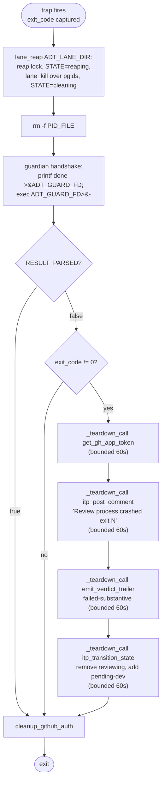

# Review-Agent Wrapper Flow

The review-agent wrapper is `skills/autonomous-dispatcher/scripts/autonomous-review.sh`. The dispatcher launches it via `dispatch-local.sh review <issue>`. The wrapper finds the PR linked to the issue, runs the underlying agent against it, parses the agent's verdict from issue comments, and either approves+merges (PASS) or submits `--request-changes` and sends the issue back to dev (FAIL). The **wrapper** owns the GitHub-native PR review/merge action on BOTH sides — `--approve`/`gh pr merge` on PASS and `--request-changes` on a substantive FAIL — while the review **agent** posts a verdict comment only and never runs `gh pr review`/`gh pr merge` itself ([INV-52](invariants.md#inv-52-the-review-wrapper-owns-the-github-native-pr-reviewmerge-action-the-agent-posts-verdicts-only)).

The wrapper is the **producer** for two of the five [handoffs](handoffs.md) (review → approved/merged, review → pending-dev) and the **consumer** for one (dispatcher → review).

> **Code-Host Provider seam ([INV-87](invariants.md#inv-87-provider-dispatch-is-spec-defined--callers-route-every-issuecode-host-op-through-itp_chp_-never-a-raw-gh-in-the-caller-layer), #282).** The wrapper's PR-lifecycle leaves now route through the CHP verbs ([`provider-spec.md`](provider-spec.md) §3.2): the mergeable poll is `chp_mergeable` (returns the raw token; the [INV-44]/[INV-54] `_classify_mergeable_gate`/`_pr_open_gate` classifiers in `lib-review-mergeable.sh` are **byte-unchanged** caller-side and consume it), `--approve` is `chp_approve`, `--request-changes` (in `submit_request_changes`) is `chp_request_changes` (gated by the `rest_request_changes` cap §4.2), `gh pr merge` is `chp_merge`, and CI status (`ci_is_green`) is `chp_ci_status`. The PR↔issue resolution (`resolve_pr_for_issue`/`verify_pr_closes_issue`) routes through `chp_find_pr_for_issue` — under W1c1 (#397) an ABSTRACT positional contract `chp_find_pr_for_issue ISSUE FIELDS-CSV → normalized JSON candidate array` driven by `gh api graphql` cursor pagination (§3.2.1/§3.5); no gh flags cross the seam, and the [INV-86] two-tier close-linkage + branch-name resolution is pure jq over the normalized array in `lib-pr-linkage.sh`. **The PR-lifecycle leaves are byte-identical leaf-only moves; the W1c1 linkage-read leaf is a deliberate SHAPE change with decision-level parity** (see W1a/W1c1 amendments in [INV-87]): the [INV-52]/[INV-79] wrapper-owns-approve/merge ownership, the INV-44/INV-54 gate decision logic, and the UNKNOWN-retry loop all stay caller-side. (The diagram's `gh pr review`/`gh pr merge` arrows are these verbs' GitHub leaves.)
>
> **Issue-Tracker Provider seam ([INV-87](invariants.md#inv-87-provider-dispatch-is-spec-defined--callers-route-every-issuecode-host-op-through-itp_chp_-never-a-raw-gh-in-the-caller-layer)/[INV-90](invariants.md#inv-90-the-normalized-issue-comment-shape-is-id-author-body-createdat-sorted-ascending-by-createdat-with-author-a-machine-handle-for-exact-equality), #321).** The verdict-comment READ in the per-agent poll loop — `_fetch_agent_verdict_body` (`lib-review-poll.sh`), the **verdict-authenticity choke-point** — now routes through `itp_list_comments` (the normalized array), NOT a raw `gh issue view --json comments -q`. The [INV-20] (actor + window) and [INV-40] (per-agent `Review Agent:` discriminator) binding stays caller-side, BUT moving the verdict-keyword `select` from gh's Go-**RE2** (ASCII-only case fold) to system jq's **Oniguruma** (Unicode fold) is a real engine boundary, so the keyword match is rewritten to preserve RE2 parity + fail-CLOSED: `ascii_downcase | test("<lowercased _VERDICT_RE>")` with the `"i"` flag dropped (Oniguruma `"i"` would widen the literal ASCII keywords to also match U+212A `K` / U+017F `ſ` at the authenticity gate); the shell-side lowercase is `LC_ALL=C tr` not bash `${,,}` (Turkish-locale dotless-`ı` on the `I` in "Review FAILED"); a `// empty` so a no-match yields EMPTY not the literal `"null"`; and an `[[ -z "$_vre_lc" ]] && return 0` so an empty `_VERDICT_RE` fails CLOSED instead of `test("")` matching every body. The three case-SENSITIVE predicates (`Review Session` / `Review Session.*<sid>` / `Review Agent: <name>`) are byte-unchanged (RE2 ≡ Oniguruma — no `"i"`/boundary). A caller-side `sort_by(.createdAt // "", .id // 0) | last` makes a same-second verdict tie resolve deterministically on the monotone REST comment id. The seam is self-sourced LAZILY in-function (the wrapper sources `lib-review-poll.sh` before `lib-issue-provider.sh`, so a top-level guard would change production source order). Behavior-equivalent for every matrix case — proven by `tests/unit/test-final2-marker-scanners.sh`.
>
> The wrapper also honors two CHP **capability gates** (§4.2) — both no-ops on GitHub's `caps=1` defaults, live only on a degraded backend: when `chp_caps review_bots != 1` bot-review enforcement is disabled **end-to-end** — the effective `REVIEW_BOTS_VALIDATED` is blanked at the source, which suppresses the prompt's `render_bot_review_section` (and its Step-8 line), the trigger broker (`drain_agent_bot_triggers`), AND the wrapper-side mandatory-bot-review wait gate (a `review_bots=0` backend's `chp_trigger_bot` is a no-op, so a bot review can never arrive — telling the agent to trigger/wait, or waiting post-run, would fail/loop an otherwise-clean review); and when `chp_caps merge_closes_issue != 1` the merge success path transitions the issue after `chp_merge` (the merge does not auto-transition it) with a provider-gated 3-way: `itp_transition_state` when defined (downstream itp-writes), else `gh issue close` **only under `ISSUE_PROVIDER=github`**, else a loud ERROR (never a wrong GitHub close on a non-GitHub tracker). The dev side keeps such a PR discoverable by rendering a non-closing `Related to #N` (when `native_issue_pr_link=0`) instead of an empty body ref. The PR-create / bot-trigger brokers in `lib-auth.sh` route through `chp_create_pr` / `chp_trigger_bot` (leaf-only swap, [INV-87]).

The default model is Sonnet (vs Opus for dev) — review is checklist-driven and benefits less from the larger model, and using a different model class avoids quota contention with the more expensive dev sessions.

## Lifecycle

```mermaid
sequenceDiagram
    participant D as dispatch-local.sh
    participant W as autonomous-review.sh
    participant L as lib-agent.sh
    participant A as claude / codex / gemini / kiro / opencode
    participant GH as GitHub API

    D->>D: kill_stale_wrapper(PID_FILE)
    D->>W: nohup autonomous-review.sh --issue N
    W->>W: setup_github_auth
    W->>W: acquire_pid_guard(PID_FILE)
    W->>GH: find PR linked to issue (3 fallback methods)
    alt no PR found
        W->>GH: comment 'Review failed - no PR found'
        W->>GH: remove reviewing, add pending-dev
        W-->>D: exit 1
    end
    W->>GH: extract preview URL (if E2E_MODE=browser)
    opt REVIEW_SMOKE_ENABLED (Phase A.5, INV-64)
        W->>L: smoke_agent per REVIEW_AGENTS_LIST member (parallel)
        alt any member FAIL
            W->>GH: comment 'Review aborted: smoke FAILED' + emit trailer
            Note over W,GH: stays reviewing; RESULT_PARSED=true; exit 1 (self-heals next tick)
        else some/all UNAVAILABLE
            W->>W: drop UNAVAILABLE members (smoke: reason); all → all-unavailable
        end
    end
    W->>W: build review prompt (mergeability, drift, checklist, decision)
    W->>L: run_agent
    L->>A: printf '%s' PROMPT | claude --session-id ... --model sonnet -p
    A->>GH: post verdict comment ('Review PASSED' or 'Review findings')
    A-->>L: agent exits
    W->>GH: poll for verdict comment via itp_list_comments (6 attempts, 5s each, actor + window + trailer)
    W->>GH: post 'Reviewed HEAD' trailer (if verdict and SHA known)
    alt verdict PASS
        W->>GH: gh pr view --json state (re-check OPEN)
        W->>GH: gh pr review --approve
        opt no-auto-close NOT set
            W->>GH: gh pr merge --squash --delete-branch
            alt merge succeeded
                W->>GH: remove autonomous and reviewing, add approved
                Note over W,GH: GitHub auto-closes issue via 'Closes #N' (INV-33; wrapper does NOT call gh issue close)
            else merge failed (INV-33)
                W->>GH: gh pr comment 'Auto-merge failed: ... Re-dispatching dev'
                W->>GH: remove reviewing, add pending-dev (autonomous KEPT)
            end
        end
        opt no-auto-close set
            W->>GH: remove reviewing, add approved (autonomous KEPT)
        end
    else verdict FAIL or missing
        opt substantive FAIL (agent posted findings, or CONFLICTING gate)
            W->>GH: gh pr review --request-changes (INV-52; reviewDecision=CHANGES_REQUESTED; best-effort)
        end
        W->>GH: remove reviewing, add pending-dev
    end
    W->>W: rm -f PID_FILE and cleanup_github_auth
```

## Spawn, PID guard, auth

Same pattern as the dev wrapper — see [`dev-agent-flow.md`](dev-agent-flow.md#pid-guard-acquire_pid_guard-in-lib-agentsh) — including the atomic `flock`-based acquire ([INV-103](invariants.md#inv-103-acquire_pid_guard-acquires-the-per-issue-mode-start-slot-atomically--no-check-then-write-toctou-window), #360/302a: closes the TOCTOU window where two near-simultaneous review wrappers for the same issue could both pass the old check-then-write and both fan out) — except:

- **Lane registry mint** ([Lane-GC PR-2](dev-agent-flow.md#lane-registry-mint-lane-gc-pr-2-lib-lanesh-inv-109inv-110), [INV-109](invariants.md#inv-109-every-wrapper-run-mints-and-atomically-installs-a-durable-lane-registry-entry-before-spawning-any-background-child-including-token-daemons-and-heartbeat)): identical mechanism to the dev side (`lane_mint "$PROJECT_ID" review "$ISSUE_NUMBER"` — `role=review` instead of `dev`), also minted before the `GH_AUTH_MODE` branch below. `ADT_LANE_ID`/`ADT_LANE_DIR` are exported for the rest of this run — every fan-out subshell, smoke probe, and E2E lane below inherits them (see [Multi-agent fan-out](#multi-agent-fan-out-inv-40) and [Sequential E2E lane](#sequential-e2e-lane-inv-46) for the per-lane `ADT_LANE_ROLE` tagging and PGID recording specific to the review side).
- **Guardian sidecar** ([Lane-GC PR-5](dev-agent-flow.md#guardian-sidecar-lane-gc-pr-5-lib-guardiansh-inv-118), [INV-118](invariants.md#inv-118-each-lane-runs-a-setsid-detached-guardian-holding-the-read-end-of-guardfifo-the-wrappers-write-end-is-opened-before-the-guardian-ever-spawns-so-kernel-eof-on-any-death--including-sigkilloom--triggers-an-idempotent-lane-scoped-reap)): identical mechanism to the dev side — `mkfifo` → write-fd open → `setsid` prereq check → guardian spawn (closing its own inherited fd first) → `GUARDIAN_PID` recorded, immediately after the lane mint above. Every fan-out subshell and smoke probe closes its own inherited copy of `ADT_GUARD_FD` (see [Multi-agent fan-out](#multi-agent-fan-out-inv-40) and the smoke-probe subshell) — a forgotten close there degrades EOF from "wrapper died" to "that fan-out member died", never a false kill.
- PID file: `${PID_DIR}/review-<N>.pid` ([INV-01](invariants.md#inv-01-pid-file-naming)) — `${PID_DIR}` resolved by `lib-config.sh::pid_dir_for_project`.
- Auth: review-agent app mode uses `REVIEW_AGENT_APP_ID` / `REVIEW_AGENT_APP_PEM` (separate App identity from dev so reviewer comments are attributed correctly).
- **Two-token split ([INV-79])**: after `setup_github_auth`, the review wrapper calls `setup_agent_token` to mint the SCOPED token (`contents:write`, `issues:write`, `pull_requests:read`) for the review-agent subtree — identical to the dev side (see [dev-agent-flow § Two-token split](dev-agent-flow.md#two-token-split--the-agents-scrubbed-environment-inv-79)). Review agents only READ the PR and post issue/PR comments + the E2E report, so none need `pull_requests:write`; the wrapper's full-write token remains the sole approve/merge path ([INV-44](invariants.md#inv-44-the-wrapper-owns-the-mergeability-gate-merge-only-when-githubs-mergeable-true-not-the-agents-claim) / [INV-52](invariants.md#inv-52-a-substantive-fail-asserts-the-prs-github-native-state-not-just-a-comment)). `lib-agent.sh::_run_with_timeout` applies the same CLI-agnostic env scrub to every fan-out agent + the browser-E2E lane. `GH_USER_PAT` is scrubbed here too, so the mandatory `REVIEW_BOTS` trigger step is **brokered**: when scoping is armed, `render_bot_review_section` tells the agent to write the trigger phrase(s) to `$AGENT_BOT_TRIGGER_FILE` (instead of running `gh-as-user.sh`, which can't authenticate), and the wrapper posts them via `gh-as-user.sh` post-run (`drain_agent_bot_triggers`, in `cleanup`) — the next review tick then sees the bot's review present (#234 review [P1] 8e87de14). PAT mode → one-time WARN + no scrub + the direct `gh-as-user.sh` trigger.

## PR discovery — authoritative close linkage ([INV-86](invariants.md#inv-86-prissue-binding-is-authoritative-via-closingissuesreferences-never-a-bare-n-body-mention-and-no-pr-is-mutated-without-verified-linkage))

The wrapper binds the issue to the open PR that **closes** it via the shared `resolve_pr_for_issue` ([`lib-pr-linkage.sh`](../../skills/autonomous-dispatcher/scripts/lib-pr-linkage.sh)) — GitHub's parsed close linkage, NOT a `#N` body mention:

1. **Close linkage (authoritative)**: `chp_find_pr_for_issue $issue $fields` (W1c1, #397) returns a normalized JSON candidate array; the caller selects the PR whose `closingIssueNumbers` (int-array flattened from GitHub's `closingIssuesReferences.nodes[].number`) contains the issue via `contains([N])` (lowest PR number on ties).
2. **Branch-name fallback**: only when no PR carries close linkage — the PR whose `headRefName` matches the boundary-anchored `issue-<N>` marker (lowest PR number on ties). Serves close-keyword-less partial-fix PRs. **Never** a bare `.[0]` body mention.

> **Pre-#277 the wrapper used three loose fallbacks** — Method 1 `select(.body | test("#N"))] | .[0]`, Method 2 a `(?:PR|pull)[/ #]*<digits>` comment scrape, Method 3 `gh pr list --search "issue N"`. All keyed on a bare `#N` **mention**, so a sibling PR whose body cross-referenced this issue (a good-practice `related to #N` line) could be selected, reviewed, and **mutated** (a `REQUEST_CHANGES` against a foreign PR) — the [INV-86](invariants.md#inv-86-prissue-binding-is-authoritative-via-closingissuesreferences-never-a-bare-n-body-mention-and-no-pr-is-mutated-without-verified-linkage) loop driver. They are removed; the same resolver also backs the dispatcher's `lib-dispatch.sh::fetch_pr_for_issue`.

**Hard linkage guard before any PR mutation**: after resolving `PR_NUMBER`, the wrapper asserts `verify_pr_closes_issue "$PR_NUMBER" "$ISSUE_NUMBER"` before handing the PR to the review / `submit_request_changes` / `--approve` / `gh pr merge` / label-flip path. A foreign / unlinked PR is refused (diagnostic + no GitHub review action against it).

If discovery yields no PR **or** the linkage guard fails → comment "Review failed: no PR found linked to this issue …" → `emit_verdict_trailer … failed-non-substantive no-pr-found` → `−reviewing +pending-dev` → exit 1.

This is one of the legitimate ways the wrapper can transition to `pending-dev` even though the agent never ran. The dispatcher's Step 4a retry counter does NOT count this as a dev-failure — only `Agent Session Report (Dev)` comments and the dispatcher's own crash regex feed the counter.

## E2E mode dispatch (issue #161)

The review wrapper supports three E2E modes via `E2E_MODE` in `autonomous.conf`:

| `E2E_MODE` | Activates when | Prompt block |
|---|---|---|
| `none` (default when unset) | always — no E2E section in the prompt | (none) |
| `browser` | project explicitly opts in | Chrome DevTools MCP UI smoke test (existing) |
| `command` | project explicitly opts in | Project-supplied verify command (new) |

**Fail-loud at startup**: `E2E_ENABLED=true` with `E2E_MODE` unset exits the wrapper non-zero. Projects must opt into a specific mode rather than implicitly inheriting `browser`. This catches the most common upgrade footgun (existing projects had only `E2E_ENABLED`).

The wrapper internally derives `E2E_ACTIVE` (true when mode is `browser` or `command`); downstream prompt language gates off this flag rather than `E2E_ENABLED`.

### Preview URL extraction (browser mode only)

Only relevant when `E2E_MODE=browser` AND `E2E_PREVIEW_URL_PATTERN` is configured. The wrapper builds a URL from the pattern (replacing `{N}` with the PR number) and also scans PR comments for the most recent comment containing "Preview" + an `https://` URL. Comment-extracted URL takes priority (it's specific to the actual deploy).

If browser-mode E2E is enabled but preview URL extraction yields nothing, the agent's review prompt receives `Preview URL: NOT_FOUND`, and the agent is instructed to FAIL the review with "E2E verification failed: PR preview URL not found."

### Command rendering (command mode only)

In `command` mode the wrapper substitutes the literal `${PR_NUMBER}` placeholder in `E2E_COMMAND`, `E2E_COMMAND_PRE_HOOKS`, and `E2E_COMMAND_EVIDENCE_PARSER` with the resolved PR number before pasting them into the prompt. Operators MUST single-quote those assignments in `autonomous.conf` so the shell does not eagerly expand `${PR_NUMBER}` when sourcing the conf file. Unbraced `$PR_NUMBER` is rejected at config-validation time (would silently render as empty since the var is exported only inside the command-mode block, after substitution).

The wrapper exports `PR_NUMBER` and `PR_HEAD_SHA` into the lane process's environment when `E2E_MODE=command`. The project's evidence parser reads `PR_HEAD_SHA` from env to embed in the evidence-block marker.

**Since #182 ([INV-46](invariants.md#inv-46-e2e-runs-once-in-a-dedicated-lane-before-the-review-fan-out--gated-not-per-agent)) the E2E runs in a dedicated WRAPPER lane, ONCE, before the review fan-out — NOT in each review agent's prompt.** The exit-code semantics (0 → parser; 124 → parser on partial, recover-or-fail; other → skip parser + log-tail), the SHA-bound evidence marker, and the stale-evidence skip are unchanged, but they now execute in `lib-review-e2e.sh::_run_command_e2e_lane` (shell) / the one browser lane (LLM), not in N review-agent prompts. See [Sequential E2E lane (INV-46)](#sequential-e2e-lane-inv-46) below for the full lane + gate flow.

For the project-side contract (`E2E_COMMAND` semantics, evidence-block format, parser PR_HEAD_SHA usage), see `skills/autonomous-review/references/e2e-command-mode.md`.

> **Wait/stall budgets must fit the E2E ([INV-43](invariants.md#inv-43-command-mode-e2e-review-wait-budgets-must-not-be-smaller-than-the-e2e-they-dispatched), #172).** A command-mode E2E can take far longer than the legacy 30 s verdict-poll window or the 300 s dispatcher stall window. Post-#182 the E2E runs once in the wrapper lane (not per agent), so the per-agent verdict-poll window now only spans the residual code-review verdict wait — but the operator MUST still set `REVIEW_NEAR_SUCCESS_WINDOW_SECONDS` ≥ `E2E_COMMAND_TIMEOUT_SECONDS` because the lane runs **synchronously inside the wrapper** before the fan-out, so the dispatcher's [INV-24](invariants.md#inv-24-review-wrapper-dead-detection-requires-both-pid_alive-miss-and-no-near-success-pr-signal) crash check must not SIGTERM the still-working wrapper mid-E2E. The verdict-poll budget still auto-scales (`lib-review-poll.sh::_resolve_verdict_poll_attempts`) as belt-and-suspenders. After verdict resolution the wrapper reaps any lingering fan-out agent process group AND the E2E lane's process group so neither outlives the round — hardened by [INV-104](invariants.md#inv-104-the-inv-43-fan-out-reap-also-sweeps-recorded-descendants-that-re-parented-out-of-the-agents-process-group) (#360/302a) with an additional best-effort sweep for a fan-out child that re-parented out of that process group (e.g. it called `setsid` itself) via a marker env var recorded at spawn time.

## Sequential E2E lane (INV-46)

When `E2E_MODE` is active (`browser` or `command`), the wrapper runs the project E2E **exactly once per review round** in a dedicated lane that completes **before** the review fan-out, then gates on the result. This replaces the pre-#182 design where the E2E execution block was injected into every review agent's prompt — so `AGENT_REVIEW_AGENTS` with N CLIs ran the full E2E N times (N× `E2E_COMMAND_PRE_HOOKS` container builds, N× verify, N× evidence, racing on shared stage state). See [INV-46](invariants.md#inv-46-e2e-runs-once-in-a-dedicated-lane-before-the-review-fan-out--gated-not-per-agent).

```
E2E_ACTIVE == true:
  PHASE A — run the E2E lane ONCE, to completion:
    command mode → _run_command_e2e_lane (lib-review-e2e.sh): a PURE SHELL subshell
        (no run_agent, token-free). Idempotency: reuse a SHA-matching evidence
        comment if present. Else pre-hooks → verify (under setsid + timeout
        --kill-after, PGID captured in _E2E_LANE_PGID) → parser → post evidence.
        Each step guarded `|| rc=$?` so set -e can't skip the .rc sidecar.
        INV-49: also extracts the OPTIONAL structured AC-coverage artifact from the
        evidence (fence ac-coverage:begin/end, jq-validated, fail-safe) → the
        per-round sidecar E2E_AC_COVERAGE_FILE for the fan-out's deterministic check.
    browser mode → ONE LLM lane (run_agent against build_browser_e2e_prompt). The
        LLM WRITES its `## E2E Verification Report` to $E2E_REPORT_FILE (the INV-79
        broker); the WRAPPER posts it (_post_brokered_e2e_report) then stamps the
        SHA marker ONTO that report (_stamp_browser_evidence_marker, REST PATCH)
        after a clean exit. The LLM ALSO posts directly as a fallback (issues:write
        retained). No report to stamp → fail closed (rc forced non-zero).
  E2E HARD GATE — _classify_e2e_gate <lane_rc> <evidence_present>:
    (a) lane .rc == 0  AND
    (b) re-fetch (_fetch_sha_evidence, bounded retry) finds a SHA-matching
        evidence comment for the captured PR_HEAD_SHA
    → pass | fail | block-nonsubstantive
  gate in {fail, block-nonsubstantive} → PR-OPEN GUARD FIRST (INV-54 ext, #195):
                                 E2E_PR_STATE = gh pr view --json state
                                 if _pr_open_gate "$E2E_PR_STATE" == "skip":
                                   # merged/closed WHILE the E2E lane ran
                                   −reviewing (NO +pending-dev) ; exit 0
  gate == fail                 → SAME-HEAD BREAKER CHECK FIRST (INV-122, #453):
                                 (head_sha, e2e_lane_rc) fingerprint count >=
                                 GATE_FAIL_STALL_THRESHOLD (default 2) AND not
                                 already stalled (NO may_stall_now — see below) →
                                   −reviewing +stalled ; ONE report ; exit 0
                                 else → [BLOCKING] E2E finding + failed-substantive
                                 + submit_request_changes (INV-52, best-effort)
                                 + −reviewing +pending-dev ; exit 0  (NO fan-out)
  gate == block-nonsubstantive → "Review held" + failed-non-substantive
                                 cause=e2e-evidence-missing + −reviewing
                                 +pending-dev ; exit 0  (re-queue, NO fan-out,
                                 NO request-changes — transient)
  gate == pass                 → PHASE B (review fan-out below)
E2E_ACTIVE == false → no lane, no gate (E2E_GATE=inactive); straight to fan-out.
```

- **command-mode lane is shell, not an LLM.** `_run_command_e2e_lane` runs entirely in the wrapper shell — no `run_agent`, no tokens. The verify command runs under `setsid` + `timeout --kill-after=30s --signal=TERM ${E2E_COMMAND_TIMEOUT_SECONDS}` so its subtree is reapable ([INV-23](invariants.md#inv-23-pid_file-points-at-a-process-whose-death-reaps-the-entire-agent-subtree)); the lane's PGID is added to `_reap_fanout_processes`'s arg list alongside the fan-out agents'.
- **browser-mode is ONE LLM lane**, not replicated across review agents. **Report broker ([INV-79]):** the LLM WRITES the report to `$E2E_REPORT_FILE` and the wrapper posts it (`_post_brokered_e2e_report`) — matching the verdict-artifact broker direction so report DELIVERY does not depend on the agent's own write capability under the scoped token (the agent's direct post is a retained fallback via `issues:write`). Before posting, the broker DEDUPS against the review window: its `_existing` in-window `## E2E Verification Report` count now routes through `itp_list_comments "$PR_NUMBER"` ([INV-87](invariants.md#inv-87-provider-dispatch-is-spec-defined--callers-route-every-issuecode-host-op-through-itp_chp_-never-a-raw-gh-in-the-caller-layer)/[INV-90](invariants.md#inv-90-the-normalized-issue-comment-shape-is-id-author-body-createdat-sorted-ascending-by-createdat-with-author-a-machine-handle-for-exact-equality), #333) rather than a raw `gh api .../issues/<PR>/comments`; the caller-side `select((.createdAt >= "$WRAPPER_START_TS") and (.body | contains("## E2E Verification Report")))|length` is a literal `contains`/`>=` test (no `test()`/regex, so no RE2→Oniguruma divergence — the #319/#321 lesson) and the retained `| tail -n1` is a zero-cost defensive collapse against a future re-paginating provider. The wrapper then stamps `<!-- e2e-evidence: complete sha="${PR_HEAD_SHA}" -->` **onto the `## E2E Verification Report` comment** (`_stamp_browser_evidence_marker`, REST `PATCH`, idempotent) so the gate anchor is deterministic without the LLM transcribing the SHA — and so the gate's evidence-present signal + the review agents' evidence-read both resolve to the REAL report, not a marker-only comment. A clean exit with NO stampable report comment fails the gate closed (rc forced non-zero) — a marker-only comment can never satisfy the gate. **Since #345** (#296 deferred), `_stamp_browser_evidence_marker`'s id-lookup + body-fetch also route through `itp_list_comments "$PR_NUMBER"` — ONE call replaces the former raw GET-comment-id (`gh api …/issues/<PR>/comments --paginate --jq … | last | .id`) plus a second raw GET-body-by-id (`gh api …/issues/comments/<id> --jq .body`). The caller-side select re-expresses the author/time/marker predicates over the normalized fields (`.author`, `.createdAt`) and picks the newest match via `sort_by(.createdAt // "", .id // 0) | last` (the #321 verdict-poll tie-break); the selected element's `.body` serves both the id and the body, so the second GET is redundant and dropped. This retires the former [INV-46] carve-out that kept these two reads raw ("out of #333's scope").
- **The gate is a mechanical dual-signal**, fail-closed: a crash between parser-ok and comment-post (`rc=0` but no SHA-matching evidence) routes `block-nonsubstantive` (transient re-queue), not a dev bounce; a real verify failure (`rc≠0`) routes `fail` (substantive). A `rc≠0`-with-stale-present-evidence does NOT pass.
- **Evidence-freshness pre-check on a new HEAD (issue #449, R3).** Same-HEAD reuse (`_fetch_sha_evidence` + the lane's own reuse block) already works for a repeat check against an UNCHANGED head. The gap this closes: after a NEW head, the lane runs clean (`rc==0`) but a SHA-matching evidence comment is not yet visible on re-fetch — purely a GitHub propagation lag on the comment the lane itself JUST posted. `lib-review-e2e.sh::_e2e_ci_green_precheck <pr_num>` is consulted ONLY in that exact case (`rc==0` AND `evidence_present==0`, right before `_classify_e2e_gate` is called): when the PR's overall CI status (`chp_ci_status`, independent of this wrapper's own dedicated E2E lane) is already `green` for the current HEAD, the wrapper treats that as satisfying the evidence requirement (`evidence_present` is set to `1`) rather than routing to `block-nonsubstantive` and waiting for the comment to propagate. A `rc≠0` lane failure is UNTOUCHED — it always routes to `fail` regardless of CI status, so a red/pending CI never changes existing fail semantics. Design note: the dispatcher-side `ci_is_green` (`lib-dispatch.sh`) is NOT reused — `autonomous-review.sh` does not source `lib-dispatch.sh` (no precedent for cross-sourcing dispatcher logic into the review wrapper, mirroring [INV-122]'s own deliberate non-reuse of `may_stall_now`); `_e2e_ci_green_precheck` is a review-wrapper-local equivalent calling the SAME already-sourced `chp_ci_status` primitive directly.
- **Same-HEAD circuit breaker on repeated `gate == fail` ([INV-122](invariants.md#inv-122-a-same-head-repeated-e2e-gate-failure-an-inv-46-fail-verdict-against-an-unchanged-head_sha-e2e_lane_rc-fingerprint-gate_fail_stall_threshold-consecutive-rounds-is-detected-and-halted--the-breaker-transitions-reviewing--stalled-then-posts-one-structured-reasonsame-head-gate-failure-report-gated-on-an-already-stalled-skip-deliberately-not-the-dispatcher-side-may_stall_now-live-pid-pre-gate--see-rationale-below), #453).** Runs INSIDE the `gate == fail` branch, BEFORE the existing `pending-dev` routing. A REPEATED `fail` against an UNCHANGED `(head_sha, e2e_lane_rc)` fingerprint (≥`GATE_FAIL_STALL_THRESHOLD`, default 2) transitions `reviewing → stalled` instead of re-queuing — the fixed-point-repetition sibling of [INV-105]'s divergent-findings convergence breaker, for the case where the E2E gate itself never lets a review agent run at all. State is a `dispatcher-gate-fail-breaker` HTML-comment marker (unbounded full-history scan); the fingerprint resets on either a new commit OR a different `rc` on the same head, so an unrelated transient failure followed by a genuinely new bug never misclassifies as a stuck loop. **Deliberately does NOT call `may_stall_now`** (codex review round 2 [P1]): that shared INV-105 predicate's dispatch-marker-freshness check exists for the DISPATCHER to ask whether some EXTERNAL process might still be alive for this issue before mutating labels from outside; this breaker instead runs synchronously inside the very review wrapper the dispatcher just launched, so it would always see its own fresh `review`-mode dispatch marker and defer for the marker's full TTL (default 600s) — silently defeating the breaker for any E2E failure completing within that window, the common case. The `reviewing`-label single-writer invariant already provides the liveness guarantee `may_stall_now` exists to add.
- **Review agents are PURE code reviewers.** `build_review_prompt` no longer contains any E2E execution block; the prompt tells each agent to READ the wrapper-posted evidence comment as input and cross-check it against the acceptance criteria. They do not run E2E.
- **Structured AC-coverage double-check ([INV-49](invariants.md#inv-49-command-mode-e2e-may-feed-the-review-fan-out-a-structured-ac-coverage-artifact--optional-fail-safe), #183).** Command-mode only: when the evidence parser emits the optional `ac-coverage:begin … ac-coverage:end` JSON fence, the lane jq-validates it (fail-safe — malformed → empty, fall back to free-form; never fail-open) and writes it to `E2E_AC_COVERAGE_FILE`. When that per-round sidecar is non-empty, `build_review_prompt` PREFERS the deterministic map over LLM-parsing the free-form markdown table; an empty/absent sidecar yields the exact post-#182 free-form double-check. The artifact is a review aid only — the E2E hard gate is unchanged.
- **Composition**: `final PASS ≡ (E2E_ACTIVE==false OR gate==pass) AND review-unanimity-pass`. Because a gate fail/block exits before the fan-out, only `gate ∈ {pass, inactive}` ever reaches the review aggregation — the AND is enforced by the short-circuit. The E2E gate runs before the [INV-44](invariants.md#inv-44-mergeable-hard-gate--a-conflicting-pr-can-never-reach-approved) mergeable block.
- **PR-open guard on the block exits ([INV-54](invariants.md#inv-54-the-pr-still-open-guard-gates-all-pass-chain-exits-not-just-pass) extension, #195).** A `fail`/`block-nonsubstantive` gate re-checks `gh pr view --json state` (via the reused `_pr_open_gate` helper) before writing `−reviewing +pending-dev`; if the PR was merged/closed WHILE the lane ran, it removes `reviewing` only and exits — never re-queues a merged PR's issue to `pending-dev`. The check is wedged after `_classify_e2e_gate` and before the block cascade, so the `pass`/`inactive` fall-through is unaffected. See [§ PR-open guard (INV-54)](#pr-open-guard-inv-54).
- **Lane registry tagging ([Lane-GC PR-2](dev-agent-flow.md#lane-registry-mint-lane-gc-pr-2-lib-lanesh-inv-109inv-110), [INV-110](invariants.md#inv-110-adt_lane_id-is-exported-before-any-child-spawn-and-every-_run_with_timeout-spawn-appends-its-pgid-to-the-durable-registry)):** the command-mode lane's `_run_command_e2e_verify` records its own PGID into `${ADT_LANE_DIR}/pgids` directly (it bypasses `_run_with_timeout`, being a pure shell subshell). The browser-mode lane exports `ADT_LANE_ROLE=e2e:browser` before its `run_agent` call (PGID recorded via the shared `_run_with_timeout` chokepoint) and redirects `TMPDIR` to `${ADT_LANE_DIR}/tmp` before launch — Chrome's `--user-data-dir` (which defaults under `$TMPDIR`) then carries a lane-unique path, recorded as `CHROME_PROFILE_HINT` in the lane file, since Chrome mains clobber their own environ post-launch and cannot otherwise be env-tag-matched.

## Pre-fan-out agent-smoke gate (Phase A.5, INV-64)

When `REVIEW_SMOKE_ENABLED=true`, the wrapper runs a **pre-fan-out agent-smoke gate** in a dedicated Phase A.5 — AFTER the [INV-46](invariants.md#inv-46-e2e-runs-once-in-a-dedicated-lane-before-the-review-fan-out--gated-not-per-agent) E2E lane (Phase A) and BEFORE the review fan-out (Phase B). It smokes EVERY `REVIEW_AGENTS_LIST` member via [INV-63](invariants.md#inv-63-agent-smoke-is-a-three-state-probe-pass--unavailable--fail-run-through-the-production-run_agent-never-a-parallel-invocation-path)'s `lib-agent-smoke.sh::smoke_agent` and applies three-state semantics. Default OFF — opt in per project; with it off the wrapper is byte-for-byte unchanged. See [INV-64](invariants.md#inv-64-the-review-wrapper-smokes-every-fan-out-member-before-the-fan-out-phase-a5-fail-aborts-the-review-unavailable-drops-the-member-pass-proceeds).

```
        E2E gate == pass (Phase A) ──┐
                                     ▼
   Phase A.5: smoke each REVIEW_AGENTS_LIST member IN PARALLEL
   (resolved per-agent model [INV-41] + INV-38/INV-42 launcher;
    collected-PID wait, never bare wait — #167-class hang)
                                     │
   ┌─────────────────────┬──────────┴───────────────┬───────────────────────┐
   │ any member FAIL      │ some/all UNAVAILABLE       │ all PASS              │
   │ (smoke rc 1:         │ (smoke rc 2: quota/        │ (smoke rc 0)          │
   │  auth/config/launch  │  capacity, bare timeout,   │                       │
   │  — NOT a bare        │  OR a bare no-response     │                       │
   │  no-response, which  │  that stayed no-response   │                       │
   │  retries-once first) │  after one retry)          │                       │
   ▼                      ▼                            ▼                       │
 ABORT review:          drop UNAVAILABLE members      fan out all members     │
 post naming comment    (drop reason `smoke: …`,                              │
 + SMOKE evidence;      INV-40 unavailable tolerance);                        │
 emit failed-non-       remaining members fan out;                            │
 substantive trailer    ALL unavailable → list                               │
 (cause smoke-config-   UNCHANGED, falls through to                          │
 error); RESULT_PARSED  the INV-40 all-unavailable                            │
 =true (crash trap not  terminal state                                       │
 overriding); stays                                                          │
 `reviewing`; exit 1                                                         │
```

- **FAIL = config error, not a PR defect.** A smoke FAIL (wrong model id / expired auth / region drift / a launcher that does not fit the CLI — i.e. an **auth/config scraper signal**) aborts the whole review: no fan-out, no verdict, the issue stays `reviewing`, and the wrapper exits non-zero after posting a comment naming the failed agent(s) + their `SMOKE …` evidence. It does NOT flip to `pending-dev` (that would send dev chasing a non-existent PR problem) and does NOT shrink the vote (that would disguise the config error as a quota wall). It sets `RESULT_PARSED=true` so the crash EXIT trap does not override the stay-`reviewing` decision, and emits a `failed-non-substantive` trailer (cause `smoke-config-error`) — a heartbeat-consistent exit so [INV-24](invariants.md#inv-24-review-wrapper-dead-detection-requires-both-pid_alive-miss-and-no-near-success-pr-signal) does not false-DEAD mid-abort. The dispatcher re-runs the review on the next tick → self-heals once the operator fixes the config. **A bare smoke timeout (rc 124/137 with no auth/config signal) is NOT a FAIL** — it is UNAVAILABLE per [INV-67](invariants.md#inv-67-a-bare-smoke-timeout-rc-124137-with-no-authconfig-signal-classifies-unavailable-not-fail) (a Bedrock slow-start / capacity blip); only a timeout that ALSO carries an auth/config scraper signal aborts. **A bare `no-response` (rc≠0, nonce absent, no scraper signal) is ALSO no longer a single-shot FAIL** — `smoke_agent` retries it once and, only if it stays no-response after the retry, drops it UNAVAILABLE per [INV-76](invariants.md#inv-76-a-transient-smoke-no-response-rc0-no-signal-retries-once-then-drops-unavailable--never-a-single-shot-gate-fail) (a transient infra hiccup); a retry that exposes a genuine auth/config signal still aborts. The retry is keyed on a **non-zero** exit: a `rc=0` silent-success `no-response` (the CLI exited 0 but produced no token — genuine broken-output, not a transient) stays a single-shot gate-worthy FAIL with no retry (issue #257 follow-up).
- **UNAVAILABLE = quota/capacity (or a bare timeout, or a retried no-response), fine to drop.** An UNAVAILABLE member is removed from the fan-out set with a `smoke: <reason>` breadcrumb (the same INV-40 `unavailable` tolerance); the rest fan out and vote. UNAVAILABLE includes a **bare smoke timeout** (rc 124/137 with no auth/config signal — [INV-67](invariants.md#inv-67-a-bare-smoke-timeout-rc-124137-with-no-authconfig-signal-classifies-unavailable-not-fail), #246) AND a **bare `no-response` that stays no-response after one retry** ([INV-76](invariants.md#inv-76-a-transient-smoke-no-response-rc0-no-signal-retries-once-then-drops-unavailable--never-a-single-shot-gate-fail), #257): a single slow / transiently-dead Bedrock member is dropped and the review proceeds on the survivors instead of the prior FAIL that aborted everything. ALL members UNAVAILABLE (incl. via the timeout / retried-no-response paths) → the list is left UNCHANGED and falls through to the existing INV-40 all-unavailable terminal state (no empty fan-out spawned). A single-agent project whose one member is UNAVAILABLE reaches this same state; a single-agent FAIL aborts as above.
- **Same launch path as the fan-out.** The smoke resolves each member's model (`_resolve_review_agent_model`, INV-41) and applies the INV-38/INV-42 launcher treatment — identical to the fan-out subshell — so a smoke PASS certifies the same `(CLI, model, launcher)` tuple the fan-out runs.
- **Strictly before the fan-out clock.** Phase A.5 posts no verdict comment, so it counts toward neither the INV-40 verdict-attribution window nor the verdict-poll window. Cost when enabled: N small LLM calls + up to ~`REVIEW_SMOKE_TIMEOUT_SECONDS` wall-clock (parallel, slowest member).
- **Lane registry tagging ([Lane-GC PR-2](dev-agent-flow.md#lane-registry-mint-lane-gc-pr-2-lib-lanesh-inv-109inv-110), [INV-110](invariants.md#inv-110-adt_lane_id-is-exported-before-any-child-spawn-and-every-_run_with_timeout-spawn-appends-its-pgid-to-the-durable-registry)):** each smoke subshell exports `ADT_LANE_ROLE=smoke:<agent>` before its `run_agent` call — a smoke probe previously carried NO lane marker at all; `ADT_LANE_ID`/`ADT_LANE_DIR` are already inherited from the wrapper's top-level export, so this is diagnostic-only (distinguishes a smoke's `pgids`-file entry from a real fan-out member's).

## Per-side review timeout (INV-48)

The review side has its OWN wall-clock cap, separate from the shared 4h `AGENT_TIMEOUT` ([INV-13](invariants.md#inv-13-wall-clock-cap-on-agent-invocations)). In the per-side override block (next to the [INV-37](invariants.md#inv-37-per-side-agent_cmd-precedence) `AGENT_CMD` and [INV-38](invariants.md#inv-38-per-side-agent_launcher-precedence) `AGENT_LAUNCHER_ARGV` rebinds, AFTER `source lib-auth.sh`), the wrapper:

```bash
_ORIG_AGENT_TIMEOUT="$AGENT_TIMEOUT"                          # the conf 4h (INV-13)
AGENT_TIMEOUT="${AGENT_REVIEW_TIMEOUT:-1h}"                   # review cap, 1h literal default
E2E_BROWSER_TIMEOUT_SECONDS="${E2E_BROWSER_TIMEOUT_SECONDS:-$_ORIG_AGENT_TIMEOUT}"  # browser-E2E keeps 4h
```

Because `_run_with_timeout` reads the LIVE `AGENT_TIMEOUT` at call time, this rebind caps every review fan-out agent at the review timeout — with no change to `lib-agent.sh`. The **dev wrapper is untouched** (keeps 4h); it never reads `AGENT_REVIEW_TIMEOUT`. See [INV-48](invariants.md#inv-48-per-side-review-wall-clock-timeout-agent_review_timeout-1h-default-with-browser-e2e-exclusion-and-timeout-veto). Three safety rails make the aggressive 1h cap safe:

- **Browser-E2E exclusion.** The browser-mode E2E lane ([INV-46](invariants.md#inv-46-e2e-runs-once-in-a-dedicated-lane-before-the-review-fan-out--gated-not-per-agent) Phase A) is an LLM `run_agent` lane that would otherwise inherit the 1h cap; it runs under a LOCAL `AGENT_TIMEOUT="$E2E_BROWSER_TIMEOUT_SECONDS"` rebind inside its existing subshell (naturally scoped; the parent's review cap is unchanged for the fan-out), defaulting to the original 4h so a slow preview deploy is not killed at 1h. Command-mode E2E already runs its verify under `timeout … ${E2E_COMMAND_TIMEOUT_SECONDS}` and is unaffected.
- **Timeout-veto.** A fan-out agent killed BY the cap (CLI exit `124`/`137`) with no posted verdict is classified `timed-out` and counted as a deciding FAIL ([INV-40](invariants.md#inv-40-multi-agent-review-attribution-unanimous-aggregation-and-all-unavailable-fallback) amendment) — it VETOES the merge instead of being silently dropped as `unavailable`. See [Aggregation](#aggregation-unanimous-pass) below.
- **Startup validation.** `validate_review_timeout_config` rejects non-`timeout`-unit and `0` values for `AGENT_REVIEW_TIMEOUT` / `E2E_BROWSER_TIMEOUT_SECONDS` (fail-loud, mirrors `validate_e2e_config`); a startup `log` line reports the resolved review cap, browser-E2E cap, and the unaffected dev cap.

## Multi-agent fan-out (INV-40)

By default the wrapper runs exactly ONE verdict-reaching agent (`AGENT_REVIEW_CMD`, the per-side review CLI). Setting `AGENT_REVIEW_AGENTS` to a space-separated list (e.g. `"agy kiro"`) makes the wrapper run all listed agents **in parallel against the same PR** and gate the merge on their **unanimous agreement** ([INV-40](invariants.md#inv-40-multi-agent-review-attribution-unanimous-aggregation-and-all-unavailable-fallback)). The fan-out is entirely internal to the wrapper: the dispatcher, the single `review-${N}.pid` file, and the `reviewing` label are unchanged.

> **Distinct from `REVIEW_BOTS`.** `REVIEW_BOTS` (`/q review`, `/codex review`) triggers *external GitHub bots* whose review comments are read as **input** by the verdict agent(s). `AGENT_REVIEW_AGENTS` runs N *independent verdict-reaching* agents — each reaches its own approve/pushback decision, and the wrapper aggregates them.

### Agent-list resolution

`REVIEW_AGENTS_LIST` resolves once at startup:
- `AGENT_REVIEW_AGENTS` non-empty → the word-split list (`agy kiro` → `(agy kiro)`).
- empty/unset → `("$AGENT_CMD")` — exactly one element equal to the already-rebound `$AGENT_REVIEW_CMD` ([INV-37](invariants.md#inv-37-per-side-agent_cmd-precedence)). This is the N=1 backward-compatible default; everything below collapses to the legacy single-agent behavior.

### Fan-out

One backgrounded subshell per agent. Each subshell:
- overrides `AGENT_CMD="$agent"` locally so `run_agent` dispatches to THAT CLI;
- mints its OWN `SESSION_ID` (`uuidgen`) — distinct per agent so verdict comments don't collapse under a shared GitHub identity;
- **resolves its OWN launcher** ([INV-42](invariants.md#inv-42-per-agent-review-launcher-resolution), #173) via `lib-review-resolve.sh::_resolve_review_agent_launcher "$agent"` (looks up `AGENT_REVIEW_LAUNCHER_<SUFFIX>`, same suffix transform): if a per-agent key is set, the value is `eval`-tokenized into `AGENT_LAUNCHER_ARGV` and the [INV-38](invariants.md#inv-38-per-side-agent_launcher-precedence) claude-only guard is **bypassed for this agent** (the operator asserted the launcher fits this CLI; a tokenize failure logs an ERROR and runs naked). If NO per-agent key is set, the launcher is neutralized (`AGENT_LAUNCHER_ARGV=()`) for non-`claude` members ([INV-38](invariants.md#inv-38-per-side-agent_launcher-precedence): a claude-only `cc` bridge must not wrap a non-claude CLI) while a `claude` member keeps the shared `AGENT_REVIEW_LAUNCHER`. The resolver deliberately does NOT fall back to the shared launcher — see INV-42. This is the escape valve that lets a fleet add a third reviewer like `codex` whose headless launch needs a per-machine bridge (the same `bash -c 'source ~/.bash_aliases && codex "$@"' --` shape as the `cc` claude launcher);
- `unset AGENT_PID_FILE` so the per-agent `run_agent` does NOT rewrite the wrapper's single `review-${N}.pid` (the wrapper owns that file; the dispatcher's liveness model depends on it);
- **resolves its OWN model + extra-args** ([INV-41](invariants.md#inv-41-per-agent-review-model--extra-args-resolution), #168) via `lib-review-resolve.sh`: `_resolve_review_agent_model "$agent"` looks up `AGENT_REVIEW_MODEL_<SUFFIX>` (suffix = uppercased name, every char outside `[A-Z0-9]`→`_`) else the shared `AGENT_REVIEW_MODEL`, and the resolved value is passed to `run_agent` as `"${_agent_model:-sonnet}"`; `_resolve_review_agent_extra_args "$agent"` looks up `AGENT_REVIEW_EXTRA_ARGS_<SUFFIX>` else the shared `AGENT_REVIEW_EXTRA_ARGS`, resolved **once** into `_resolved_review_extra_args` and aliased onto **both** `AGENT_DEV_EXTRA_ARGS` (read by `run_agent`, turn 1; ALSO the var `lib-review-codex.sh::_codex_review_argv` reads for the `codex review` lane — [INV-62](invariants.md#inv-62-the-codex-review-lane-runs-the-codex-review-subcommand-auto-scoped-prompt-carried-gate-with-a-stdout-verdict-fallback)) **and** `AGENT_REVIEW_EXTRA_ARGS` (the var `resume_agent` reads), so the per-agent override reaches whichever launch path the CLI takes (#212). The dual alias is kept as belt-and-suspenders even though [INV-62](invariants.md#inv-62-the-codex-review-lane-runs-the-codex-review-subcommand-auto-scoped-prompt-carried-gate-with-a-stdout-verdict-fallback) retired the codex resume path (`codex review` is multi-step and never resumes): no review CLI resumes any more, so the `AGENT_REVIEW_EXTRA_ARGS` alias is harmless and guards any future resume caller. Both lookups are scoped to this subshell (the `AGENT_REVIEW_EXTRA_ARGS` write does not leak to the parent loop or a sibling agent). With no per-agent key set, both resolve to the shared values, so the model arg is identical to the legacy `${AGENT_REVIEW_MODEL:-sonnet}` and the N=1 path is byte-for-byte legacy. This lets a mixed `"kiro <claude-fam>"` fleet give kiro `claude-sonnet-4.6` and the claude-family agent `sonnet[1m]` — two model ids each CLI would reject if forced to share one;
- writes to its OWN log `/tmp/agent-${PROJECT_ID}-review-${N}-${agent}.log`;
- builds its prompt via `build_review_prompt "$agent" "$SESSION_ID"` and records its CLI exit code to a per-run sidecar (a subshell can't mutate the parent's variables);
- **dispatches via the right agent-launch path for its CLI**: a `codex` agent goes through `lib-review-codex.sh::_run_codex_review` (the `codex review` subcommand + bounded re-run, [INV-62](invariants.md#inv-62-the-codex-review-lane-runs-the-codex-review-subcommand-auto-scoped-prompt-carried-gate-with-a-stdout-verdict-fallback)); every other CLI calls `run_agent` directly — byte-for-byte the legacy invocation. See [codex review subcommand (INV-62)](#codex-review-subcommand-inv-62) below.
- **Lane registry tagging ([Lane-GC PR-2](dev-agent-flow.md#lane-registry-mint-lane-gc-pr-2-lib-lanesh-inv-109inv-110), [INV-110](invariants.md#inv-110-adt_lane_id-is-exported-before-any-child-spawn-and-every-_run_with_timeout-spawn-appends-its-pgid-to-the-durable-registry)):** each subshell exports `ADT_LANE_ROLE="fanout:${agent}"` right alongside the existing `ADT_FANOUT_LANE_MARKER` export ([INV-104](invariants.md#inv-104-the-inv-43-fan-out-reap-also-sweeps-recorded-descendants-that-re-parented-out-of-the-agents-process-group)). `ADT_LANE_ID`/`ADT_LANE_DIR` are already inherited from the wrapper's top-level export — `ADT_LANE_ROLE` only tags which spawner recorded a given `pgids`-file line; `_run_with_timeout` (`lib-agent.sh`) appends the PGID there via `lane_record_pgid` for every CLI branch uniformly.

The fan-out loop appends each subshell's PID (`$!`) to a `_fanout_pids` array and the wrapper joins with `wait "${_fanout_pids[@]}"` — the **collected PIDs only**. A bare `wait` is forbidden here: it would also block on the long-lived `gh-token-refresh-daemon` and the heartbeat `sleep` loop (neither exits), hanging the wrapper forever after the agents finish and stranding the issue in `reviewing`. See [INV-40](invariants.md#inv-40-multi-agent-review-attribution-unanimous-aggregation-and-all-unavailable-fallback) sub-rule 1.

### codex review subcommand (INV-62)

> **Location ([INV-75](invariants.md#inv-75-all-per-cli-behavior-lives-in-that-clis-adapter--inline-cli-conditionals-in-orchestration-code-are-a-defect), #232).** The entire codex review lane (`_run_codex_review`, `_codex_review_prepare_worktree` / `_cleanup_worktree`, `_codex_review_argv`, `_codex_review_classify_stdout` / `_compose_body`, the prompt-echo malformed guard, and the `_classify_codex_drop_reason` / `_codex_drop_reason_phrase` scrapers) now lives in **`adapters/codex.sh`**. `lib-review-codex.sh` is a thin compat shim that `source`s the adapter — every `lib-review-codex.sh::<fn>` reference below resolves through it unchanged, so the function names + contracts are byte-for-byte identical to pre-#232.

> **History.** Before [INV-62](invariants.md#inv-62-the-codex-review-lane-runs-the-codex-review-subcommand-auto-scoped-prompt-carried-gate-with-a-stdout-verdict-fallback) (#218) the codex review member ran `codex exec` (one agentic turn) + a JSONL-driven auto-resume loop ([INV-51](invariants.md#inv-51-codex-review-thread-auto-resumes-until-a-verdict-posting-turn)) + an inline-diff prompt ([INV-55](invariants.md#inv-55-the-codex-review-lane-receives-the-pr-diff-inline-in-its-prompt)) to coax that one turn into a verdict. That machinery was the root cause of a recurring bug class (#198 / #209 / #212). It is **all deleted** — moving to the purpose-built `codex review` subcommand removes the machinery and the bug class together.

`codex review "<prompt>"` is purpose-built for reviewing a PR: it is natively **multi-step** (it fetches and re-reads the diff across turns without a single-turn budget) and **auto-scopes** the diff against the **current working tree's** merge-base. So a `codex` fan-out member is dispatched through `lib-review-codex.sh::_run_codex_review` instead of a bare `run_agent` ([INV-62](invariants.md#inv-62-the-codex-review-lane-runs-the-codex-review-subcommand-auto-scoped-prompt-carried-gate-with-a-stdout-verdict-fallback)). The launch path:

1. **establishes the PR-branch context** (`_codex_review_prepare_worktree "$PR_BRANCH" <dest>`, #218 findings 3 + 1 + stale-ref): because `codex review` has no `--base`/PR-number flag and scopes against the **current checkout**, and the wrapper runs from `PROJECT_DIR` (kept on `main` by the dispatcher), the codex branch `git worktree add --detach`s the PR tip into a throwaway, session-id-keyed dir — then runs `codex review` FROM that worktree (a subshell `cd`, so the wrapper's cwd is untouched). This is the scoping the deleted INV-55 path got via `gh pr diff <PR_NUMBER>`. **Stale-proof tip resolution**: when an `origin` remote exists, the fetch is MANDATORY (`git fetch origin <branch>` MUST succeed) and the checkout commit is `FETCH_HEAD` (the tip fetched NOW) — NOT `origin/<branch>`, which the targeted fetch may leave stale absent a refspec; no `origin` → a local ref. The worktree is torn down (`_codex_review_cleanup_worktree`, rc-0-always) regardless of rc. **FAIL CLOSED (finding 1)**: if preparation fails (no `PR_BRANCH`, a fetch failure when a remote exists, or an add error), the wrapper does NOT run a vote-producing `codex review` from `PROJECT_DIR` — it skips the run and sets the `CODEX_REVIEW_NO_WORKTREE_RC` (70) sentinel rc so codex resolves `unavailable` (dropped, never a vote on a stale / `main`'s wrong / empty diff). (`_run_codex_review`'s own empty-workdir → degrade-to-cwd+warn path stays as a lib-level defense-in-depth fallback, but the wrapper gates the call behind `_cx_wt_ready` and never reaches it.);
2. **builds the argv** (`_codex_review_argv`): `review "<prompt>" -c 'model="<resolved-model>"' <extra-args>`. The model is `-c 'model="..."'` because `codex review` **rejects `-m`**; there is **no `--base`** (`[PROMPT]` is mutually exclusive with `--base`/`--commit`, and auto-scope is what we want) and **no `--json`** (`codex review` output is human-readable text, not a JSONL event stream). The `<extra-args>` are the [INV-41](invariants.md#inv-41-per-agent-review-model--extra-args-resolution) per-agent resolved value (read from `AGENT_DEV_EXTRA_ARGS`), so `AGENT_REVIEW_EXTRA_ARGS_CODEX` reaches the argv — #212 stays fixed without a resume path;
3. **runs `codex review` once** from the PR-branch worktree under the shared `_run_with_timeout` (so the launcher / setsid / PGID-sidecar / per-run wall-clock cap all match `run_agent`), capturing codex's **clean stdout** (stderr folded in) to a per-agent file keyed by session id;
4. **re-runs on a transient (non-timeout) failure** (no resume exists — each run re-reads the diff fresh, re-using the same PR-branch worktree). A non-zero, **non-timeout** exit (a transient `turn.failed` / SSE stream blip — #209) re-runs a fresh `codex review`, bounded by `CODEX_REVIEW_MAX_RERUNS` (default 3; a non-numeric value degrades to the default, no `set -euo pipefail` abort) **AND** the `AGENT_REVIEW_TIMEOUT`-derived wall-clock deadline (`_codex_review_deadline_seconds`, clock seam `_codex_now_seconds`). The max-rerun bound is checked BEFORE the deadline so a `max=N` config does exactly N re-runs when time allows. The loop's break decision keys on the **last invocation's rc** (`last_run_rc`), not the sticky return value — it stops the instant a run exits `0`;
5. **a per-run timeout OR any other signal-death STOPS the loop immediately (zero further re-runs) and returns the INV-48 veto rc**: `124` (coreutils `timeout`'s own TERM-expiry exit code) or `rc >= 128` (any `128+N` signal-death — `137` --kill-after SIGKILL, and, as of [INV-112](invariants.md#inv-112-a-codex-review-signal-death-rc-including-143-terminates-the-re-run-loop-and-a-defense-in-depth-reap-terminates-the-fan-out-controller-subshell-itself-406) (#406), `143` SIGTERM and every other signal) terminates the loop at once, and `_run_codex_review` returns that rc, so the post-window sweep maps a no-verdict 124/137 to `timed-out` (a deciding FAIL that VETOES the merge, [INV-48](invariants.md#inv-48-per-side-review-wall-clock-timeout-agent_review_timeout-1h-default-with-browser-e2e-exclusion-and-timeout-veto)). The re-run loop is for transient stream errors, NOT a process-level kill: re-running a capped OR externally-terminated run is pointless (the cap refires, or the terminator kills the fresh run too) and — since each clean re-run could self-post — would risk DUPLICATE verdict comments (#218 finding 4). A non-terminal exhaustion returns the last rc → the poller resolves `unavailable`. See [codex re-run orphan containment (INV-112)](#codex-re-run-orphan-containment-inv-111-406) below for why `143` specifically needed this generalization.

**Verdict capture is double-insured** ([INV-62](invariants.md#inv-62-the-codex-review-lane-runs-the-codex-review-subcommand-auto-scoped-prompt-carried-gate-with-a-stdout-verdict-fallback) sub-rule 4):

- **(a)** the codex prompt (the codex branch of `build_review_prompt`) carries the decision-gate rules + the `Review PASSED` / `Review findings:` verdict format + the instruction to self-post via `bash scripts/post-verdict.sh` ([INV-56](invariants.md#inv-56-review-verdict-is-posted-via-the-deterministic-post-verdict-helper-not-the-agents-bare-gh)) — and tells codex it is running inside `codex review` (the diff is already scoped, do NOT re-run `git diff`/`gh pr diff`) and to mark blocking findings with `[P1]`. The inline diff is GONE — `codex review` fetches its own;
- **(b)** after the poll window, if a codex member that **exited rc 0** (the SOLE gate) produced stdout but **no** self-posted verdict landed, the wrapper classifies the stdout (`_codex_review_classify_stdout`: any `[P1]` → `fail`, else `pass` — the gate the manual `/codex review` skill uses), composes the canonical body (`_codex_review_compose_body`), and posts it via `post-verdict.sh` as agent `codex`, then re-polls. EVERY completed (rc 0) review posts exactly one verdict — an empty capture (→ default PASS body) and a capture whose text merely **mentions** the stream-error phrases (no `[P1]`) both post PASS. There is **no stream-error skip on the rc-0 path** (#218 finding 5): a genuine stream failure exits non-zero (filtered by the rc-0 gate → `unavailable` + the stream-error drop-reason), and `_codex_review_has_stream_error` is a broad substring scan that would false-positive on review TEXT about a stream error — so it gates only the drop-reason path, never the fallback;
- **(c)** the comment poller (`lib-review-poll.sh::_classify_verdict_body`) stays the **authoritative** verdict gate, unchanged.

The result: **exactly one** verdict comment per codex review — codex self-posted, OR the wrapper posted from parsed stdout — never zero, never two. The double-insurance is load-bearing because `codex review` has its own review-output orchestration and may not honor a "call post-verdict.sh" instruction as reliably as `codex exec` (a pure prompt executor) did. Scope is strictly `AGENT_CMD == codex`; the codex **dev** path stays on `codex exec` byte-for-byte and `lib-agent.sh` (the CLI-agnostic plumbing) carries no `codex review` token — the review-only knowledge lives in `adapters/codex.sh` (with the rest of codex's per-CLI behavior, [INV-75](invariants.md#inv-75-all-per-cli-behavior-lives-in-that-clis-adapter--inline-cli-conditionals-in-orchestration-code-are-a-defect)), reached via the `lib-review-codex.sh` shim, so verdict/GitHub semantics never leak into the plumbing.

#### codex re-run orphan containment (INV-115, #406)

Post-resolution, `autonomous-review.sh` runs **four** reap calls at the same call site, immediately after verdict resolution (see [Multi-agent fan-out (INV-40)](#multi-agent-fan-out-inv-40) above for the fan-out loop that populates their inputs):

1. `_reap_fanout_processes "${_AGENT_PGIDS[@]:-}" "${_AGENT_PGIDS_E2E:-}"` ([INV-43](invariants.md#inv-43-command-mode-e2e-review-wait-budgets-must-not-be-smaller-than-the-e2e-they-dispatched)) — group-kills each agent's setsid PGID.
2. `_reap_fanout_recorded_descendants "ADT_FANOUT_LANE_MARKER" "${AGENT_SESSION_IDS[@]:-}"` ([INV-104](invariants.md#inv-104-the-inv-43-fan-out-reap-also-sweeps-recorded-descendants-that-re-parented-out-of-the-agents-process-group)) — env-marker sweep for a re-parented descendant.
3. `_reap_fanout_controller_subshells "${_fanout_pids[@]:-}"` ([INV-112](invariants.md#inv-112-a-codex-review-signal-death-rc-including-143-terminates-the-re-run-loop-and-a-defense-in-depth-reap-terminates-the-fan-out-controller-subshell-itself-406), new) — direct-PID TERM→KILL of the fan-out CONTROLLER SUBSHELL itself.
4. `_reap_fanout_recorded_descendants "ADT_FANOUT_LANE_MARKER" "${AGENT_SESSION_IDS[@]:-}"` (same call as 2, repeated) — closes the late-spawn race (INV-115 layer 2, review-round-2 finding): a controller that already committed to a re-run launch before the fan-out dir was removed can fork ONE more marked child in the window between call 2 and call 3, and that child's PGID is never sidecar-recorded. Re-running the marker sweep AFTER the controller kill catches it; idempotent against every PID call 2 already reaped.

Reap 3 exists because a `codex` member's `_run_codex_review` bounded re-run controller runs **inside the fan-out subshell**, not inside the `codex review` process reap 1 targets — one level of process hierarchy reap 1 never reaches, and one that reap 2's environ-marker sweep cannot see either (the marker is exported inside the ALREADY-RUNNING controller subshell, which never rewrites its own `/proc/<pid>/environ`). `_reap_fanout_controller_subshells` uses ONLY a direct `kill "$pid"` / `kill -9 "$pid"` — **never** a group form — because the controller subshell is a plain fork sharing the WRAPPER's own process group (no `setsid`/`set -m`); a group kill here would signal the wrapper itself. Its PIDs (`_fanout_pids`, the same array INV-40 sub-rule 1's `wait` already collects `$!` into) are **never** `lane_record_pgid`'d into the durable lane registry, for the same reason: a later `lane_kill` reading that registry could then kill the live wrapper.

**Reap 3 is defense-in-depth, not the primary fix.** The primary fix is in `_run_codex_review`'s re-run loop itself (sub-rule 5 above, amended by [INV-112](invariants.md#inv-112-a-codex-review-signal-death-rc-including-143-terminates-the-re-run-loop-and-a-defense-in-depth-reap-terminates-the-fan-out-controller-subshell-itself-406)): once reap 1's SIGTERM lands on a still-running `codex review`, `_run_with_timeout` returns 143, and the loop now breaks on it (previously it did not — 143 fell through to sub-rule 4's #209 transient-retry arm and scheduled a FRESH `codex review`, the orphan this issue reports). With the loop-break fix alone, the controller subshell running that loop runs off its own end and exits normally; reap 3 only matters on a path where reap 1's PGID kill missed (e.g. the agent's `.pgid` sidecar was never written).

A third, independent layer closes the remaining noise: `_run_codex_review` takes an optional 5th arg — the wrapper's fan-out scratch dir (`_FANOUT_DIR`) — and re-checks it exists before every re-run launch, breaking (with a log line, no spawn) once the wrapper has `rm -rf`'d it. The wrapper's own post-loop rc-sidecar write is symmetrically guarded on `[[ -d "$_FANOUT_DIR" ]]`, with stderr redirected to `/dev/null` **before** the file-open redirect (`2>/dev/null > "$_agent_rc_file"`, not the other way around) — bash opens redirects left-to-right, so the reversed order would still attempt the `>` open first and let its own ENOENT hit stderr before the dup2 took effect, missing the narrow TOCTOU window where the dir vanishes between the `[[ -d ]]` check and the write. Correctly ordered, a deleted dir produces silence rather than a `No such file or directory` stderr line.

#### Fan-out model label (INV-58)

The `Fanning out N review agent(s): …` log line reports each agent's **per-agent RESOLVED** model — `lib-review-resolve.sh::_review_fanout_model_label` renders each agent through `_resolve_review_agent_model_label` (the honest display label over `_resolve_review_agent_model`, [INV-41](invariants.md#inv-41-per-agent-review-model--extra-args-resolution)) and prints `model: <id>` when uniform or `models: <agent>=<id>, …` when they diverge. Before [INV-58](invariants.md#inv-58-agy-quotaauth-unavailable-drops-surface-a-distinct-reason-fan-out--reviewed-head-model-labels-are-per-agent) this line printed `(shared model: ${AGENT_REVIEW_MODEL})`, which for a fleet with per-agent overrides (e.g. `AGENT_REVIEW_MODEL_AGY="Gemini 3.5 Flash (High)"`) misreported the model as the shared `sonnet` default and misled operators into suspecting a model-pin bug.

**agy label honesty (#220):** for an `agy` member whose resolved id is NOT an `agy models` id (e.g. the shared `claude-sonnet-4.6` with no `AGENT_REVIEW_MODEL_AGY` key), [INV-50](invariants.md#inv-50-agy---model-is-validated-against-agy-models-before-forwarding) drops that `--model` and agy runs its `settings.json` default — so the label renders `agy default (settings.json)` (or the generic `agy default` when `agy models` can't be enumerated), **not** the dropped id. A valid `AGENT_REVIEW_MODEL_AGY` is shown verbatim; claude/kiro/codex (which honor `--model`) are unchanged. This keeps the fan-out label honest about what agy *actually ran*, consistent with the INV-60 verdict comment and the INV-04 Reviewed-HEAD trailer (which route through the same helper). The helper is fail-safe under `set -euo pipefail` — it degrades to a generic `agy default` rather than ever asserting a wrong id.

### agy quota/auth drop reason (INV-58)

When a fan-out member whose CLI is `agy` exits, agy does NOT fail loudly: it returns **rc 0** even when it hit the Antigravity consumer **quota wall** (HTTP 429 `RESOURCE_EXHAUSTED`, "Individual quota reached") or an **auth failure** ("not logged into Antigravity"), with empty stdout/stderr and no verdict comment. The verdict poller therefore finds nothing and the post-window sweep resolves agy `unavailable` ([INV-40](invariants.md#inv-40-multi-agent-review-attribution-unanimous-aggregation-and-all-unavailable-fallback)) — but the 429 (and its `Resets in …` recovery window) lives only in agy's separate `--log-file`, so the operator sees a bare `unavailable` indistinguishable from a launch failure. On an `agy codex` AND-gate this silently degrades the fleet to codex-only with no visible cause.

[INV-58](invariants.md#inv-58-agy-quotaauth-unavailable-drops-surface-a-distinct-reason-fan-out--reviewed-head-model-labels-are-per-agent) closes that gap:

1. During fan-out the wrapper captures each agy member's `--log-file` path (`lib-agent.sh::_agy_log_file <session-id>`, deterministic from the session id) into `AGENT_AGY_LOGS`.
2. In the drop-classification loop, for any agent resolved `unavailable` whose CLI is `agy`, the wrapper calls `lib-review-agy.sh::_classify_agy_drop_reason <log>` (a `grep -F`, single-pass, jq-free, fail-safe scrape). It echoes `quota-exhausted[:Resets in <dur>]` for a 429/quota signal (the reset window appended when agy printed one), `auth-failed` for an auth/login signal with no quota signal (quota takes precedence — agy logs the OAuth failure as a side effect of the same quota-walled call), or empty when neither signal is present.
3. `_agy_drop_reason_phrase` renders the token into a human clause, which is appended to BOTH the `WARNING: review agent(s) dropped (unavailable)` log line + the posted "dropped (unavailable) agent(s)" issue comment (partial-unavailability path) and the `All N review agent(s) unavailable` log line (all-unavailable path).

This is **observability only** — it does NOT change the [INV-40](invariants.md#inv-40-multi-agent-review-attribution-unanimous-aggregation-and-all-unavailable-fallback) vote. A `quota-exhausted` / `auth-failed` agy is still DROPPED from the unanimous-PASS aggregation exactly as `unavailable` (a quota wall is an infra condition, not a code rejection; promoting it to a deciding FAIL would block every merge whenever agy's daily quota is spent). `_classify_noverdict_agent` / `_aggregate_review_verdicts` are untouched. Scope is strictly an `agy` member that was dropped; a non-agy drop or a signal-free agy log adds nothing and keeps the bare `unavailable` wording. The detector now lives in `adapters/agy.sh` (with the rest of agy's per-CLI behavior, [INV-75](invariants.md#inv-75-all-per-cli-behavior-lives-in-that-clis-adapter--inline-cli-conditionals-in-orchestration-code-are-a-defect); `lib-review-agy.sh` is a thin compat shim that sources it) so the CLI-agnostic `lib-agent.sh` never gains quota/GitHub knowledge.

### codex stream-error drop reason + retry (INV-59, re-scoped by INV-62)

> **Re-scoped by [INV-62](invariants.md#inv-62-the-codex-review-lane-runs-the-codex-review-subcommand-auto-scoped-prompt-carried-gate-with-a-stdout-verdict-fallback) (#218).** The original [INV-59](invariants.md#inv-59-codex-transient-stream-error-drops-surface-a-distinct-reason-and-are-ridden-out-by-the-resume-loop-not-opaquely-dropped) read the `codex exec` JSONL `turn.failed` event and rode the blip out in the resume loop. `codex review` emits no JSONL stream and has no resume loop, so both halves are re-implemented: **the detector scans codex review's stdout/stderr capture** and **the retry is INV-62's bounded re-run**. The function names + the rc-0-always fail-safe contract are unchanged.

A codex review member's model stream can die with an **upstream server error** (HTTP 5xx — "The server had an error while processing your request"). codex's CLI retries the SSE stream up to `Reconnecting... 5/5`, then prints `stream disconnected before completion: ...` and exits non-zero with no verdict comment. Before INV-59 this was dropped as a bare, opaque `unavailable` (the drop-reason assembly enriched only `agy`, INV-58), and the launch early-returned so even a *brief* blip permanently cost codex its independent vote.

INV-59 (as re-scoped by INV-62) closes both gaps — the codex-shaped sibling of the agy detector above, for a transient stream 5xx instead of a quota wall:

1. **Retry (half 2) is INV-62's bounded re-run.** `_run_codex_review` re-runs a fresh `codex review` on any non-zero, non-`124`/`137` exit (a transient `turn.failed` / stream blip), bounded by `CODEX_REVIEW_MAX_RERUNS` + the `AGENT_REVIEW_TIMEOUT` wall-clock deadline. A **brief** blip is ridden out (the re-run succeeds → codex posts a verdict → its vote is kept); a **sustained** outage exhausts the re-run bound → codex resolved `unavailable` by the post-window sweep, gracefully degrading to the surviving fleet. There is no resume-loop "fall-through" any more — every non-timeout failure is simply re-run, so the old early-return distinction is moot. No new terminal `retryable` state and no dispatcher coordination — the re-run + timeout guards already bound "N pointless re-runs against a sustained outage".
2. **Drop reason (half 1, observability) scans the stdout capture.** During fan-out the wrapper captures each codex member's `codex review` **stdout-capture** path (the same file `_run_codex_review` writes, into `AGENT_CODEX_LOGS`). In the drop-classification loop, for any agent resolved `unavailable` whose CLI is `codex`, the wrapper calls `lib-review-codex.sh::_classify_codex_drop_reason <stdout-file>` (`_codex_review_has_stream_error` underneath; `grep -iE` for `stream disconnected before completion` or a `Reconnecting... N/M` ladder; no jq, fail-safe). It echoes `stream-error[:N/M]` for a stream error (the highest ladder depth appended when present), or empty when no stream-error signal — a clean review (with or without findings, incl. a genuine `[P1]`) yields empty, so the detector never over-claims (a real review is NOT a stream error). `_codex_drop_reason_phrase` renders the token into the human clause appended to the `WARNING: review agent(s) dropped (unavailable)` log line + the posted "dropped (unavailable) agent(s)" comment (and the all-unavailable `log` line). The classifier's `return 0`-always contract holds even for a BARE call under `set -euo pipefail`: the reconnect-ladder-depth extraction pipeline is `|| true`-guarded so a no-ladder capture (the inner grep matches nothing → rc 1 under `pipefail`) cannot abort the function body before its load-bearing `return 0`.

Like INV-58 this is **observability only** — a `stream-error` codex is still DROPPED from the [INV-40](invariants.md#inv-40-multi-agent-review-attribution-unanimous-aggregation-and-all-unavailable-fallback) aggregation exactly as `unavailable`, NOT a deciding FAIL (a server-side 5xx is an infra condition; promoting it to a veto would block merges whenever the provider blips). `_classify_noverdict_agent` / `_aggregate_review_verdicts` are untouched. The SAME drop-reason loop enriches agy (quota/auth), codex (stream-error / config-error), AND kiro (auth-failed) members in one fan-out, each with its own distinct clause. Scope is strictly a dropped `codex` member; a non-codex drop or a signal-free codex capture keeps the bare `unavailable` wording. Out of scope (per #209): codex's `stream_max_retries` (the `amazon-bedrock` provider takes no per-provider override), the upstream 5xx itself, and classifiers for other CLIs.

### codex config-error drop reason — deterministic argv rejection (INV-62 sub-rules 2 + 5b, #223)

A second codex-shaped no-verdict cause is **deterministic**, not transient: `_codex_review_argv` splices the [INV-41](invariants.md#inv-41-per-agent-review-model--extra-args-resolution)-resolved per-agent extra-args verbatim into the `codex review` argv, but `codex review` accepts only `-c/--config`, `--base`, `--commit`, `--uncommitted`, `--title`, `--enable`, `--disable` (0.137.0). A `codex exec`-era sandbox flag carried over the #218 migration — e.g. `AGENT_REVIEW_EXTRA_ARGS_CODEX="-s danger-full-access"`, valid+needed on the deleted `codex exec` lane — is rejected with an **exit-2 clap parse error** (`error: unexpected argument '-s' found`). Two separate gaps before #223:

1. **The re-run controller misread it as transient** and re-ran the identical argv to `CODEX_REVIEW_MAX_RERUNS` exhaustion, emitting the misleading "likely a transient stream error / turn.failed" line on every re-run — sending the operator chasing upstream/network issues instead of their own conf.
2. **The drop-reason scan had no bucket for it** — a clap usage block matched neither the stream-error phrases nor anything else, so the agent resolved as a bare opaque `unavailable` with no reason naming the flag. The fleet silently degraded to the surviving members on every fan-out.

#223 fixes both (the codex-shaped sibling of the stream-error split above, for an operator-conf error instead of an infra 5xx):

1. **Stop on the first run — gated on rc 2** ([INV-62](invariants.md#inv-62-the-codex-review-lane-runs-the-codex-review-subcommand-auto-scoped-prompt-carried-gate-with-a-stdout-verdict-fallback) sub-rule 2). On a run that exits **rc 2** (clap's parse-error exit code), `_run_codex_review` scans the stdout capture via `_codex_review_argv_rejection_flag` (`grep -iE` for `error: unexpected argument '<flag>' found` or `error: invalid value … for '<opt>'`; the leading `error:` + clap grammar is the discriminator, so a prose mention does not false-match; no jq, fail-safe). On a match it **breaks immediately (zero further re-runs)** and logs a `config-error`-naming line with the `AGENT_REVIEW_EXTRA_ARGS_CODEX=" "` remedy. The non-zero rc still propagates → the post-window sweep resolves codex `unavailable`. The argv builder is unchanged — the rejection is caught at runtime, not pre-filtered (flag-filtering was rejected as too magical).
2. **Distinct drop reason — gated on rc 2** ([INV-62](invariants.md#inv-62-the-codex-review-lane-runs-the-codex-review-subcommand-auto-scoped-prompt-carried-gate-with-a-stdout-verdict-fallback) sub-rule 5b). In the same drop-classification loop, the wrapper passes the agent's launch rc to `_classify_codex_drop_reason "$capture" "$rc"`, which checks the clap signature **before** the stream-error scan (a clap error fails before any model stream opens, so they never co-occur; config-error first is defensive) and echoes `config-error:<flag>` **only when the rc is 2**. `_codex_drop_reason_phrase` renders it as `config-error: codex review rejected '-s' (exec-only flag in extra-args; clear it via AGENT_REVIEW_EXTRA_ARGS_CODEX=" ")` in the WARN line + the posted dropped-agent comment.

**The rc-2 gate is load-bearing (PR #225 review finding [P1]).** The capture scan alone is not a sufficient discriminator: a GENUINE transient failure (e.g. rc 1) whose stdout merely **quotes** `error: unexpected argument '-s' found` — codex echoing a reviewed-diff hunk, or a transport blip after partial output — would otherwise skip the configured re-runs and be dropped as config-error. So both the early-break and the drop-reason classification require **rc 2**; every other non-zero rc takes the bounded re-run path (#209) and, if it stays dropped, is classified `stream-error` / left bare — the true transient cause, not a phantom config-error.

Like the stream-error and auth-failed reasons this is **observability only** — a `config-error` codex stays a dropped `unavailable`, NOT a deciding FAIL (an operator-conf error is not a code rejection; promoting it to a veto would block merges over a stale conf value). `_classify_noverdict_agent` / `_aggregate_review_verdicts` are untouched. The remedy is the [INV-41](invariants.md#inv-41-per-agent-review-model--extra-args-resolution) single-space idiom: set `AGENT_REVIEW_EXTRA_ARGS_CODEX=" "` to clear the poison exec-era value out of the codex review extra-args. Out of scope (per #223): pre-filtering exec-only flags out of the argv (too magical — the runtime classification alone fixes diagnosability), and classifiers for other CLIs.

### codex malformed-output (prompt-echo) drop reason (INV-73)

A THIRD codex-shaped no-verdict cause is a **clean exit (rc 0) with bogus stdout**: `codex review` sometimes echoes its OWN prompt + CLI startup trace instead of producing a review — the startup banner (`OpenAI Codex vX.Y.Z` / a `workdir:`+`model:`+`provider:` header), then the verbatim review prompt (the inlined decision-gate rules, the `gh issue view` comment-history dump, the issue body), truncated at the wrapper's char cap, with NO analysis and NO verdict. This is DISTINCT from the stream-error (non-zero exit) and config-error (clap rc 2) causes above — it **exits rc 0**, so it bypasses the bounded re-run's non-zero key and the rc-0 stdout fallback's clean-exit gate alike.

The danger is that the **prompt itself contains the literal `[P1]`** (the `Prefix EACH blocking finding with [P1]` instruction + quoted prior-round findings in the comment-history dump). So the pre-fix `_codex_review_classify_stdout` `grep -qF '[P1]'` matched the echoed prompt and posted a **phantom blocking FAIL**, with `_codex_review_compose_body` posting the 700+-line prompt/trace dump as the `Review findings:` body. Under the [INV-40](invariants.md#inv-40-multi-agent-review-attribution-unanimous-aggregation-and-all-unavailable-fallback) unanimous-PASS gate, that single phantom FAIL vetoed an otherwise-clean PR on every round — a non-self-terminating dev↔review loop (a clean, twice-PASSED-by-claude, CI-green, mergeable PR repeatedly bounced back to dev).

[INV-73](invariants.md#inv-73-a-codex-review-prompt-echo--startup-trace-stdout-is-malformed-never-a-blocking-p1-fail--retry-or-drop-not-a-phantom-veto) (#252) closes it — the codex-shaped sibling of the stream-error / config-error splits, for a clean-exit garbage stdout instead of an infra 5xx or an operator-conf error:

1. **Detect the echo/trace shape structurally.** `_codex_review_stdout_is_malformed <capture>` returns rc 0 iff the capture is prompt-echo / startup-trace; rc 1 otherwise (the fail-safe direction — a real review is NEVER mis-flagged). Three structural signals, any one sufficient: the startup banner `^OpenAI Codex v[0-9]` as the **capture's first non-empty line**; a `workdir:`+`model:`+`provider:` triple within the **contiguous leading header region** (the run of lines from the top up to the first blank / fence / heading / finding line) — keyed on the actual launch-trace structure, NOT the strings appearing anywhere in the first N lines, so a banner/header a genuine review QUOTES in a fenced block (after review prose) is not mis-flagged (PR #253 2nd-round review finding [P1]); **≥2 distinct prompt-scaffolding markers in the ECHO REGION** (the capture with fenced code blocks stripped + truncated at the first FINDING-BOUNDARY line — `_echo_region`): the `## Step 0:` / `## Step 0.5:` MANDATORY-PRE-REVIEW headings counted separately, the `## You are running inside codex review` header, `## Review Checklist` / `## Review Process` / `## Acceptance Criteria Verification`, the `Prefix EACH blocking finding` instruction, the `You are reviewing PR #…` opener; OR a large capture (≥ 45000 chars) with no verdict/conclusion structure **AND no finding boundary** (#252 5th-round finding-2: a genuine LONG review with numbered/bold `[P1]` findings but no `Summary:`/`Review findings:` heading is a real review, not a dump — so signal 3 also requires the absence of a finding boundary). The finding boundary (shared with signal 1b's leading region) recognizes numbered / markdown-list / bold / JSON finding forms (`1. **[P1] …`, `- [P1]`, `"severity":"P1"`) — NOT just a bare leading `[P1]`, and NOT the prompt's `Prefix EACH blocking finding with [P1]` instruction. Findings drove signal 2 from a bare substring to here: PR #253 1st-round (a single quoted marker → require ≥2); #252 3rd-round / fdc9ff60 (≥2 markers ANYWHERE still dropped a review that QUOTED two headings in a fenced block → count only the unfenced leading echo region); #252 4th-round / 6000c69c (the boundary missed the wrapper's own numbered+bold finding format `1. **[P1] …` → widen it to numbered/markdown/JSON forms). The size floor guards signal 3 only — banner / ≥2-marker scaffolding are unambiguous at any size, but "no verdict structure" is suspicious only in a large dump (a short plausibly-complete review need carry no `Summary:`). No jq, fail-safe under `set -euo pipefail`.
2. **Classify `malformed` BEFORE the `[P1]` scan.** `_codex_review_classify_stdout` now echoes `pass | fail | malformed`: malformed first (the `[P1]` scan never runs over an echoed prompt), else any `[P1]` → fail, else pass. So a `[P1]` present only as quoted prompt-instruction text can never produce a verdict; the conservative-on-`[P1]` rule still applies to a confirmed REAL review (a quoted `[P1]` in a genuine review still FAILs).
3. **Re-run a malformed rc-0 capture (bounded), then leave it unresolved.** `codex review` is stateless, so a fresh run may produce a real review — `_run_codex_review` re-runs a malformed rc-0 capture exactly like a transient (a `_run_malformed_rc0` flag, recomputed per run since the exit is rc 0), bounded by the SAME `CODEX_REVIEW_MAX_RERUNS` + `AGENT_REVIEW_TIMEOUT` deadline. A clean REAL review still breaks the loop at once; only a malformed rc-0 continues. After exhaustion still malformed, the rc-0 stdout fallback sees the `malformed` token and `continue`s — codex is left UNRESOLVED → `unavailable` (no phantom FAIL, no body posted).
4. **Distinct drop reason — checked LAST among the codex buckets.** `_classify_codex_drop_reason` gains a `malformed-output` token, checked after config-error (rc-2 gated) and the stream-error scan (those are more specific and never shadowed; a clean / `[P1]` review still yields empty). `_codex_drop_reason_phrase` renders `malformed-output (codex review echoed its prompt/startup trace instead of a review — no verdict; retried, still malformed)` in the WARN line + the posted dropped-agent comment.

Like the stream-error / config-error / auth-failed reasons this is **observability only** — a `malformed-output` codex stays a dropped `unavailable`, NEVER a deciding FAIL (the "absent ⇒ not a deciding vote" [INV-40](invariants.md#inv-40-multi-agent-review-attribution-unanimous-aggregation-and-all-unavailable-fallback) semantics the issue calls for); `_classify_noverdict_agent` / `_aggregate_review_verdicts` are untouched. The pre-fan-out agent-smoke probe ([INV-63](invariants.md#inv-63-agent-smoke-is-a-three-state-probe-pass--unavailable--fail-run-through-the-production-run_agent-never-a-parallel-invocation-path) / [INV-64](invariants.md#inv-64-the-review-wrapper-smokes-every-fan-out-member-before-the-fan-out-phase-a5-fail-aborts-the-review-unavailable-drops-the-member-pass-proceeds)) maps a codex `malformed-output` to **UNAVAILABLE** (environmental — the CLI ran but emitted garbage), grouped with quota/stream-error, not the auth/config FAIL bucket — so one misbehaving codex drops the member rather than aborting the whole Phase A.5 fan-out, the same drop-don't-veto tolerance a bare timeout ([INV-67](invariants.md#inv-67-a-bare-smoke-timeout-rc-124137-with-no-authconfig-signal-classifies-unavailable-not-fail)) gets. Scope is strictly a dropped `codex` member; a non-codex drop or a genuine review keeps the existing classification. Out of scope (per #252): the longer-term #233 verdict-artifact channel (which would subsume stdout-scraping entirely — this is the targeted near-term guard).

**An rc-0 codex infra drop routes the all-unavailable terminal path NON-substantive (#252 5th-round finding-1; broadened #254 6th-round [P1]).** A malformed prompt-echo exits **rc 0**, so the terminal all-unavailable branch — which keys `AGENT_EXIT` on launch rc (rc 0 → `failed-substantive`, rc ≠ 0 → `failed-non-substantive`) — would route a single-agent-codex fleet's malformed drop through the rc-0 `failed-substantive` legacy branch, turning a no-vote infra drop back into a blocking request-changes FAIL (the loop a single-agent codex repo hit). Fix: the drop-classification loop sets `_any_nonsubstantive_drop=true` when a dropped codex agent has ANY non-empty infra-drop reason token at launch rc 0, and the all-unavailable branch raises `AGENT_EXIT=1` on that flag → `failed-non-substantive` (re-dispatchable), the same terminal class as a non-zero `stream-error` drop. So an rc-0 codex infra drop is a genuine no-vote / non-deciding outcome end-to-end, not just at classification time. **6th-round [P1] (#254, session 5732e287)**: the flag originally keyed on the EXACT token `malformed-output`, but `_classify_codex_drop_reason` checks stream-error BEFORE malformed-output — so a malformed rc-0 prompt-echo whose echoed issue/comment text contained `Reconnecting... N/M` / `stream disconnected` tokenized `stream-error:*` and the exact-match check missed it, re-routing to `failed-substantive` again. Keying on any non-empty token at rc 0 (the classifier only emits a token for a genuine infra drop) closes the overlap regardless of which bucket matched first.

### kiro auth/login drop reason (INV-61)

A `kiro` review member whose stored OAuth/login token on the execution host has expired tries to open a browser for device-flow re-auth. In the headless (SSM-spawned) shell that is impossible, so kiro exits at **launch** with no verdict comment, and the post-window sweep resolves it `unavailable` ([INV-40](invariants.md#inv-40-multi-agent-review-attribution-unanimous-aggregation-and-all-unavailable-fallback)). Before [INV-61](invariants.md#inv-61-kiro-authlogin-failure-unavailable-drops-surface-a-distinct-reason-not-a-bare-opaque-unavailable) this was dropped as a bare, opaque `unavailable` — the drop-reason assembly enriched only `agy` (INV-58) and `codex` (INV-59), so kiro's actual failure (an expired token, fixable with one operator command) was invisible, indistinguishable from a launch misconfig or a no-verdict miss.

[INV-61](invariants.md#inv-61-kiro-authlogin-failure-unavailable-drops-surface-a-distinct-reason-not-a-bare-opaque-unavailable) closes that gap — the kiro-shaped sibling of the agy / codex detectors above, for an auth/login token expiry instead of a quota wall or a transient stream 5xx:

1. During fan-out the wrapper captures each kiro member's GENERIC per-agent log path (`$_agent_log` = `/tmp/agent-${PROJECT_ID}-review-${ISSUE_NUMBER}-kiro.log` — kiro has no separate `--log-file` like agy) into `AGENT_KIRO_LOGS`.
2. In the drop-classification loop, for any agent resolved `unavailable` whose CLI is `kiro`, the wrapper calls `lib-review-kiro.sh::_classify_kiro_drop_reason <log>` (single-pass `grep -F`, fixed-substring, no jq, fail-safe). It echoes `auth-failed` for ANY of the documented signals (`Failed to open browser for authentication`, `kiro-cli login`, `--use-device-flow`, `Failed to open URL`), or empty when none is present — a clean no-verdict kiro turn yields empty, so the detector never over-claims. `_kiro_drop_reason_phrase` renders the token into the human clause appended to the `WARNING: review agent(s) dropped (unavailable)` log line + the posted "dropped (unavailable) agent(s)" comment (and the all-unavailable `log` line): `auth-failed (browser/device-flow login required on the execution host: kiro-cli login --use-device-flow)`.

Unlike INV-59 there is NO retry half — kiro fails at LAUNCH, not mid-stream, so there is no transient blip to ride out (re-running the same expired-token launch would fail identically). The remedy is operational: `kiro-cli login --use-device-flow` on the execution host. Like INV-58/INV-59 this is **observability only** — an `auth-failed` kiro is still DROPPED from the [INV-40](invariants.md#inv-40-multi-agent-review-attribution-unanimous-aggregation-and-all-unavailable-fallback) aggregation exactly as `unavailable`, NOT a deciding FAIL (an expired token is an operational/infra condition; promoting it to a veto would block merges whenever kiro's token expires on the host). `_classify_noverdict_agent` / `_aggregate_review_verdicts` are untouched. The SAME drop-reason loop now enriches agy (quota/auth), codex (stream-error), AND kiro (auth-failed) members in one fan-out, each with its own distinct clause. Scope is strictly a dropped `kiro` member; a non-kiro drop or a signal-free kiro log keeps the bare `unavailable` wording. Out of scope (per #215): re-authenticating kiro (operational), the INV-40 vote, and classifiers for other CLIs (claude/gemini/opencode).

### post-failed drop reason (INV-69)

The three reasons above are **per-CLI** — each scrapes one CLI's own log for a failure mode visible only there. But there is a CLI-**agnostic** failure mode the per-CLI scrapers structurally cannot see: a verdict post that **failed at `gh` time**. Every review agent posts through the SAME deterministic helper `post-verdict.sh` ([INV-56](invariants.md#inv-56-review-verdict-is-posted-via-the-deterministic-post-verdict-helper-not-the-agents-bare-gh)), which exits non-zero when its `gh issue comment` fails — but that exit code is observed by the *agent's own session*, not the wrapper, so a transient GitHub/API/token error during the post collapsed into the same opaque `unavailable` as an agent that never reviewed at all. The agent DID reach a verdict; only its post failed. (This is the explicitly-deferred follow-up from #202 / #247.)

[INV-69](invariants.md#inv-69-a-failed-verdict-post-surfaces-a-distinct-post-failed-drop-reason-cli-agnostic-not-a-bare-opaque-unavailable) closes that gap — the CLI-agnostic sibling of the agy / codex / kiro detectors above, for a failed verdict POST instead of a CLI-side review failure:

1. **The helper drops a breadcrumb.** When `post-verdict.sh`'s `gh issue comment` returns non-zero, the helper writes `pid_dir_for_project()/verdict-postfail-<session_id>` (mode 0600, `issue=`/`agent=`/`session=`/`gh_rc=` lines) and STILL exits 1. The helper sources `lib-config.sh` for `pid_dir_for_project`; a pid-dir that cannot resolve **skips the breadcrumb silently** (it is a diagnostic, never load-bearing — the exit code stays 1 on the underlying post failure). No breadcrumb is written on a successful post.
2. **No fan-out capture is needed.** Unlike the per-CLI logs (`AGENT_AGY_LOGS` / `AGENT_CODEX_LOGS` / `AGENT_KIRO_LOGS`), the breadcrumb path is fully derivable from the agent's session id, which the wrapper already holds in `AGENT_SESSION_IDS` — so there is no new capture array.
3. **It is classified FIRST, ahead of the per-CLI branches.** In the drop-classification loop, for ANY agent resolved `unavailable` (regardless of CLI), the wrapper calls `lib-review-postfail.sh::_classify_postfail_drop_reason "${AGENT_SESSION_IDS[$_i]}"` (a `grep`-based, jq-free, fail-safe presence check). It echoes `post-failed[:gh-rc <n>]` when a breadcrumb exists for that session (the recorded `gh` rc appended when present), or empty when it does not. A confirmed post failure is the most specific cause, so it takes **precedence**: if the breadcrumb is present the wrapper attaches the `post-failed` phrase and skips the per-CLI scrape for that agent; otherwise the agent falls through to the existing agy/codex/kiro branches unchanged. `_postfail_drop_reason_phrase` renders the token into the human clause appended to the `WARNING: review agent(s) dropped (unavailable)` log line + the posted "dropped (unavailable) agent(s)" comment (and the all-unavailable `log` line): `post-failed (verdict comment post failed; gh rc <n> — transient GitHub/API or token error)`.

Like INV-58/INV-59/INV-61 this is **observability only** — a `post-failed` agent is still DROPPED from the [INV-40](invariants.md#inv-40-multi-agent-review-attribution-unanimous-aggregation-and-all-unavailable-fallback) aggregation exactly as `unavailable` (it posted no classifiable verdict comment, so it cannot be a deciding vote), NOT a deciding FAIL and NOT a retry (the dispatcher re-dispatches on the next tick). `_classify_noverdict_agent` / `_aggregate_review_verdicts` are untouched. Scope is strictly a dropped agent with a breadcrumb; an `unavailable` agent with no breadcrumb keeps the bare `unavailable` wording and falls through to the per-CLI scrapers unchanged. Out of scope (per #247): auto-retry/re-post of a post-failed agent, and a re-fetch-to-confirm a rc-0 post actually landed (that belongs to the verdict-artifact channel #233 / per-CLI adapters #232 — this detector surfaces only the case `gh` itself reported as failed).

### Verdict-artifact channel — artifact first, comment fallback (INV-78)

Before any comment scraping, the wrapper resolves each agent's verdict from a
typed **artifact FILE** ([INV-78](invariants.md#inv-78-review-verdicts-resolve-from-a-typed-artifact-file-first-comment-scraping-is-an-explicitly-logged-fallback-a-malformed-artifact-is-loud-never-a-silent-absent), #233).
For each agent the wrapper provisioned (in the fan-out loop) a path
`${XDG_STATE_HOME:-$HOME/.local/state}/autonomous-<project>/runs/<run-id>/verdict-<agent>.json`
(run-id = the agent's session UUID), exported it as `VERDICT_ARTIFACT_PATH`, and
told the agent (in the prompt) to write its verdict JSON there atomically
(tmp + `mv`). The fan-out join is a **bounded observe loop** (INV-78 [P1] #2): it
breaks as soon as EITHER all `_fanout_pids` exited (`kill -0`) OR **every agent
slot has a resolved first verdict** (`_all_first_verdicts_resolved` —
[INV-84](invariants.md#inv-84-the-fan-out-observe-loop-early-exit-fires-once-every-agent-slot-has-a-resolved-first-verdict-artifact-frozen-or-comment-observed--not-when-every-artifact-file-exists), #271:
artifact first-land snapshot classifies **valid** OR, for a comment-only agent, its
verdict comment observed via the poll) — so a verdict that already landed/posted is
not held hostage by an agent that hangs in `post-verdict.sh`/teardown until the
wall-clock cap. This **replaces** the pre-#271 file-only `_all_artifacts_landed`
gate, which was dead on a MIXED panel (a comment-only agent never writes a file,
so the all-files-exist check never held → a lingering PID pinned the loop to the
6h ceiling). The INV-48 property is unchanged: a slot the loop passes is ALREADY
resolved with a VALID verdict (its verdict wins over its rc, INV-40), and any
unresolved agent — no VALID artifact (a `malformed` snapshot does **not** count,
#271 review [P1]) and no comment — keeps the gate false so the loop keeps waiting
on PIDs and that agent still gets its real 124/137 launch rc for the timeout-veto
(otherwise a malformed-AND-still-running reviewer would be reaped before its rc
landed → dropped `unavailable` instead of the `timed-out` veto); a still-running
agent the loop passes is group-killed by the reaper after resolution. The loop also **freezes the first-landed bytes** each round
(`_freeze_landed_artifact` copies `<path>` → `<path>.landed` the first time it
lands, round-5 [P1] #2): the resolution pass validates the frozen snapshot, so a
duplicate `mv` that lands in the gap between the land-signal and resolution
replaces the live file but NOT the snapshot — the first-landed bytes win and the
rewrite is logged as a duplicate (Clause VA5). Then
`lib-review-artifact.sh::_classify_verdict_artifact` reads each frozen snapshot
ONCE and classifies the §4.3 `verdict.state`:

- **`valid`** (schema-pass) → seed `AGENT_VERDICTS[i]` from the artifact
  (`PASS`→pass / `FAIL`→fail) AND populate `AGENT_VERDICT_BODIES[i]` with a
  human-facing body RENDERED off the artifact (`_verdict_body_from_artifact_json`),
  logged `verdict-source=artifact`. The body makes `LATEST_COMMENT` non-empty so
  the `Reviewed HEAD` trailer posts and a FAIL takes the substantive path even
  when the artifact is the only successful channel. The poll loop then skips that
  agent → **no comment poll**. When every agent produces a valid artifact, the
  fleet resolves with **ZERO** comment-list API calls. After aggregation, the
  wrapper posts **exactly ONE aggregate verdict comment** from `AGGREGATE` (round-5
  [P1] #1) — gated on ≥1 deciding agent being artifact-sourced so it never
  double-posts on the pure comment-channel path, but always lands a
  `Review PASSED`/`Review findings:` comment when the artifact is the only channel
  (replacing the old per-agent breadcrumb re-post that missed reaped-before-post
  agents and could emit contradictory per-agent comments). In a MIXED fleet where
  one agent resolves a PASS artifact and another times out (rc 124/137 → deciding
  FAIL veto), the timeout-veto blocking finding is folded into `LATEST_COMMENT`
  unconditionally (round-6) so the aggregate comment states the blocking timeout
  reason rather than just the PASS body; the standalone INV-48 timeout comment is
  skipped when the aggregate carries it.
- **`malformed`** (file present, schema-fail) → surface a LOUD operator error
  envelope (`VERDICT_ARTIFACT_MALFORMED`, #231) naming the agent + the schema
  error, and treat the artifact as **absent for the vote** (Clause V1 — never a
  silent PASS, and the agent's comment is NOT consulted). The agent then resolves
  via the terminal sweep (`timed-out` / `unavailable`).
- **`absent`** (no file) → fall through to the comment fallback below, tagged
  `verdict-source=comment-fallback` once resolved (so #228 metrics can measure the
  per-CLI fallback rate — the signal that gates eventual fallback removal).

The artifact moves the verdict **CHANNEL**, not the absence model: an absent
verdict keeps the bounded-retry/drop semantics (INV-43/INV-48). `post-verdict.sh`
stays the sole comment poster ([INV-56](invariants.md#inv-56-review-verdict-is-posted-via-the-deterministic-post-verdict-helper-not-the-agents-bare-gh)),
and the wrapper's rendered aggregate comment + the INV-35 trailer are
format-unchanged, so the dispatcher (INV-03/06/07) and dev-resume `Review findings:`
machine consumers keep working.

### Per-agent verdict collection (comment fallback)

For each agent **the artifact-first pass did NOT already resolve**, the wrapper runs ONE verdict jq query with the [INV-20](invariants.md#inv-20-verdict-authenticity-binding-actor--window--trailer-presence) authenticity binding PLUS a per-agent `Review Agent: <name>` discriminator predicate, taking `last` per agent. Each matched comment is classified with the existing two-step FAIL-first rule (`_classify_verdict_body`, in `lib-review-poll.sh`). An agent whose artifact was `artifact-malformed` is NOT comment-polled (INV-78 Clause V1 — its machine output is untrustworthy; the loud envelope + terminal sweep is the contract). A no-verdict agent is resolved at window-expiry by `lib-review-aggregate.sh::_classify_noverdict_agent <rc>` ([INV-48](invariants.md#inv-48-per-side-review-wall-clock-timeout-agent_review_timeout-1h-default-with-browser-e2e-exclusion-and-timeout-veto)): CLI exit `124`/`137` (killed by the review wall-clock cap) → **`timed-out`** (a deciding FAIL veto), any other rc → **`unavailable`** (dropped). The window is the full (INV-43-scaled) poll window — a non-zero exit does **not** drop it early (see [Verdict polling](#verdict-polling), #180), and a verdict (PASS or FAIL) it *did* post always counts, even if the CLI also exited non-zero.

### Pre-aggregation severity filter (issue #449, R1)

Runs AFTER the terminal no-verdict sweep (which resolves `unavailable`/`timed-out` for any agent still without a verdict) and BEFORE `_aggregate_review_verdicts` below — the exact hook point the issue specifies. For each agent classified `fail`, `lib-review-severity.sh::_review_apply_severity_filter` extracts the highest severity tag from its findings text (`AGENT_CODEX_LOGS[i]`'s raw stdout for a codex agent, else `AGENT_VERDICT_BODIES[i]`'s rendered comment body — which is the artifact-rendered body for a non-codex artifact-sourced agent) and demotes to `pass` — non-blocking for THIS round only — when `shouldBlockFinding "$REVIEW_ROUND" "$sev"` says the round's floor doesn't reach it. `unavailable`/`timed-out` agents pass through unchanged (no findings text to score). On demotion, `AGENT_VERDICT_BODIES[i]` is ALSO re-rendered: the original body's `Review findings:` prefix and `[BLOCKING]` markers are replaced with an explicit non-blocking note (keeping the underlying finding text for transparency) — otherwise the demoted body would flow into `LATEST_COMMENT` unchanged and get posted as a self-contradictory `Review PASSED - Review findings: ... [BLOCKING] ...` comment that could also make a LATER dev-resume session misread an already-passed review as still having outstanding blocking feedback (the dev-resume prompt scans for the literal `Review findings:`/`[BLOCKING]` substrings).

The generic numbered-list body's severity extraction (`_review_extract_highest_severity`) is a PER-FINDING scan for any body containing numbered lines (`N. ...`): if ANY numbered finding lacks a `[P0]`-`[P3]` tag, the whole body extracts as `none` (fail-safe) rather than reporting the highest tag found ANYWHERE in the body — otherwise a correctly-tagged low-severity finding elsewhere in the same comment could mask a genuinely severe UNTAGGED finding and wrongly demote the whole verdict. A body with no numbered lines at all (the codex free-form capture, whose findings are bare `[Pn] ...` lines) falls back to the original whole-text highest-tag-anywhere scan, since there is no reliable per-finding boundary to key an "untagged finding" check on in unstructured prose. Either way, checked P0 > P1 > P2 > P3 so multiple tags report the most severe one, and `none` (no tag, or an untagged finding masked-check trip) is always blocked by `shouldBlockFinding` (fail-safe — an agent that omits or partially omits tags can never silently bypass the ratchet). The filter's output is the SAME `pass`/`fail`/`unavailable`/`timed-out` vocabulary `_aggregate_review_verdicts` already expects, so aggregation itself is unmodified.

Note that `_codex_review_classify_stdout` (the codex stdout→verdict fallback classifier, [INV-62]) itself now flags `fail` on ANY severity tag (`[P0]`-`[P3]`), not just `[P1]` as before #449 — the round-aware demotion decision happens strictly LATER, in this filter, not in that classifier.

**Re-posting a demoted verdict on the comment-only path ([P1] fix, review round 5).** The severity filter above re-renders `AGENT_VERDICT_BODIES[i]` in memory on demotion, but a re-render alone does nothing unless something POSTS the corrected body — the agent's ORIGINAL `Review findings:`/`[BLOCKING]` comment is already live on the issue. The wrapper's aggregate-verdict-comment post (below) previously fired only when `_any_deciding_artifact` was true (≥1 deciding agent resolved via the verdict-artifact channel). On a pure comment-channel round — every deciding agent resolved via `_classify_verdict_body` rather than an artifact, e.g. the codex-stdout fallback — `_any_deciding_artifact` stays false, so a demotion's corrected body was computed but never posted; the agent's stale, still-blocking original comment remained the only visible verdict, misleading both a human reader and the dev-resume prompt's `[P1]`/`BLOCKING` scan. Fixed by tracking a second flag, `_any_severity_demotion` (set in the severity-filter loop whenever a `fail→pass` demotion actually occurs), and OR-ing it into the aggregate-post gate: `(_any_deciding_artifact == true || _any_severity_demotion == true)`. This is never a duplicate post — a demotion by definition changed at least one agent's rendered body, so the aggregate comment carries content the agent never posted itself. The [INV-48] standalone timeout-veto post (the sibling gate immediately above the aggregate post) is symmetrically extended to also skip when `_any_severity_demotion` is true, so a round with both a demotion and a timeout veto still posts the timeout finding exactly once (folded into the aggregate), not twice.

### Aggregation (unanimous PASS)

`lib-review-aggregate.sh::_aggregate_review_verdicts` collapses the per-agent outcomes (post-severity-filter):
- PASS iff ≥1 deciding agent AND every deciding agent passed;
- any deciding FAIL → FAIL — including a `timed-out` veto ([INV-48](invariants.md#inv-48-per-side-review-wall-clock-timeout-agent_review_timeout-1h-default-with-browser-e2e-exclusion-and-timeout-veto): an agent killed by the review cap with no verdict is deciding, not dropped);
- zero deciding agents (all `unavailable`) → `all-unavailable` (a `timed-out` agent is deciding, so a round with any `timed-out` agent is `fail`, never `all-unavailable`).

The aggregate maps onto the existing `PASSED_VERDICT` / `LATEST_COMMENT` / `AGENT_EXIT` variables, so the downstream PASS / FAIL / crash branches run UNCHANGED — exactly one aggregated INV-35 verdict trailer and one INV-04 Reviewed-HEAD trailer per run. `all-unavailable` sets `LATEST_COMMENT=""` and falls back to the single-agent FAIL path, preserving the legacy `AGENT_EXIT` distinction so N=1 is byte-for-byte: `AGENT_EXIT=1` when any agent's CLI actually crashed (rc ≠ 0) → crash-fallback comment + `failed-non-substantive other`; `AGENT_EXIT=0` when every agent exited cleanly but posted no verdict → no crash comment + `failed-substantive`. On *partial* unavailability the wrapper posts one human-visible summary comment (dropped vs. deciding agents) and logs a WARN, then decides on the deciding agents.

## Prompt construction

The prompt encodes the entire review procedure as numbered steps. The wrapper does NOT execute any of those steps itself — they're all instructions to the underlying agent. The wrapper's job is to construct the prompt (per agent via `build_review_prompt <name> <session-id>`), kick off the agent(s), and parse the verdict(s).

Major prompt sections:

| Section | Purpose |
|---|---|
| **Step 0: merge-conflict resolution** | Mandatory pre-review. `gh pr view --json mergeable` ⇒ proceed (`MERGEABLE`), rebase (`CONFLICTING`), wait+retry (`UNKNOWN`). On rebase failure the agent FAILs with "[BLOCKING] Merge conflict with main" and step-by-step rebase instructions. |
| **Step 0.5: requirement drift detection** | Read all issue comments before reading the PR diff. Find scope changes posted after implementation began. Drift ⇒ FAIL with "[BLOCKING] Requirement drift". |
| **Review checklist** | Process compliance, code quality, testing, infra. The Kiro path skips `code-simplifier` / `pr-review` items since Kiro doesn't support those. |
| **Acceptance criteria verification** | For each `## Acceptance Criteria` checkbox in the issue body, verify against PR code/tests/build then mark via `bash scripts/mark-issue-checkbox.sh`. ALL must be checked before approving. |
| **Severity-aware blocking ratchet (issue #449, R1)** | Every finding — both the codex path and the generic `post-verdict.sh` path — is tagged inline with exactly one of `[P0]` (catastrophic — data loss/corruption, security, unrecoverable), `[P1]` (clear correctness/reliability merge blocker), `[P2]` (narrower but real correctness/reliability gap), or `[P3]` (low-severity residual risk or test-gap). Style/doc/general suggestions are never tagged and never block. The rendered instruction block (`lib-review-severity.sh::_review_severity_prompt_block`) states this round's blocking floor (P0-P3 all block at rounds 1-2; P0-P2 at rounds 3-4; only P0/P1 at round 5+ — the SAME matrix `shouldBlockFinding` enforces, see below) and varies its wording by round: round 1 asks the agent to enumerate findings EXHAUSTIVELY; round>1 asks it to re-verify EXISTING blocking findings first and explicitly states that a newly-discovered finding below the current floor must still be REPORTED as a non-blocking note, never omitted. **The JSON verdict-artifact channel (INV-78, the PRIMARY resolution path for every agent, not only codex) carries the SAME tag as an OPTIONAL `severity` field on each `blockingFindings[]` entry** (`docs/pipeline/schemas/verdict-artifact.schema.json`); `lib-review-artifact.sh::_verdict_body_from_artifact_json` renders it inline into the finding line (`1. [P2] **[BLOCKING] ...`) so the severity filter (below) scores an artifact-sourced finding identically to a free-form one. A finding with `severity` omitted renders untagged and is treated as unscoreable — it ALWAYS blocks (the same fail-safe rule an untagged free-form finding gets), so silently dropping the field is never a way to bypass the ratchet. |
| **Amazon Q Developer trigger** | Mandatory bot-review trigger. Q ignores `/q review` from bot accounts ⇒ in PAT/no-scope mode the wrapper instructs the agent to use `bash scripts/gh-as-user.sh pr comment N --body "/q review"` and poll up to 3 min. Under the [INV-79] scoped scrub (`GH_USER_PAT` removed) the trigger is **brokered**: the agent writes the phrase to `$AGENT_BOT_TRIGGER_FILE` and the wrapper posts it via `gh-as-user.sh` post-run; the next review tick verifies the bot's review is present. |
| **E2E verification (if `E2E_MODE` ∈ {browser, command})** | Branch on `E2E_MODE`. `browser`: Chrome DevTools MCP procedure (navigate, login, execute happy-path + feature test cases, screenshot+upload each, post structured E2E report on PR). `command`: invoke project-supplied `E2E_COMMAND`, run `E2E_COMMAND_EVIDENCE_PARSER`, post evidence block ending with SHA-bound marker `<!-- e2e-evidence: complete sha="${PR_HEAD_SHA}" -->` as PR comment. See **E2E mode dispatch** above. |
| **Diff-size advisory (if a `PR_DIFF_SOFT_CAP_*` cap is set and exceeded)** | Informational-only note naming the exceeded dimension(s) and measured stat(s), explicitly labeled advisory/not-a-verdict. Empty when both caps are unset or the PR is under cap. See [PR-diff-size (over-reach) soft signal (INV-124)](#pr-diff-size-over-reach-soft-signal-inv-124) below. |
| **Decision** | PASS ⇒ post a "Review PASSED ..." verdict on the **issue** (not PR). FAIL ⇒ post a "Review findings: ..." verdict with a numbered remediation list. **The verdict is posted ONLY via `bash scripts/post-verdict.sh` — never a bare `gh issue comment`** ([INV-56](invariants.md#inv-56-review-verdict-is-posted-via-the-deterministic-post-verdict-helper-not-the-agents-bare-gh)); the helper guarantees the first-line phrasing and appends the `Review Session:` / `Review Agent:` trailer itself. See [Verdict posting (INV-56)](#verdict-posting-inv-56) below. |

The `Review Session:` trailer (presence) + the `Review Agent: <name>` discriminator (per-agent) are how the wrapper identifies which comment is each agent's verdict — see [Verdict polling](#verdict-polling) below.

**`review-round-counter` marker (issue #449, R1; redefined head-agnostic by [INV-129], issue #475).** Before rendering the prompt, the wrapper computes `REVIEW_ROUND` — a new counter, independent of `REVIEW_RETRY_LIMIT`'s `count_review_aware_flips` and [INV-105]'s `count_frozen_convergence_rounds` (neither measures "how many times has the review fan-out actually run against this PR head"). State is a `<!-- review-round-counter: issue=<N> head=<sha|unknown> round=<n> -->` marker (`lib-review-round.sh`). `REVIEW_ROUND` is the length of the current series of consecutive decided `failed-substantive` rounds (plus 1), **accumulating ACROSS head changes** — `head` is recorded in the marker for forensic/audit value only, never as a reset key (the original #449 semantics scoped the counter to `(issue, head)` and reset `round` to 1 on every push; [INV-129] found that this never let the floor loosen in an ACTIVE dev↔review loop where the dev agent pushes a new commit every round, since the counter would never advance past round 1-2). Read via `_review_round_prior_marker` (`lib-review-round.sh`) — a cutoff-then-scan mirroring [INV-127]'s own `_review_cap_prior_marker`: the cutoff is the later of the latest `passed`/`failed-non-substantive` `review-verdict` trailer or the latest INV-127 trip report, and the scan below that cutoff is a full-body-anchored match on the marker grammar (`authorKind != "human"` filtered, same authenticity contract as [INV-105]/[INV-122]/[INV-127]). `REVIEW_ROUND` feeds both the severity-ratchet prompt wording above and the pre-aggregation severity filter below. **The marker is only POSTED once a genuine verdict lands** — right after `AGGREGATE` is computed (pass/fail), not at prompt-render time — so a crash, an E2E-gate short-circuit, or a no-verdict round never advances the counter before any real review has completed (`all-unavailable` does not post a marker either, for the same reason). A `pass` round posts an explicit `round=0` reset marker (rather than the incremented round) — a second, independent reset channel alongside the trailer cutoff above, so a transient trailer-post failure can never let a later fail round inherit a stale high round. **A `fail` aggregate ALSO requires `_aggregate_has_substantive_fail` ([P1] codex review round 4, `lib-review-aggregate.sh`)** — a `fail` produced entirely by [INV-48] timeout vetoes (no agent posted findings text, nothing for the severity ratchet to score) is not evidence a real blocking finding exists, so it must not advance `REVIEW_ROUND` either; only a `fail` where at least one agent's per-agent verdict is the literal `fail` token (post severity filter) counts as a completed round for ratchet purposes. See [INV-129](invariants.md#inv-129-review_round-is-a-head-agnostic-series-of-consecutive-decided-failed-substantive-rounds--the-severity-ratchets-blocking-floor-loosens-across-an-active-devreview-loop-new-commit-every-round-not-only-against-a-frozen-head) for the full redefinition rationale, reset-channel design, and the documented `GH_AUTH_MODE=token` residual.

**Provider-aware prompt fragments (#421, [`provider-spec.md`](provider-spec.md)
§prompts).** The table above shows GitHub-flavored prose (`gh pr view
--json mergeable`, `gh issue view`, `gh-as-user.sh`) because that is what the
guide renders under the default `CODE_HOST=github`/`ISSUE_PROVIDER=github`.
Every one of those mentions is actually rendered through
`provider_prompt_fragment <key> [args...]` (`lib-provider-prompts.sh`, sourced
before `lib-review-bots.sh`) — under a non-GitHub backend the SAME prompt
section instead reads API-neutral phrasing ("check the merge request's
detailed merge status", "wait for CI to finish") with a `curl .../api/v4/...`
reference example where a command is genuinely load-bearing, never a bare
`gh`/`glab` invocation. GitHub rendering is golden-pinned byte-identical to
the pre-#421 hardcoded prose. This is distinct from [INV-91]'s cutover guard:
that guard covers the EXECUTABLE `gh` calls this wrapper itself makes (`gh api
user` for bot-login detection, the [INV-33] interim `gh issue close`); this
covers what the wrapper TELLS the review agent to run.

## PR-diff-size (over-reach) soft signal (INV-124)

Computed ONCE per review round, in the wrapper, BEFORE the fan-out loop — `build_review_prompt()` is called once per fan-out member, so per-member computation would redundantly re-read the provider seam and duplicate the metrics row. The wrapper:

1. Normalizes `PR_DIFF_SOFT_CAP_FILES` / `PR_DIFF_SOFT_CAP_LINES` (`lib-review-diffcap.sh::_diff_cap_normalize`) — empty/unset/`0`/negative/non-numeric all silently normalize to "disabled" for that key.
2. When BOTH are disabled, skips everything below entirely: no provider-seam call, no prompt note, no metrics event — `build_review_prompt()` output is byte-identical to pre-#452.
3. Otherwise reads the applicable dimension(s) via the provider seam (`chp_pr_diffstat PR DIMENSIONS-CSV`, `docs/pipeline/provider-spec.md` §3.2) and computes `over_reach` via strict-`>` OR-across-dimensions (`lib-review-diffcap.sh::review_diff_over_reach`) — a read failure for a dimension (rc≠0/empty/unparseable) leaves it unset, and an unset stat never contributes `true` (fail-open).
4. Renders the advisory note (`lib-review-diffcap.sh::review_diff_soft_cap_prompt_note`, an `echo`-only pure helper mirroring `review_protected_paths_prompt_rule` — empty when `over_reach=false`) into the prompt, right before the `## Decision` section.
5. Emits exactly one `pr_diff_soft_cap` metrics event (`docs/pipeline/metrics.md`) — never folded into the per-member `review_agent_run` event.

**Provider cost, not capability.** Both `files` and `lines` are supported on both hosts. GitHub answers both from ONE `gh pr view --json additions,deletions,changedFiles` call regardless of which is requested. GitLab answers `files` from the base MR view's `changes_count` (a string, parsing the capped `"1000+"` literal down to the integer `1000`) at zero extra cost, but `lines` requires a SEPARATE GraphQL `diffStatsSummary` call — issued ONLY when `lines` is actually requested. This is the first GraphQL call site in `chp-gitlab.sh`; GitLab's GraphQL endpoint authenticates via `Authorization: Bearer`, not the REST `PRIVATE-TOKEN` header the rest of the GitLab leaves use via `_gl_api`/`_gl_http`, so it routes through a new sibling transport primitive, `_gl_graphql` (`providers/lib-gitlab-transport.sh`). A GraphQL failure degrades ONLY the `lines` dimension — it never suppresses a `files` result the base MR view already answered. A `GITLAB_TRANSPORT_HOOK`-only installation with no `GITLAB_TOKEN` (SSO gateway, cookie-sync tooling, forked CLI) is NOT stuck with that degrade: the hook may additionally define an optional `_gl_graphql_hook` function to answer the GraphQL call through its own auth path (round-2 review amendment; see [INV-116](invariants.md#inv-116-the-gitlab-transport-is-a-two-layer-choke-point-_gl_http-request-primitive--_gl_api-public-function-pagination--backoff--fail-closed-live-in-_gl_api-the-override-hook-may-redefine-_gl_http-only)'s amendment note) — absent that override, the token-required degrade is unchanged.

**Soft signal, never a gate.** `over_reach` is a prompt-weighting advisory only — see [INV-124](invariants.md#inv-124-the-pr-diff-size-over-reach-signal-is-a-default-off-fail-open-soft-signal-never-read-by-verdict-aggregation) for the full invariant. It is never read by verdict aggregation, any `_classify_*_gate`, or the merge decision; a legitimately large PR still reaches PASS and auto-merges regardless of its value.

## Verdict posting (INV-56)

Each review agent posts its verdict comment through the deterministic, wrapper-provided helper `scripts/post-verdict.sh` — **not** a hand-rolled bare `gh issue comment`. `build_review_prompt` routes ALL THREE verdict-post spots through the helper (the generic Helper-usage example, the Decision PASS branch, and the Decision FAIL branch) and explicitly forbids bare `gh issue comment` for the verdict. The verdict-post instruction is identical for every CLI — there is no per-CLI branch for the verdict post (the only codex-specific prompt difference is the [INV-62](invariants.md#inv-62-the-codex-review-lane-runs-the-codex-review-subcommand-auto-scoped-prompt-carried-gate-with-a-stdout-verdict-fallback) "you are inside `codex review`, the diff is already scoped, do NOT re-run `git diff`" note). For codex, [INV-62](invariants.md#inv-62-the-codex-review-lane-runs-the-codex-review-subcommand-auto-scoped-prompt-carried-gate-with-a-stdout-verdict-fallback) ALSO has the wrapper post the verdict from parsed stdout as a fallback if codex did not self-post — still through `post-verdict.sh`, so the deterministic chokepoint holds.

The agent writes its body to a FILE and calls:

```bash
bash scripts/post-verdict.sh <issue-number> <pass|fail> <body-file|-> <agent-name> <session-id> [<model>]
```

**The body-file path is a wrapper-created per-lane scratch dir, enforced read-side — [INV-100](invariants.md#inv-100-review-lane-scratch-paths-are-keyed-by-project_id-agent-prissue-via-wrapper-created-lane-dirs-agents-receive-concrete-literal-paths-post-verdictsh-enforces-the-rendered-path-when-verdict_body_file-is-set), `#355` (supersedes `#353`/`#354`'s issue+session-namespaced literal).** The fan-out loop mints `LANE_DIR=$(mktemp -d "/tmp/review-${PROJECT_ID}-${agent}-${ISSUE_NUMBER}-XXXXXX")` per agent, and `build_review_prompt` renders `<body-file>` as the LITERAL `${LANE_DIR}/verdict.md` — no `${_agent_session_id}` token in the path. The #353/#354 form (`/tmp/verdict-${_agent_name}-${ISSUE_NUMBER}-${_agent_session_id}.md`) closed the bare `/tmp/verdict-${_agent_name}.md` global-across-projects race, but a `mktemp -d` lane dir is strictly stronger: it does not depend on `${_agent_session_id}` being non-empty at prompt-RENDER time, which codex/opencode cannot guarantee (they mint their thread/session id AFTER launch). The wrapper also exports the SAME path as `VERDICT_BODY_FILE` into the agent's environment; `post-verdict.sh` requires the positional `<body-file>` arg to match it when set, closing the "a RESUMED agent still holds an OLD prompt" hole no render-time fix alone can close — see the Verdict posting details below. The two wrapper-owned body files (the codex-stdout-fallback post and the aggregate-comment post, both further down this doc) were never affected — both already use `mktemp` with a random suffix.

**Read-side enforcement (`post-verdict.sh`, [INV-100]).** When `VERDICT_BODY_FILE` is set (every fan-out-launched agent has it), the helper: requires the positional `<body-file>` arg to realpath-equal it (mismatch → exit `2`, nothing posted); rejects any OTHER `/tmp/verdict*.md` literal outright, even before the realpath comparison; rejects an empty/whitespace-only body (treated as `unavailable`, mirroring [INV-73](invariants.md#inv-73-a-codex-review-prompt-echo--startup-trace-stdout-is-malformed-never-a-blocking-p1-fail-retry-or-drop-not-a-phantom-veto)). Unset `VERDICT_BODY_FILE` (human/ad-hoc use) leaves the helper unchanged. This makes the mixed rollout window (an old prompt in a resumed session + the new scripts already live) safe with no feature flag: the stale-path post fails loud → resolves `unavailable` for that round → re-dispatch renders the current path.

### Other review-lane scratch paths ([INV-100])

| Scratch path | Keyed by | Notes |
|---|---|---|
| Verdict comment-fallback body | `PROJECT_ID`, agent name, `ISSUE_NUMBER`, `mktemp -d` suffix | `${LANE_DIR}/verdict.md`; see above. |
| Rebase worktree dir (Step 0) | `PROJECT_ID`, agent name, `PR_NUMBER` | `/tmp/rebase-${PROJECT_ID}-${agent}-pr-${PR_NUMBER}`; idempotent pre-clean before `git worktree add` (a crashed prior lane can't wedge a retry). Mirrored in `skills/autonomous-review/references/merge-conflict-resolution.md`. |
| E2E command-mode AC-coverage sidecar | `PROJECT_ID`, `PR_NUMBER`, `RUN_ID` | `E2E_AC_COVERAGE_FILE`; agents read the exported var, never construct it. See [INV-49](invariants.md#inv-49-command-mode-e2e-may-feed-the-review-fan-out-a-structured-ac-coverage-artifact--optional-fail-safe) for validation/lifecycle rules (unchanged). |
| E2E command-mode verify log | `PROJECT_ID`, `PR_NUMBER` | `/tmp/e2e-${PROJECT_ID}-${PR_NUMBER}.log`; truncated at lane entry (not appended). |
| Verdict-artifact FILE (typed channel) | `PROJECT_ID`, agent session id, agent name | Already safe pre-#355 — see [INV-78](invariants.md#inv-78-review-verdicts-resolve-from-a-typed-artifact-file-first-comment-scraping-is-an-explicitly-logged-fallback-a-malformed-artifact-is-loud-never-a-silent-absent). |
| codex review PR-branch worktree, per-agent logs, PID/PGID sidecars, token dirs | agent session id / `mktemp -XXXXXX` | Already safe pre-#355 (audited, no change) — random-suffixed or session-UUID-keyed. |

The helper:

- reads the body from a **FILE** (or stdin via `-`), so a multi-line findings body with backticks/quotes/`$()` can't be mangled by the agent's shell quoting — the suspected `agy` failure mode;
- **guarantees the first-line phrasing the poller matches** (`Review PASSED` for `pass`, `Review findings:` for `fail`, `lib-review-poll.sh::_classify_verdict_body`), prepending the canonical prefix when the agent's body omits it;
- **composes the AGENT verdict trailer itself** — `` Review Session: `<session-id>` `` + `Review Agent: <agent-name>` ([INV-40](invariants.md#inv-40-multi-agent-review-attribution-unanimous-aggregation-and-all-unavailable-fallback) / [INV-20](invariants.md#inv-20-verdict-authenticity-binding-actor--window--trailer-presence)) — so the agent never hand-writes it (closing the session-id-rebind hazard). This is the AGENT verdict trailer, distinct from `lib-review-verdict.sh::emit_verdict_trailer` (the wrapper's `<!-- review-verdict: … -->` machine marker);
- **folds the review model into the `Review Agent:` line** when the optional 6th `<model>` arg is supplied ([INV-60](invariants.md#inv-60-the-review-model-is-shown-inline-on-every-verdict-comments-review-agent-line)): the line becomes `Review Agent: <agent-name> (model: <model>)` so the verdict comment records which model produced it — consistent with the [INV-04](invariants.md#inv-04-reviewed-head-trailer-format) `Reviewed HEAD: … model` trailer and the [INV-58](invariants.md#inv-58-agy-quotaauth-unavailable-drops-surface-a-distinct-reason-fan-out--reviewed-head-model-labels-are-per-agent) fan-out label. `build_review_prompt` resolves the per-agent **honest** model label (`_resolve_review_agent_model_label` → `${…:-sonnet}`, the same helper the `Reviewed HEAD:` trailer and the fan-out label use) and passes it as the 6th arg in all three verdict-post examples. **agy honesty (#220):** when the agent is `agy` and the resolved id is one [INV-50](invariants.md#inv-50-agy---model-is-validated-against-agy-models-before-forwarding) drops (agy runs its `settings.json` default), the label is `agy default (settings.json)` (or generic `agy default`), not the dropped id — so the verdict comment never asserts a model agy never ran; a valid `AGENT_REVIEW_MODEL_AGY` and the honor-`--model` CLIs (claude/kiro/codex) are shown verbatim. The `Review Agent: <agent-name>` substring at the START of the line is preserved byte-for-byte, so the INV-40 discriminator (`test("Review Agent: <name>")`, a substring test) and the INV-20 trailer binding keep matching. A 5-arg (no-model) call renders the legacy two-line trailer unchanged;
- **posts via the token-refresh proxy `gh`** co-located in the dispatcher `scripts/` dir (the same wrapper `mark-issue-checkbox.sh` uses) — guaranteeing the correct bot identity + real-gh resolution;
- **fails loudly**: non-zero exit on a failed `gh` post (exit `2` on invalid args, including a `<model>` arg that contains a newline or exceeds the length cap), and echoes the created comment URL on success.

**Why**: review agents previously hand-rolled their own bare `gh issue comment`. `agy` exited `0` claiming it posted the verdict, but its multi-line `--body` call never landed, so the verdict poller ([INV-40](invariants.md#inv-40-multi-agent-review-attribution-unanimous-aggregation-and-all-unavailable-fallback)) found nothing and dropped agy `unavailable` on every fleet review. In the SAME run, agy's `mark-issue-checkbox.sh` calls (a deterministic helper) landed fine — so routing the verdict through the same kind of helper makes the post reliable. **The fix is reliable posting, not the exit code**: `unavailable` is decided on comment-absence, not the agent's exit code (`lib-review-aggregate.sh::_classify_noverdict_agent` only consults rc to split `124`/`137` `timed-out` from everything-else `unavailable`, and only for an agent that already posted no verdict). The helper's non-zero-on-failure exit is hygiene + a future hook a follow-up wrapper-side change would consume.

> **Post-install / upgrade**: this added `scripts/post-verdict.sh`. After `npx skills update -g`, re-run `install-project-hooks.sh` on every onboarded project or the review wrappers will instruct agents to call a `scripts/post-verdict.sh` symlink that doesn't exist yet.

## Verdict polling

After the agent exits, the wrapper polls issue comments looking for a comment that satisfies all applicable predicates. The loop body lives in `lib-review-poll.sh::_run_verdict_poll_loop` (extracted so the round-by-round behavior is unit-testable, #180); the wrapper resolves the budget, declares the verdict arrays, calls it, then runs the post-window sweep. The poll budget is **command-mode-aware ([INV-43](invariants.md#inv-43-command-mode-e2e-review-wait-budgets-must-not-be-smaller-than-the-e2e-they-dispatched), #172)**: `lib-review-poll.sh::_resolve_verdict_poll_attempts` returns the legacy `6` attempts (5s interval = 30s window) for every non-`command` mode, and `max(6, ceil(E2E_COMMAND_TIMEOUT_SECONDS/5))` when `E2E_MODE=command` — so a review agent that faithfully runs a slow command-mode E2E (and posts its verdict only after it finishes) is not dropped as `unavailable` for taking as long as the E2E it was asked to run. The loop still **early-exits** once every agent has a verdict, so the happy path settles in one round (~5s) regardless of budget.

**No early non-zero-rc drop ([INV-43](invariants.md#inv-43-command-mode-e2e-review-wait-budgets-must-not-be-smaller-than-the-e2e-they-dispatched) sub-rule 1b, #180)**: because the poll loop runs *after* the fan-out `wait`, every agent's CLI has already exited and `AGENT_LAUNCH_RC` is fully populated before round 1. A non-zero CLI exit therefore must NOT, by itself, drop an agent while the window is still open — the verify command can exit non-zero on a soft path, or the CLI can exit non-zero just after the agent posted its `Review PASSED` verdict, or the verdict comment is still propagating. The per-round decision is made by the pure `lib-review-poll.sh::_classify_unresolved_agent <body> <rc>`: a matched verdict **wins over the launch rc** (classified FAIL-first); an agent with no verdict keeps being polled **regardless of rc** for the full INV-43-scaled budget — there is no separate post-exit grace timer (#180 Fix 2: the scaled window IS the propagation grace). Only the wrapper's post-window sweep resolves a still-no-verdict agent to `unavailable`. This pre-#180 short-circuit was a LATENT defect (every captured field drop was actually the sub-rule-1 timing bug, rc 0); the fix is proactive, proven by the loop regression test. The candidate comment must satisfy all applicable predicates:

- Body matches a verdict phrasing (case-insensitive). The supported set was broadened in #95 to handle agent phrasing drift:
  - **Pass-side**: `Review PASSED`, `Review APPROVED`, `APPROVED FOR MERGE`, `LGTM`, `Review PASS`.
  - **Fail-side**: `Review findings:`, `Review FAILED`, `Review REJECTED`, `Changes requested`.
- Authenticity binding — three layers, all required (primary path):
  - **Actor**: `author.login == BOT_LOGIN`. The wrapper resolves `BOT_LOGIN` once at startup via `gh api user --jq .login`. In `GH_AUTH_MODE=app` the dev and review wrappers authenticate as distinct GitHub Apps, so the actor predicate alone separates them.
  - **Time window**: `createdAt >= WRAPPER_START_TS`. Captured before `run_agent` in ISO-8601 UTC. Excludes stale verdict comments left by a prior tick.
  - **Body trailer presence**: body matches `/Review Session/`. Note: the trailer's UUID is NOT bound to the wrapper's `SESSION_ID` — only the trailer's presence is checked. This eliminates a long-standing brittleness where the agent occasionally rewrote the UUID and broke the regex match. The trailer requirement is load-bearing in `GH_AUTH_MODE=token`, where dev and review wrappers share `BOT_LOGIN`: only the review agent's prompt instructs it to emit `Review Session:`, so the trailer excludes the dev agent's status comments that contain a verdict keyword as quoted history.

Fallback path: if `gh api user` fails at startup (returns empty, errors out, or returns the literal string `"null"` from a misconfigured GitHub App), `BOT_LOGIN` is treated as unset and the predicate becomes `createdAt >= WRAPPER_START_TS AND body matches Review Session.*<SESSION_ID>`. This restores the prior brittleness (agent must echo the wrapper's UUID) only on the rare path where actor binding is unavailable.

**Per-agent discriminator ([INV-40](invariants.md#inv-40-multi-agent-review-attribution-unanimous-aggregation-and-all-unavailable-fallback), #166)**: with multi-agent fan-out, all N agents post under the same identity, so the three predicates above match all N verdicts and `last` would pick one arbitrarily. The wrapper therefore runs ONE query **per agent**, adding a fourth predicate `body matches /Review Agent: <name>/` and taking `last` per agent. In the `BOT_LOGIN`-empty fallback the per-agent UUID (`Review Session.*<that-agent's-session-id>`) is the narrowing key. For N=1 this is the lone agent's discriminator — identical routing to the pre-#166 single query. See [Multi-agent fan-out](#multi-agent-fan-out-inv-40) above.

If polling completes (the full INV-43-scaled budget is exhausted) without finding a verdict comment for an agent — whether its CLI exited clean or non-zero — that agent is treated as **unavailable** (dropped from the vote) by the post-window sweep. If NO agent yields a verdict, the wrapper proceeds to the FAIL branch via the all-unavailable crash fallback (no false-positive PASS); that fallback's crash-vs-no-verdict discriminator (`AGENT_LAUNCH_RC != 0` → `AGENT_EXIT=1`) is a **separate** check from the poll loop and is unchanged by #180.

### Pass-vs-fail classification

Once polling finds a candidate comment, the wrapper applies a two-step classification (#95 — was previously a brittle `head -1 | grep -qi "^Review PASSED"` check that missed "APPROVED FOR MERGE" and similar drift):

1. **FAIL pattern first** (`Review FAILED|Review REJECTED|Review findings:|Changes requested`) — if any matches, classify as FAIL. Conservative on ambiguity: a comment containing both "LGTM" and "Review findings:" routes to FAIL since the agent flagged at least one issue.
2. **PASS pattern next** (`Review PASSED|Review APPROVED|APPROVED FOR MERGE|LGTM|Review PASS`) — if any matches and no FAIL phrasing did, classify as PASS.
3. Otherwise FAIL by default.

The classification scans the entire body, not just the first line, because some agents emit a heading (`## Review Verdict`) on line 1 and the verdict on line 2.

## Reviewed HEAD trailer

Posted as a separate comment, exactly once, only when:

- A verdict comment was found in polling AND
- `PR_HEAD_SHA` (captured at prompt-build time) is non-empty.

Format ([INV-04](invariants.md#inv-04-reviewed-head-trailer-format)):
```
Reviewed HEAD: `<sha>` (issue #N, session `<id>`)
```

The trailing parenthesised metadata also carries `agent` / `model` for forensic attribution. Per [INV-58](invariants.md#inv-58-agy-quotaauth-unavailable-drops-surface-a-distinct-reason-fan-out--reviewed-head-model-labels-are-per-agent) these render the **representative** (first) fan-out agent's name (`_REVIEW_HEAD_AGENT`) and its **per-agent RESOLVED** model (`_REVIEW_HEAD_MODEL` via `_resolve_review_agent_model_label`), not the shared `${AGENT_CMD}` / `${AGENT_REVIEW_MODEL}` defaults — so for a per-agent-overridden fleet the trailer attributes the model the agent actually reviewed with. **agy honesty (#220):** when the representative agent is `agy` and its resolved id is dropped by [INV-50](invariants.md#inv-50-agy---model-is-validated-against-agy-models-before-forwarding) (agy runs its `settings.json` default), `_REVIEW_HEAD_MODEL` renders `agy default (settings.json)` (or generic `agy default`), not the dropped id — the same honest label the INV-60 verdict comment and the INV-58 fan-out line use, via the shared `_resolve_review_agent_model_label`. `SESSION_ID` is already the first agent's session, so session/agent/model now describe ONE agent consistently. The dispatcher parser anchors only on the leading `Reviewed HEAD: \`<sha>\``, so this metadata change is purely human-attribution.

The dispatcher's Step 5b reads the most recent trailer matching `Reviewed HEAD: \`<sha>\`` and compares it to the current `PR.headRefOid`. If they match, the dispatcher sends the issue back to `pending-dev` ("no new commits since last review") instead of bouncing it through review again — see [`dispatcher-flow.md` § Step 5b in-progress](dispatcher-flow.md#dead--in-progress) and [#53](https://github.com/zxkane/autonomous-dev-team/issues/53).

If the trailer post fails (token expiry, 403, rate limit), the wrapper logs `WARNING: Failed to post Reviewed HEAD trailer` and continues — the failed trailer means the dispatcher cannot detect SHA-match, but the empty-trailer fallthrough routes to `pending-review` ([INV-07](invariants.md#inv-07-empty-reviewed-head-trailer-routes-to-pending-review)) which is the safe default.

## PR-open guard (INV-54)

The PR-still-open check ([INV-54](invariants.md#inv-54-the-pr-still-open-guard-gates-all-pass-chain-exits-not-just-pass)) runs before any wrapper-level block gate writes a `reviewing → pending-dev` transition, and skips the `pending-dev` add when the PR is no longer OPEN. It is applied at **two** points, each delegating to the same `lib-review-mergeable.sh::_pr_open_gate` helper.

**(a) Top of the `PASSED_VERDICT == true` chain** — before the mergeable gate, before any block-branch label flip. The check used to live only in the PASS path (step 1 below), AFTER the mergeable gate, so a PR merged out-of-band (manual merge, or the #191 agent self-merge) that then took an INV-44 block branch flipped its already-closed issue to `pending-dev`. Hoisting it makes all three PASS-chain exits (block-substantive, block-nonsubstantive, PASS) honor it with one query.

```
if PASSED_VERDICT == true:
  PR_STATE = gh pr view --json state  (failed query → "UNKNOWN" sentinel)
  if _pr_open_gate "$PR_STATE" == "skip":     # lib-review-mergeable.sh
      # PR no longer OPEN — merged/closed out-of-band, or state in doubt
      −reviewing  (NO +pending-dev) ; exit 0
  # else proceed → mergeable gate + PASS path below
```

**(b) The INV-46 E2E hard gate** (#195) — after `_classify_e2e_gate`, before the `fail`/`block-nonsubstantive` block cascade. The E2E gate runs *before* the fan-out and *before* any verdict, so the hoisted check (a) — which only runs inside the `PASSED_VERDICT == true` chain — never reaches it. A PR merged WHILE the E2E lane ran (a concurrent review / manual merge / #191 self-merge) would otherwise flip its already-closed issue to `pending-dev` from the E2E block branch. The same helper guards it with one query, gating both E2E block exits:

```
if E2E_ACTIVE:
  E2E_GATE = _classify_e2e_gate "$rc" "$evidence_present"     # lib-review-e2e.sh
  if E2E_GATE in {fail, block-nonsubstantive}:
    E2E_PR_STATE = gh pr view --json state  (failed query → "UNKNOWN" sentinel)
    if _pr_open_gate "$E2E_PR_STATE" == "skip":   # lib-review-mergeable.sh (reused)
        # PR merged/closed while the E2E lane ran, or state in doubt
        −reviewing  (NO +pending-dev) ; exit 0
  # else (pass/inactive) → fall through to the review fan-out (UNCHANGED)
```

- The ONLY value that proceeds is a case-insensitive `OPEN` — the exact inverse of the old PASS-branch `!= OPEN` test. `MERGED`/`CLOSED`/`UNKNOWN`/empty/any other token → `skip` → clean `−reviewing` exit, never `+pending-dev`. Fail-closed toward "do not re-queue dev on a merged PR".
- DRY: check (a) **replaces** the old PASS-branch duplicate (step 1 below is now a no-op — by the time the PASS path runs, the PR is guaranteed open); check (b) guards both E2E block exits with a single pre-cascade query. The wrapper holds **exactly two** `gh pr view --json state` calls — one per gate — and neither gate's block branches re-query.
- The E2E check (b) runs only on the block paths (`fail`/`block-nonsubstantive`); the gate's `pass`/`inactive` outcomes fall through to the fan-out before the check is reached, so the happy path costs no extra `gh` call.

## Mergeable hard gate (INV-44)

After the PR-open guard ([INV-54](invariants.md#inv-54-the-pr-still-open-guard-gates-all-pass-chain-exits-not-just-pass)) confirms the PR is OPEN, and **before** the wrapper acts on the PASS, a wrapper-enforced gate re-checks the PR's `mergeable` status — so a CONFLICTING PR can never reach `approved`, regardless of whether the review agent ran its Step-0 pre-review rebase prompt ([INV-44](invariants.md#inv-44-mergeable-hard-gate--a-conflicting-pr-can-never-reach-approved)). This is the mechanical counterpart to the agent's best-effort Step 0; the prompt step still rebases clean conflicts up-front, the gate is the safety net for when it is skipped.

```
if PASSED_VERDICT == true:
  # (PR-open guard already ran here — see § PR-open guard (INV-54))
  MERGEABLE_STATUS = poll `gh pr view --json mergeable` while UNKNOWN/empty,
                     up to MERGEABLE_RETRIES (default 3, 10s apart)
  gate = _classify_mergeable_gate "$MERGEABLE_STATUS"   # lib-review-mergeable.sh
    MERGEABLE   → proceed → fall through to the PASS path below (UNCHANGED)
    CONFLICTING → block-substantive:
        issue comment "Review findings: ... [BLOCKING] Merge conflict with main ... rebase steps"
        PR    comment "Auto-merge failed: PR is CONFLICTING ... Re-dispatching dev agent to rebase onto main."
        emit_verdict_trailer failed-substantive
        submit_request_changes <PR> "<merge-conflict body>"  # INV-52, best-effort (CONFLICTING is substantive)
        −reviewing +pending-dev ; exit 0
    UNKNOWN/empty/other → block-nonsubstantive:
        issue comment "Review held: mergeable is UNKNOWN ... will be re-reviewed next tick"
        emit_verdict_trailer failed-non-substantive cause=mergeable-unknown
        −reviewing +pending-dev ; exit 0
```

- The ONLY value that proceeds is a case-insensitive `MERGEABLE`. An empty string (failed `gh` call), a literal `UNKNOWN` that survived the retry budget, or any unexpected token all **block** — fail-closed. This closes the stale-`UNKNOWN` pass-through (the prior prompt-side "after 3 retries treat as MERGEABLE" shortcut).
- **CONFLICTING** reuses the `Auto-merge failed:` PR marker so the dev-resume branch ([§ Auto-merge failure → dev re-dispatch](#auto-merge-failure--dev-re-dispatch-inv-33)) prepends its mandatory rebase pre-step — giving the conflict a deterministic owner. It is a substantive blocking finding, so the wrapper also submits `--request-changes` ([INV-52](invariants.md#inv-52-the-review-wrapper-owns-the-github-native-pr-reviewmerge-action-the-agent-posts-verdicts-only); `reviewDecision=CHANGES_REQUESTED`).
- **UNKNOWN** posts no PR marker (no confirmed conflict ⇒ no forced rebase) and does NOT submit `--request-changes` ([INV-52](invariants.md#inv-52-the-review-wrapper-owns-the-github-native-pr-reviewmerge-action-the-agent-posts-verdicts-only): a transient re-queue is not a dev-actionable blocking finding); the `failed-non-substantive` trailer makes the dispatcher flip the issue back to `pending-review` (re-review) under the `REVIEW_RETRY_LIMIT` cap ([INV-35](invariants.md#inv-35-review-aware-resume-routing-for-completed-sessions)).
- Happy path (`MERGEABLE`) is byte-for-byte today's behavior plus one `gh pr view --json mergeable` call.

## Mandatory bot-review hard gate (INV-79)

When scoping is armed ([INV-79](invariants.md#inv-79-in-app-mode-the-agent-process-gets-only-a-scoped-token-the-wrapper-keeps-full-write-and-is-the-sole-approvemergepr-create-path)), the review agent's `GH_USER_PAT` is scrubbed, so it **cannot** post the `REVIEW_BOTS` trigger comments (`/q review`, `/codex review`) as the real user — `render_bot_review_section` instead has it write the trigger phrase(s) to `$AGENT_BOT_TRIGGER_FILE`, and the wrapper brokers them via `gh-as-user.sh` in `cleanup` (`drain_agent_bot_triggers`, allow-list-constrained). Because that broker runs only at cleanup — *after* the verdict — a `PASSED_VERDICT` could otherwise be approved+merged in the SAME tick, before any configured bot has reviewed. The scoped review prompt is therefore told "do NOT FAIL on an absent bot review"; the **wrapper** owns the wait instead, so the gate cannot be skipped by an agent's verdict.

**Order in the PASS chain:** PR-open guard ([INV-54](invariants.md#inv-54-the-pr-still-open-guard-gates-all-pass-chain-exits-not-just-pass)) → **this bot-review gate** → mergeable gate ([INV-44](invariants.md#inv-44-mergeable-hard-gate--a-conflicting-pr-can-never-reach-approved)) → PASS path. It runs right after the PR-open guard (PR already confirmed OPEN) and *before* the mergeable poll, so a still-missing bot review re-queues cheaply without spending the mergeable retry budget. (The Mergeable section is documented above for narrative continuity, but executes after this gate.)

```
if PASSED_VERDICT == true:           # PR-open guard already passed; mergeable gate runs AFTER this
  MISSING_BOTS = missing_bot_reviews "$REVIEW_BOTS_VALIDATED" "$PR_NUMBER" "$REPO"
                 # short-names of configured bots with NO review on the PR; each
                 # bot's review count routes through chp_count_reviews_by_login
                 # (INV-94) — ANY failure counts a bot MISSING — fail-closed
                 # (lib-review-bots.sh; the -eq 0 MISSING decision stays caller-side)
  if MISSING_BOTS non-empty:
    _wait_marker = "<!-- bot-review-wait sha=\"$PR_HEAD_SHA\" -->"
    _wait_count  = count of prior bot-review-wait markers for THIS HEAD sha
    if _wait_count < BOT_REVIEW_WAIT_MAX (3):
      issue comment "Review held — ... mandatory configured review bot(s) [$MISSING_BOTS]
                     have not posted a review on PR #$PR_NUMBER yet ... (No approve/merge
                     this tick — INV-79.)"  + the SHA-bound _wait_marker
      emit_verdict_trailer failed-non-substantive cause=awaiting-bot-review
      −reviewing +pending-review ; exit 0      # next tick re-reviews once the bot review lands
    else:                                       # bot misconfigured / down
      issue comment "Review findings: ... [BLOCKING] Mandatory review bot(s) [$MISSING_BOTS]
                     did not review PR #$PR_NUMBER after $BOT_REVIEW_WAIT_MAX attempt(s) ..."
      emit_verdict_trailer failed-substantive
      submit_request_changes <PR>               # INV-52 (substantive)
      −reviewing +pending-dev ; exit 0
  # else: no bot missing → fall through to the PASS path below (UNCHANGED)
```

- **Why `pending-review`, not `pending-dev`, on the wait branch.** There is no new commit for a dev agent to make — the code is fine, the wrapper is just waiting for an *external* bot. Routing to `pending-dev` would strand the issue: the [#106 stale-verdict dispatcher guard](state-machine.md) keeps `pending-dev` + open-PR + no-new-commits parked. `pending-review` re-queues a clean re-review on the next tick, by which time `drain_agent_bot_triggers` has fired and the bot's review is present. This is the only `reviewing → pending-review` producer in the wrapper.
- **Bounded.** The `<!-- bot-review-wait sha="…" -->` marker is SHA-bound, so a force-push (new HEAD) resets the count; on a stable HEAD the wait is capped at `BOT_REVIEW_WAIT_MAX` (3) before escalating to a substantive FAIL → `pending-dev`, on the assumption the bot is misconfigured/down and a maintainer should look. The marker is read by counting prior markers for the current HEAD SHA, so it cannot loop indefinitely.
- **Fail-closed ([INV-94](invariants.md#inv-94-the-inv-79-bot-review-hard-gate-counts-a-bots-pr-reviews-through-chp_count_reviews_by_login--on-any-gh-failure-non-zero-exit-incl-partial-pagination-leafshim-absent-encode-error--count-0--bot-missing--block-the-pass-fail-safe-never-lets-an-unreviewed-pr-pass-the---paginate-all-pages-sum-is-part-of-the-contract-and-the-leaf-checks-the-reads-exit-before-summing)).** `missing_bot_reviews` counts each bot's PR reviews through the CHP verb `chp_count_reviews_by_login` (GitHub leaf `chp_github_count_reviews_by_login`, #324): the `--paginate` all-pages `--jq '|length'` + `awk` sum moves behind the leaf, while the `^[0-9]+$` validation + the `-eq 0` MISSING decision stay caller-side. The leaf is fail-SAFE on ANY failure (returns `0` → bot MISSING) — and CAPTURES the read's output + CHECKS its exit BEFORE summing, closing a latent partial-pagination fail-open (a stream that emitted page-1's length then errored used to be summed → false PRESENT → an unreviewed PR could PASS). LOGIN is JSON-encoded into the `--jq` literal (injection-safe); REPO is threaded as an explicit param. An empty `REVIEW_BOTS` makes the gate a no-op (nothing to wait for) — it only fires for *configured* bots.
- **Unscoped / PAT mode — gate is SKIPPED.** The whole gate is guarded by `[[ -n "${AGENT_GH_TOKEN_FILE:-}" ]]` (scoped mode only). When scoping is NOT armed the agent posts the bot triggers directly (in-run) via `gh-as-user.sh` and polls for the bot review *during* the run, so its OWN verdict already covers a missing bot review — there is nothing for the wrapper to wait on, and `missing_bot_reviews` does not run. The wrapper-owned wait exists solely because the scoped scrub defers the trigger to cleanup (post-verdict).
- **Skipped on FAIL.** The gate lives inside the `PASSED_VERDICT == true` chain only — a FAIL/block verdict never reaches it (the dev side will produce a new HEAD anyway, re-arming bot review).

## Verdict = PASS path

```
1. (PR-open guard already ran at the top of the gate chain — INV-54.
    The PR is guaranteed OPEN here; no re-query.)
2. refresh_token_env (token may have expired during the review)
3. gh pr review --approve --body "All acceptance criteria verified. ..."
   (INV-52: a fresh APPROVE on the current HEAD supersedes any prior
    CHANGES_REQUESTED this reviewer left on an earlier round.)
   if approve fails (permission issue):
     comment "Review PASSED but formal PR approval failed... please approve and merge manually"
     −reviewing +approved
     exit 0
4. Read no-auto-close label
   if no-auto-close set:
     comment "Review PASSED — this issue has the 'no-auto-close' label..."
     −reviewing +approved (autonomous and no-auto-close kept)
   else (auto-merge path):
     MERGE_OUT=$(gh pr merge --squash --delete-branch 2>&1); MERGE_RC=$?
     if MERGE_RC == 0:
       −autonomous −reviewing +approved
       (issue auto-closes via GitHub's `Closes #N` resolution — wrapper does NOT call `gh issue close`, INV-33)
     else (auto-merge failed — INV-33):
       PR comment "Auto-merge failed: <stderr-excerpt>. Re-dispatching dev agent to rebase onto main."
       −reviewing +pending-dev (autonomous retained)
       (next dispatcher tick re-dispatches dev; dev resume detects the marker and rebases first)
```

### Auto-merge failure → dev re-dispatch (INV-33)

When `gh pr merge` returns non-zero, the wrapper:

1. Captures `MERGE_OUT` (combined stdout+stderr, truncated to 500 chars for the comment).
2. Posts a comment on the **PR** (not the issue) with prefix `Auto-merge failed:` followed by the captured excerpt and the directive `Re-dispatching dev agent to rebase onto main.`
3. Does NOT call `gh issue close`. Does NOT add `+approved`. Does NOT remove `autonomous` (the dispatcher's `list_pending_dev` selector gates on `autonomous`).
4. Edits the issue: `−reviewing +pending-dev`.

The dev wrapper's resume branch detects the marker by querying PR-issue comments for one whose body starts with `Auto-merge failed:`, and prepends a `## Pre-implementation: rebase` section to the resume prompt instructing `git fetch origin && git rebase origin/main && git push --force-with-lease`. Once the rebase succeeds, the dev wrapper trap transitions back to `+pending-review`, the next dispatcher tick re-dispatches review, and the merge succeeds — at which point GitHub closes the issue via the PR's `Closes #N` keyword.

If the rebase has unresolvable conflicts, the dev agent posts a `needs human` comment and exits cleanly. The dispatcher's MAX_RETRIES gate eventually transitions the issue to `stalled` if the loop fails to converge.

### Approval guard (`PR.state != OPEN`) — now the hoisted PR-open guard (INV-54)

A maintainer running `/q review` plus a manual `gh pr merge` while the autonomous review wrapper is in flight can cause the PR to be merged before the wrapper reaches the approve step. Without the guard, `gh pr review --approve` against a closed PR would fail noisily and the wrapper would fall into the approval-failure branch — incorrect, since the PR was already approved+merged by the human. The guard short-circuits to a silent `−reviewing` (no add) and exit 0.

Since [INV-54](invariants.md#inv-54-the-pr-still-open-guard-gates-all-pass-chain-exits-not-just-pass) (#196) this guard is **hoisted to the top of the `PASSED_VERDICT == true` chain** (see [§ PR-open guard (INV-54)](#pr-open-guard-inv-54)) so it also protects the INV-44 block-substantive / block-nonsubstantive branches — not just the approve/merge path. The old in-PASS-branch copy was removed (DRY). The original concurrent-merge motivation is unchanged. See [`state-machine.md` § Concurrent reviews on the same PR](state-machine.md#concurrent-reviews-on-the-same-pr) and [#31](https://github.com/zxkane/autonomous-dev-team/issues/31).

## Per-finding actionability classification ([INV-92](invariants.md#inv-92-a-review-blocking-finding-the-dev-agent-provably-cannot-act-on-protected-path--missing-token-scope-is-not-routed-to-dev-resume--the-wrapper-classifies-each-findings-actionability-and-the-dispatcher-escalates-a-non-actionable-verdict-to-stalled))

Each blocking finding the review agent writes into the verdict artifact carries an OPTIONAL actionability classification so the dispatcher does not re-dispatch the dev agent on a finding it provably cannot act on (issue #298, the proactive complement to [INV-85](invariants.md#inv-85-the-completed-session-failed-substantive-route-is-bounded-to-one-dev-new-per-unchanged-head-a-no-progress-or-bot-unfixable-finding-escalates-to-stalled-never-loops)'s reactive 403 guard):

1. **Per-finding (agent, into the artifact)**: for each blocking finding, set `actionable_by_dev_agent` / `requires_human` / `requires_privileged_token` / `blocking_for_merge` (boolean) and `recommended_next_owner` (`dev_agent`|`human`|`maintainer`). The rule (also re-validated wrapper-side from the schema-checked artifact, TOCTOU-safe): a finding on a **protected path** (`review_path_is_protected` over `REVIEW_PROTECTED_PATHS`, default `.github/workflows/** CODEOWNERS .github/CODEOWNERS`) ⇒ `actionable_by_dev_agent=false`, `requires_human=true`, `recommended_next_owner=maintainer` (and `requires_privileged_token=true` only for a `.github/workflows/**` edit when `agent_token_has_workflow_scope` is false); else `actionable_by_dev_agent=true`, `recommended_next_owner=dev_agent`. These two probes live in `lib-review-classify.sh` and are pure config-var reads (the protected list + `AGENT_TOKEN_PERMISSIONS`) — NO GitHub API call, NO sidecar. The **classification rule sent to the agent in the prompt is generated from the same `$REVIEW_PROTECTED_PATHS` value** (`review_protected_paths_prompt_rule`, also in `lib-review-classify.sh`), so an operator override is reflected verbatim in the prompt — the prompt and the wrapper-side matcher cannot diverge (issue #301). The default list is applied only when the var is **unset** (`${VAR-default}`); an explicit `REVIEW_PROTECTED_PATHS=""` is honored as "no protected paths" (every finding dev-actionable, the pre-#298 behavior), and the prompt then advertises that there are no protected paths.
2. **Aggregate (wrapper)**: DURING the verdict-artifact resolution loop (while each agent's validated `_art_json` is live, BEFORE the per-run artifact dirs are `rm -rf`'d), the wrapper computes each agent's effective aggregate `actionable_by_dev_agent` (OR over its blocking findings; absent ⇒ true) into the surviving global `AGENT_DEV_ACTIONABLE[]`. At the substantive-FAIL emit it derives a cross-agent aggregate-OR over the FAILing agents and folds a single coarse `dev-actionable=true|false` token into the trailer — `false` ONLY when EVERY blocking finding of EVERY FAILing agent is non-actionable. The four non-aggregate `failed-substantive` emits (crash-trap, E2E hard gate, missing-bot give-up, merge-conflict) hardcode `dev-actionable=true` (all are dev-actionable). The rich artifact stays local (humans + future on-box consumers); only the coarse trailer token is portable to the dispatcher (which under `remote-aws-ssm` cannot read the artifact).

The dispatcher (`handle_completed_session_routing` Branch B′) routes a `failed-substantive` + `dev-actionable=false` to escalation (an idempotent per-HEAD `@owner` notice with `reason=non_actionable_finding`, then `mark_stalled`) instead of dev-resume — see [`dispatcher-flow.md`](dispatcher-flow.md) and [INV-92](invariants.md#inv-92-a-review-blocking-finding-the-dev-agent-provably-cannot-act-on-protected-path--missing-token-scope-is-not-routed-to-dev-resume--the-wrapper-classifies-each-findings-actionability-and-the-dispatcher-escalates-a-non-actionable-verdict-to-stalled). An absent token (legacy / artifact malformed) defaults `true` ⇒ today's dev-new path (zero regression).

## Verdict = FAIL or missing path

```
1. If agent exit ≠ 0 AND no verdict comment was found (NON-substantive crash):
     post "Review process encountered an error (agent exit code: N). Moving back to development for investigation."
     emit_verdict_trailer failed-non-substantive other
   (This is the only fallback comment; if a verdict was posted but agent exited non-zero, the verdict already says everything.)
   else (SUBSTANTIVE — agent posted a FAIL verdict comment):
     [INV-127] review-round-cap breaker check FIRST (see below) — a trip short-circuits everything below via exit 0.
     emit_verdict_trailer failed-substantive dev-actionable=<aggregate>   # INV-92 (#298); aggregate-OR over FAILing agents' blocking findings
     submit_request_changes <PR> "<body linking the Review findings: comment>"   # INV-52, best-effort
2. −reviewing +pending-dev
```

**Review-round-cap escalation breaker ([INV-127](invariants.md#inv-127-a-review-side-divergent-findings-non-convergence-review_convergence_cap-consecutive-failed-substantive-rounds-where-the-severity-ratchet-s-own-p0p1-floor-is-still-failing-is-detected-and-halted--the-breaker-transitions-reviewing--stalled-then-posts-one-structured-reasonreview-round-cap-report-gated-on-an-already-stalled-skip-does-not-gate-on-may_stall_now-mirroring-inv-122s-own-rationale), #449).** Runs INSIDE the substantive-FAIL sub-path (`$AGGREGATE == "fail"`), BEFORE the `emit_verdict_trailer failed-substantive` call above. Halts re-dispatch once `REVIEW_CONVERGENCE_CAP` (default 5) consecutive `failed-substantive` rounds have run and the severity-aware blocking ratchet's own P0/P1 floor (see [Prompt construction](#prompt-construction) below) is STILL failing — the third non-convergence mode alongside [INV-105](invariants.md#inv-105-a-non-converging-devreview-loop-a-failed-substantivedev-actionabletrue-verdict-that-churns-n-completed-zero-commit-dev-resume-rounds-against-a-frozen-pr-head-is-detected-and-halted--the-breaker-transitions-to-stalled-then-posts-one-structured-reasonnon-convergence-report-gated-behind-the-shared-may_stall_now-live-pid-pre-gate-idempotent-per-issue-head-trailer-hash-session_id) (dev-side zero-commit inaction on a FROZEN head) and [INV-122](invariants.md#inv-122-a-same-head-repeated-e2e-gate-failure-an-inv-46-fail-verdict-against-an-unchanged-head_sha-e2e_lane_rc-fingerprint-gate_fail_stall_threshold-consecutive-rounds-is-detected-and-halted--the-breaker-transitions-reviewing--stalled-then-posts-one-structured-reasonsame-head-gate-failure-report-gated-on-an-already-stalled-skip-deliberately-not-the-dispatcher-side-may_stall_now-live-pid-pre-gate--see-rationale-below) (a fixed-point E2E-gate repetition on an UNCHANGED head). Unlike [INV-122]'s fingerprint, this breaker's counter is deliberately **head-AGNOSTIC** — it accumulates across consecutive `failed-substantive` rounds regardless of head changes (the motivating case has a NEW head every round, since the dev agent DOES push fixes; a head-scoped counter would never reach a cap in that scenario). State is a `dispatcher-review-cap-breaker` HTML-comment marker (unbounded full-history scan, `authorKind != "human"` authenticity filter — mirrors [INV-105]/[INV-122]); only `failed-substantive` rounds count (`failed-non-substantive` is already governed by `REVIEW_RETRY_LIMIT`, unaffected). The gate ALSO requires `_aggregate_has_substantive_fail` ([P1] codex review round 4, `lib-review-aggregate.sh`) — an all-timeout `fail` (every deciding agent was an [INV-48] veto, no findings text posted) is not evidence the P0/P1 floor is still failing, so it must not advance this counter either (mirrors the identical gate added to the `review-round-counter` marker post above). **The gate ALSO requires `_aggregate_has_p0p1_fail` ([P1] codex review round 7, `lib-review-aggregate.sh`; unchanged and re-documented by [INV-129], issue #475)** — `_aggregate_has_substantive_fail` alone only confirms a real fail survived the severity filter at THIS round's floor, not which severity survived; a P2 finding blocks (survives as `fail`) at rounds 1-4. At the time this gate was added, R1's `review-round-counter` was head-SCOPED (reset to 1 on every new push) while this breaker's own counter was head-AGNOSTIC, so a PR surfacing only P2 findings across a run of new heads would keep re-entering the round 1-4 floor and never actually have a live P0/P1, yet would still advance this counter without the narrower check. Since [INV-129] redefined `review-round-counter` itself as head-agnostic, that exact scenario now gets demoted to `pass` by the severity ratchet at round 5+ before it ever reaches this breaker as a `fail` — the gate's output is unchanged (still correct) but it is now harmless defense-in-depth rather than the mechanism preventing the false stall. `_aggregate_has_p0p1_fail` takes each agent's (verdict, highest-severity) pair and echoes "true" iff at least one `fail` verdict's severity is NOT `P2`/`P3`. Checks the issue is not already `stalled` (e.g. [INV-105]/[INV-122] tripped first) before running, and deliberately does NOT call `may_stall_now` (same rationale [INV-122] documents). The marker-scan cutoff (`_review_cap_prior_marker`, `lib-review-cap.sh`) excludes not only a prior trip report's own embedded marker but also anything at or before the latest intervening `passed`/`failed-non-substantive` `review-verdict` trailer — an intervening non-failing round resets the "consecutive" series even though it posts no `dispatcher-review-cap-breaker` marker of its own (see [INV-127]'s "Reset on an intervening non-failing round" note for the full rationale).

**REQUEST_CHANGES on a substantive FAIL ([INV-52](invariants.md#inv-52-the-review-wrapper-owns-the-github-native-pr-reviewmerge-action-the-agent-posts-verdicts-only))**: when the agent posted a blocking FAIL verdict, the wrapper additionally submits `gh pr review --request-changes` (via `lib-review-request-changes.sh::submit_request_changes`) so the PR's GitHub-native `reviewDecision` becomes `CHANGES_REQUESTED` — authoritative for humans browsing the PR, branch protection, and the dev-resume agent (closing the false-green-PR gap behind #188). The call is **best-effort**: `submit_request_changes` always returns 0, a 403/transient `gh` failure is logged and swallowed, and the call site adds a belt-and-suspenders `|| log` — a failed submit MUST NOT abort the FAIL route and strand the issue in `reviewing`. The **non-substantive** sub-path (agent crash, no verdict) does NOT request changes: a transport failure is not a dev-actionable blocking finding, and a standing `CHANGES_REQUESTED` would falsely accuse the dev. There are **three** substantive routes that request changes, each a real dev-actionable blocking FAIL: (1) the agent-posted `Review findings:` FAIL here, (2) the mergeable-gate's `block-substantive` (CONFLICTING) path, and (3) the [INV-46](invariants.md#inv-46-e2e-runs-once-in-a-dedicated-lane-before-the-review-fan-out--gated-not-per-agent) E2E hard-gate `fail` path (which runs before the fan-out). Their non-substantive siblings — `block-nonsubstantive` (mergeable UNKNOWN re-queue) and the E2E `block-nonsubstantive` (evidence-missing re-queue) — do NOT — see [Mergeable hard gate](#mergeable-hard-gate-inv-44) and [Sequential E2E lane (INV-46)](#sequential-e2e-lane-inv-46).

A subsequent PASS re-approves the new HEAD: the [PASS path](#verdict--pass-path) submits `gh pr review --approve` against the post-fix HEAD, which supersedes the prior `CHANGES_REQUESTED` from the same reviewer (and `dismiss-stale-reviews-on-push` branch protection, if configured, dismisses it on the dev's force-push) — so there is no permanently-stuck `CHANGES_REQUESTED`.

The next dispatcher tick's Step 4 will pick the issue up. Crucially, this `pending-dev` does NOT count toward the dispatcher's retry counter — only `Agent Session Report (Dev)` failures and the dispatcher's own crash-regex matches do ([INV-05](invariants.md#inv-05-retry-counter-cutoff-rule), [INV-06](invariants.md#inv-06-crashed--process-not-found-keyword-contract)).

## Exit trap (`cleanup`)

Different from the dev wrapper's trap — this one's contract is **only** to handle the case where the wrapper crashed *before* the result-parsing block ran. The trap uses `RESULT_PARSED=true` (set on the last line of the script) as the signal that the verdict-handling code already updated labels and the trap should do nothing label-related.

**[Lane-GC PR-3]** The trap's FIRST action is now `lane_reap "$ADT_LANE_DIR" 5` ([INV-115](invariants.md#inv-115-cleanup-reaps-registry-recorded-process-groups-before-any-network-call-under-a-shared-reaplock-with-every-network-call-wall-clock-bounded)) — this is the review side's **crash-path reap**: the existing graceful-verdict-path fan-out reap (`_reap_fanout_processes`/`_reap_fanout_recorded_descendants`, [INV-104](invariants.md#inv-104-the-inv-43-fan-out-reap-also-sweeps-recorded-descendants-that-re-parented-out-of-the-agents-process-group), still described above under "Sequential E2E lane") is unchanged and still runs later in the main body after verdict resolution, but `lane_reap` in `cleanup()` now ALSO covers the case that reap never reaches: a wrapper that dies (SIGTERM, SIGKILL, uncaught error) before the main body gets there, including mid-fan-out. Every fan-out/E2E/smoke PGID is recorded in the registry regardless of which subshell spawned it ([INV-110](invariants.md#inv-110-adt_lane_id-is-exported-before-any-child-spawn-and-every-_run_with_timeout-spawn-appends-its-pgid-to-the-durable-registry)), so this ONE call reaches all of them. The two reaps are idempotent with each other — a pgid the graceful path already reaped is simply already-dead by the time `lane_reap` runs.



This means if the script exits 0 (normal completion) but `RESULT_PARSED` was never set (logic bug), the trap silently leaves labels alone — defense-in-depth against a future refactor that forgets to set the flag would manifest as "issue stuck in `reviewing`" rather than "issue corrupted to `pending-dev` for no reason".

**Guardian clean-exit handshake** ([Lane-GC PR-5, INV-118](invariants.md#inv-118-each-lane-runs-a-setsid-detached-guardian-holding-the-read-end-of-guardfifo-the-wrappers-write-end-is-opened-before-the-guardian-ever-spawns-so-kernel-eof-on-any-death--including-sigkilloom--triggers-an-idempotent-lane-scoped-reap)): identical placement and contract to the dev side — right after the PID-file cleanup, before any network work, `{ printf 'done\n' >&"$ADT_GUARD_FD"; } 2>/dev/null || true; exec {ADT_GUARD_FD}>&- 2>/dev/null || true`, a no-op when no guardian was installed. The guardian wakes on the resulting EOF, sees the reap-first block's `STATE` already at a terminal/in-progress value, and exits with zero kills — this is the review side's crash-path AND graceful-path signal in one call, since this trap runs on every exit whether or not `RESULT_PARSED` was set.

**Bounded network calls** ([Lane-GC PR-3, INV-115](invariants.md#inv-115-cleanup-reaps-registry-recorded-process-groups-before-any-network-call-under-a-shared-reaplock-with-every-network-call-wall-clock-bounded)): every GitHub-API call in this trap — `drain_agent_bot_triggers`, `get_gh_app_token`, `itp_post_comment`, `emit_verdict_trailer`, `itp_transition_state` — routes through the same `_teardown_call`/`_bounded_call` (`lib-lane.sh`) 60-second bound the dev wrapper uses, so a hung `gh` invocation in the crash path can never park this trap indefinitely.

### Observe-only metrics emission ([INV-70](invariants.md#inv-70-metrics-emission-is-observe-only--silent-to-pipeline-loud-to-report))

The review wrapper emits (all `metrics_emit … || true`, guarded on `declare -F`):
`wrapper_start` (before the agent fan-out); `verdict` (the aggregated INV-40
pass/fail/all-unavailable, right after `_aggregate_review_verdicts`); one
`review_agent_run` per fan-out member (the **per-CLI denominator** for the
quota-failure rate — emitted for EVERY member so multi-agent fan-out counts
non-default CLIs that `wrapper_end side=review` would miss); a `token_usage`
`side=review` per member that ran (parsed from that member's generic per-agent
log — claude JSON usage / codex tokens line — so cost-per-merged-PR counts review
tokens, not just dev-side); one `agent_drop` per
dropped/timed-out fan-out member, carrying the failure-class taxonomy reason
(`metrics_map_drop_reason` maps each CLI's native drop token — agy quota/auth,
codex config/stream, kiro auth — onto `agent-unavailable:*`). **Members dropped at
the pre-fan-out smoke gate (INV-64, `REVIEW_SMOKE_ENABLED=true`) are emitted with
`phase=smoke` in the `pass` branch BEFORE `REVIEW_AGENTS_LIST` shrinks** — the
post-fan-out loop iterates only the surviving set, so without this the smoke
drop's quota/capacity reason would never reach metrics (a smoke that hits an
auth/config error is a FAIL that aborts the whole gate, not a per-member drop, so
only UNAVAILABLE-class smoke outcomes flow through `phase=smoke`). Each member
therefore reaches the metrics stream exactly once. One `pr_diff_soft_cap`
event per enabled review round ([INV-124](invariants.md#inv-124-the-pr-diff-size-over-reach-signal-is-a-default-off-fail-open-soft-signal-never-read-by-verdict-aggregation),
issue #452) — emitted ONCE before the fan-out, never per-member, and only when
at least one `PR_DIFF_SOFT_CAP_*` cap is configured. Then `merge`
(success/failure, the TTHW merged endpoint + the `infra` failure class); and
`wrapper_end` (in `cleanup()`, fired once for both the normal and crash paths).
At `wrapper_end` it also **prunes the metrics log once per run**
(`metrics_prune ${METRICS_RETENTION_DAYS:-90}`) so retention is enforced by normal
collection. A metrics failure (emit or prune) can never change the verdict, the
merge decision, or the trap's label transitions. See [`metrics.md`](metrics.md).

### Observe-only run-artifacts + run-id footer ([INV-81](invariants.md#inv-81-every-wrapper-run-mints-a-run-id-and-a-durable-per-run-artifact-dir-the-run-id-threads-through-logs-metrics-and-every-wrapper-posted-comment-footer-statussh-answers-pipeline-state-from-the-dispatchers-real-predicates-observe-only--never-changes-wrapper-rc-or-labels))

**EARLY** — right after the `--issue` peek and BEFORE the config/auth/E2E/PID
`error_surface` calls (#235 review [P1]) — the review wrapper mints `RUN_ID`
(`<project>-<issue>-review-<ts>`) and provisions a durable run dir (`runs/<run-id>/`,
sibling to INV-78's per-agent verdict UUID dirs under the same `runs/` parent). This
early ordering is what lets a startup-failure operator error envelope
(`lib-error.sh::error_surface`, [INV-72](invariants.md#inv-72-config-class-failures-must-surface-on-the-issue-never-log-only))
carry the run-id footer — the two footerless-by-ordering exceptions being a
missing-`PROJECT_ID` abort (nothing to anchor a run dir on) and `lib-agent.sh`'s
source-time launcher guards (they fire during `source lib-agent.sh`, before the
early init). It later tees its stdout/stderr into `run.log`,
threads `run_id=` into every
`metrics_emit` above, records each dropped fan-out member in the run dir's
`drops.jsonl` (`run_artifacts_record_drop`, alongside the `agent_drop` metric),
**persists each fan-out member's raw CONTROLLER log into `runs/<run-id>/agent-logs/<agent>.log`**
(`run_artifacts_persist_log`, in the same per-member loop — for every member, not
just dropped ones — copying the deterministic `_agent_log` controller path, NOT
the `AGENT_GENERIC_LOGS` alias which for codex is the clean stdout capture; a codex
member ALSO gets that stdout capture under `<agent>-stdout.log`, so a codex that
dies before emitting stdout still leaves its controller evidence; #235 review [P1]
r16), and
`cleanup()` calls `run_artifacts_finalize` (end marker + rc + timing) for both the
normal and crash paths. **EVERY wrapper-owned comment carries the `run-id: … ·
artifacts: …` footer (AC1, #235 review [P1] r4)** — not only the crash note and the
two wrapper-owned verdict comments (codex stdout-fallback INV-62 + INV-78 aggregate,
footered on the body file via `_append_run_footer_to_file` before `post-verdict.sh`)
but ALSO every diagnostic path: no-PR-found, E2E-gate fail / evidence-missing,
pre-fan-out smoke FAIL / all-unavailable / dropped-survivor, timeout-veto,
dropped-agent, mandatory-bot-review fail / re-queue, mergeable CONFLICTING / UNKNOWN,
approval-failed fallback, no-auto-close manual-merge notice, and the auto-merge-failure
PR rebase marker. The footer is appended at the END (after `run_footer`'s `\n---\n`),
so comments whose FIRST line is machine-parsed (`Review findings:`, `Auto-merge
failed:`) keep that leading line intact. The `Reviewed HEAD:` SHA trailer and the
`<!-- review-verdict: … -->` HTML trailer are the two deliberate exceptions (pure
machine channels — a footer there is noise the dispatcher would skip). All
best-effort + `declare -F`-guarded — a failure leaves `RUN_ID`/`RUN_DIR` empty and
degrades to no-ops, never changing the verdict, merge decision, or labels.
`status.sh <issue>` reads these run dirs (the "last run-ids" + "last drop reasons"
lines). See [`debugging.md`](debugging.md).

## Cross-references

- [`dispatcher-flow.md`](dispatcher-flow.md) — Step 3 is the producer side of the dispatcher → review handoff.
- [`dev-agent-flow.md`](dev-agent-flow.md) — the consumer of the `pending-dev` label this wrapper sets on FAIL.
- [`handoffs.md`](handoffs.md) — invariants for review → approved and review → pending-dev.
- [`invariants.md`](invariants.md) — INV-01, INV-04, INV-05, INV-06, INV-07, INV-08, INV-43, INV-103, INV-104, INV-112 are all referenced here.
