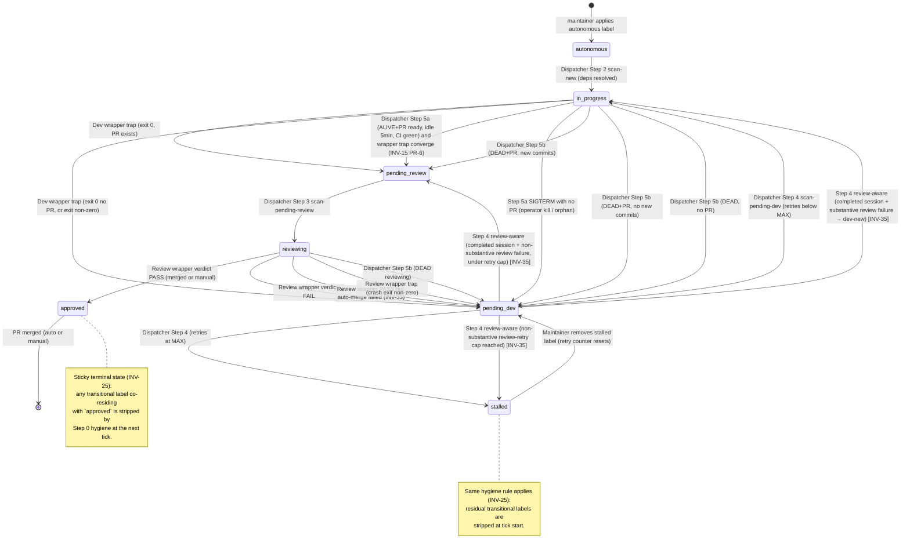

# Issue Label State Machine

The autonomous pipeline is a state machine over GitHub issue labels. An issue moves through states by label transitions, and the three actors (dispatcher, dev wrapper, review wrapper) only ever do two things to it: read its current label set, and write a new one. Every other behavior — comments, retries, PR work — is auxiliary to those transitions.

## Labels

| Label | Owner | Meaning |
|---|---|---|
| `autonomous` | Maintainer | Issue should be processed by the autonomous pipeline. Required precondition for *any* dispatcher action. Removed when the issue is auto-closed by a successful review. |
| `in-progress` | Dispatcher (set), dev wrapper trap (clears) | A dev-agent wrapper is actively running for this issue. |
| `pending-review` | Dev wrapper trap (set), dispatcher (clears) | Development complete, PR open, awaiting review. |
| `reviewing` | Dispatcher (set), review wrapper trap (clears) | A review-agent wrapper is actively running for this issue. Stays a **single** label even when the wrapper fans out to multiple verdict-reaching agents ([INV-40](invariants.md#inv-40-multi-agent-review-attribution-unanimous-aggregation-and-all-unavailable-fallback)) — the fan-out is internal to the wrapper, so the dispatcher and the state machine see one `reviewing` issue, one `review-${N}.pid`, and one aggregated verdict. |
| `pending-dev` | Review wrapper / dispatcher / dev trap (set), dispatcher (clears) | Review failed, dev agent is wanted to take another pass. |
| `approved` | Review wrapper (set) | Review passed. PR merged (or awaiting manual merge if `no-auto-close` is also present). Terminal state for the autonomous pipeline. |
| `no-auto-close` | Maintainer | Companion to `autonomous` — review still runs and approves, but auto-merge is skipped. PR awaits manual merge. |
| `stalled` | Dispatcher | Retry limit hit. Requires manual investigation. Maintainer removes the label to re-arm the pipeline (which also resets the retry counter — see [INV-05](invariants.md#inv-05-retry-counter-cutoff-rule)). |

The five **active** states are `autonomous` (no other state label), `in-progress`, `pending-review`, `reviewing`, `pending-dev`. The two **terminal** states are `approved` and `stalled`.

## State diagram

(Edges are condensed; see the transition table below for preconditions and side effects.)

## Transition table

Each row is one legal transition. "Actor" identifies who writes the labels. "Preconditions" must all hold; "postcondition comment" is the issue comment the actor posts as part of the transition. Transitions not listed here are forbidden — see [Forbidden transitions](#forbidden-transitions) below.

| From | To | Trigger | Actor | Preconditions | Postcondition comment |
|---|---|---|---|---|---|
| (none) | `autonomous` | Maintainer applies label | Maintainer | — | — |
| `autonomous` | `+in-progress` | Dispatcher Step 2 finds the issue | Dispatcher | `autonomous` only; concurrency below cap; all `## Dependencies` issues `CLOSED`/`MERGED` ([INV-11](invariants.md#inv-11-dependency-state-includes-merged)) | "Dispatching autonomous development..." |
| `in-progress` | `−in-progress +pending-review` | Dev wrapper exit 0 with PR for issue | Dev wrapper trap | Wrapper exit 0; `gh pr list` finds PR whose body references `#N` | Agent Session Report (Dev) ([INV-03](invariants.md#inv-03-dev-session-report-comment-format)) |
| `in-progress` | `−in-progress +pending-dev` | Dev wrapper exit 0 with NO PR | Dev wrapper trap | Wrapper exit 0; no PR found | "Agent exited successfully but no PR was created. Moving to pending-dev for retry." + Session Report |
| `in-progress` | `−in-progress +pending-dev` | Dev wrapper exit ≠ 0 | Dev wrapper trap | Wrapper exit ≠ 0 | Agent Session Report (with non-zero exit code) |
| `in-progress` | `−in-progress +pending-review` | Step 5a: ALIVE+PR ready | Dispatcher | Wrapper PID alive; PR exists; CI all SUCCESS; `PR.updatedAt` > 300s ago (strict `-gt`); PID still alive on recheck ([INV-09](invariants.md#inv-09-just_dispatched-skip-rule), [INV-10](invariants.md#inv-10-5-minute-idle-gate-before-sigterm), [INV-15](invariants.md#inv-15-step-5a-sigterm-race-is-non-deterministic)) | "Dev process still alive but PR #N is ready... Moving to pending-review." (after `kill PID` SIGTERM; the wrapper trap converges on the same target via `RECEIVED_SIGTERM` rewrite — PR-6) |
| `in-progress` | `−in-progress +pending-review` | Step 5b: DEAD+PR with new commits | Dispatcher | Wrapper PID dead; PR exists; current `headRefOid` ≠ last `Reviewed HEAD` trailer ([INV-04](invariants.md#inv-04-reviewed-head-trailer-format), [INV-07](invariants.md#inv-07-empty-reviewed-head-trailer-routes-to-pending-review)) | "Dev process exited (PR found). Moving to pending-review for assessment." ([INV-06](invariants.md#inv-06-crashed--process-not-found-keyword-contract)) |
| `in-progress` | `−in-progress +pending-dev` | Step 5b: DEAD+PR with NO new commits | Dispatcher | Wrapper PID dead; PR exists; current `headRefOid` = last `Reviewed HEAD` trailer | "Dev process exited (no new commits since last review at \`<sha>\`). Moving to pending-dev for retry." ([INV-06](invariants.md#inv-06-crashed--process-not-found-keyword-contract)) |
| `in-progress` | `−in-progress +pending-dev` | Step 5b: DEAD, NO PR | Dispatcher | Wrapper PID dead; no PR found | "Task appears to have crashed (no PR found). Moving to pending-dev for retry." |
| `pending-review` | `−pending-review +reviewing` | Dispatcher Step 3 | Dispatcher | concurrency below cap | "Dispatching autonomous review..." |
| `reviewing` | `−reviewing −autonomous +approved` (PR merged, issue auto-closes via `Closes #N`) | Review verdict PASS, no `no-auto-close`, `gh pr merge` succeeds | Review wrapper | Verdict comment matches session-id; `gh pr review --approve` succeeded; `gh pr merge --squash` succeeded | (no extra issue comment; the wrapper does NOT call `gh issue close` — GitHub closes the issue via `Closes #N` on merge — see [INV-33](invariants.md#inv-33-review-wrapper-must-not-close-the-linked-issue)) |
| `reviewing` | `−reviewing +pending-dev` (PR stays open) | Review verdict PASS, no `no-auto-close`, `gh pr merge` **fails** ([INV-33](invariants.md#inv-33-review-wrapper-must-not-close-the-linked-issue)) | Review wrapper | Verdict + approval succeeded; `gh pr merge` returned non-zero (conflict, branch protection, transient API error) | PR comment "Auto-merge failed: <stderr>. Re-dispatching dev agent to rebase onto main." (`autonomous` retained so dispatcher Step 4 picks it up) |
| `reviewing` | `−reviewing +approved` (PR open, awaiting manual) | Review verdict PASS, `no-auto-close` set | Review wrapper | Verdict + approval succeeded | "Review PASSED — this issue has the 'no-auto-close' label. @owner please review and merge..." |
| `reviewing` | `−reviewing +approved` (manual approval needed) | PR-approval API call failed | Review wrapper | Verdict matched but `gh pr review --approve` returned non-zero | "Review PASSED but formal PR approval failed... please approve and merge manually." |
| `reviewing` | `−reviewing` (no add) | Concurrent review already merged | Review wrapper | Verdict = PASS but `gh pr view --json state` ≠ OPEN | (none — silent skip; another review wrote `approved` first) |
| `reviewing` | `−reviewing +pending-dev` | Review verdict FAIL | Review wrapper | Verdict comment is "Review findings:" matching session-id | (verdict comment serves as postcondition) |
| `reviewing` | `−reviewing +pending-dev` | Review wrapper crash | Review wrapper trap | Wrapper exit ≠ 0 AND `RESULT_PARSED=false` | "Review process crashed (exit code: N). Moving back to development for retry." |
| `reviewing` | `−reviewing +pending-dev` | Review found no PR | Review wrapper (early exit) | All 3 PR-discovery methods failed | "Review failed: no PR found linked to this issue. Please ensure the PR description contains 'Closes #N'." |
| `reviewing` | `−reviewing +pending-dev` | Step 5b: DEAD reviewing | Dispatcher | Wrapper PID dead; issue still has `reviewing` | "Review process appears to have crashed. Moving to pending-dev for retry." |
| `pending-dev` | `−pending-dev +in-progress` | Dispatcher Step 4 (resume) | Dispatcher | concurrency below cap; retry count < `MAX_RETRIES` ([INV-05](invariants.md#inv-05-retry-counter-cutoff-rule)); prior session not terminal ([INV-12](invariants.md#inv-12-resume-only-against-unfinished-sessions)); valid `Dev Session ID:` extractable from comments | "Resuming development (session: <id>)..." |
| `pending-dev` | `−pending-dev +in-progress` (dev-new) | Step 4 review-aware: prior session `end_turn\|completed` + substantive review-failure verdict newer than session end ([INV-35](invariants.md#inv-35-review-aware-resume-routing-for-completed-sessions)) | Dispatcher | concurrency below cap; retry count < `MAX_RETRIES`; per-issue log truncated successfully (fail-closed otherwise) | `INV-35-fresh-dev:<sid>` notice + "Resuming with a fresh session..." |
| `pending-dev` | `−pending-dev +pending-review` | Step 4 review-aware: prior session `end_turn\|completed` + non-substantive review-failure verdict, under `REVIEW_RETRY_LIMIT` ([INV-35](invariants.md#inv-35-review-aware-resume-routing-for-completed-sessions)) | Dispatcher | concurrency below cap; non-substantive flip count for this session < `REVIEW_RETRY_LIMIT` (default 2) | `<!-- review-aware-flip:non-substantive cause=<x> -->` marker + "Re-routing to review (last review failed for non-substantive reason: <x>)." |
| `pending-dev` | `−pending-dev +stalled` | Dispatcher Step 4 (retry exhausted) | Dispatcher | retry count ≥ `MAX_RETRIES` (after stalled-cutoff filtering) | "Marking as stalled" comment with @owner mention |
| `pending-dev` | `−pending-dev +stalled` | Step 4 review-aware: non-substantive review-retry cap reached ([INV-35](invariants.md#inv-35-review-aware-resume-routing-for-completed-sessions)) | Dispatcher | non-substantive flip count for this session ≥ `REVIEW_RETRY_LIMIT` | "Marking as stalled — review failed N times for non-substantive reasons" with @owner mention |
| `stalled` | `−stalled` (back to `pending-dev`) | Maintainer removes label | Maintainer | — | — |

> **Note on `+approved`:** the auto-merge-success path also removes `autonomous` so the issue is no longer eligible for re-dispatch (and GitHub auto-closes the issue via the PR's `Closes #N` keyword — the wrapper itself does not call `gh issue close`, see [INV-33](invariants.md#inv-33-review-wrapper-must-not-close-the-linked-issue)). The `no-auto-close` and approval-failure paths keep `autonomous` (the issue is not auto-closed; manual operator intervention completes the flow). The auto-merge-**failure** path is *not* in the `+approved` group: it transitions to `+pending-dev` with `autonomous` retained, and the dispatcher Step 4 re-dispatches dev to rebase onto main.

## Forbidden transitions

These combinations must never happen. If you observe one, it's a bug:

- **`in-progress` + `reviewing` simultaneously.** Both wrappers think they own the issue. Indicates either (a) a missed `−in-progress` on the dev wrapper exit path, (b) Step 3 dispatched review without first removing `pending-review`, or (c) external manual label edits.
- **`pending-review` + `reviewing`.** Dispatcher Step 3 must atomically swap (`--remove-label pending-review --add-label reviewing` in one `gh issue edit` call).
- **`pending-dev` + `in-progress`.** Same as above for Step 4 (`--remove-label pending-dev --add-label in-progress`).
- **`approved` + any active state.** Once approved, the issue should be closed (auto-merge path) or stable (`no-auto-close` / approval-failure path). The dispatcher does not look at issues labeled `approved`. **Self-healed at Step 0** ([INV-25](invariants.md#inv-25-terminal-labels-approved-stalled-are-sticky-transitional-residue-is-healed-at-tick-start)) — if residue lands (wrapper crash between two label edits, [INV-15] SIGTERM race, manual reconciliation), the next tick's hygiene pass strips the transitional label and posts a one-shot audit comment.
- **`stalled` + any other active state label.** When the dispatcher sets `stalled`, it removes the active state label in the same `gh issue edit` call. **Same Step 0 hygiene applies** ([INV-25](invariants.md#inv-25-terminal-labels-approved-stalled-are-sticky-transitional-residue-is-healed-at-tick-start)) — residue from a half-completed transition is healed at tick start.

## Concurrent-modification semantics

Two cases dominate the race surface:

### Wrapper trap vs. dispatcher Step 5

The dispatcher's Step 5a / 5b can edit labels on the same issue at the same time as the wrapper's exit trap. The two cases differ:

- **Step 5b DEAD path**: the wrapper has already exited; trap already ran. The dispatcher reads the post-trap label state and decides. No live race — Step 5b sees the post-trap labels and chooses.

- **Step 5a SIGTERM path**: now **convergent** ([INV-15](invariants.md#inv-15-step-5a-sigterm-race-is-non-deterministic), fixed in PR-6; subtree-reaping hardened for #109). Dispatcher sends `kill $PID` (SIGTERM), then edits labels to `pending-review`. The wrapper's SIGTERM trap (installed via `install_agent_sigterm_trap` in `lib-agent.sh`) sets `RECEIVED_SIGTERM=1` and group-kills the agent's session via `kill -TERM -- -${_AGENT_RUN_PID}` ([INV-23](invariants.md#inv-23-pid_file-points-at-a-process-whose-death-reaps-the-entire-agent-subtree)) plus `pkill -TERM -P $$` so the agent CLI and any descendants exit promptly. The wrapper's `cleanup()` rewrites `exit_code 143 → 0` when `RECEIVED_SIGTERM=1 && PR_EXISTS>0`, then routes through the success branch to `+pending-review`. Both writers now agree on the target.

  The dispatcher's own `gh issue edit` is retained as belt-and-suspenders: if the wrapper is wedged so hard that even the EXIT trap doesn't fire (e.g. SIGKILL escalation from `timeout --kill-after`), the dispatcher's edit still gets the label right. SIGTERM with no PR (operator kill, orphaned wrapper) still routes to `+pending-dev`, which is correct.

  See [`docs/designs/dispatcher-stale-alive-with-pr.md`](../designs/dispatcher-stale-alive-with-pr.md) for the original design intent and [`docs/designs/wrapper-hangs-bundle.md`](../designs/wrapper-hangs-bundle.md) for the PR-6 convergence fix.

### `JUST_DISPATCHED` skip

Within a single dispatcher tick, an issue dispatched in Step 2/3/4 must not be evaluated by Step 5 in the same tick — its PID file may not yet exist (the wrapper is launching via `nohup` and racing the dispatcher). [INV-09](invariants.md#inv-09-just_dispatched-skip-rule) and the `JUST_DISPATCHED` array enforce this.

### Concurrent reviews on the same PR

A maintainer running `/q review` manually can race with the dispatcher's review wrapper. The wrapper guards by re-checking PR state at approve time: `gh pr view --json state` ≠ OPEN ⇒ skip approve/merge silently. See [`review-agent-flow.md`](review-agent-flow.md) and [INV-08](invariants.md#inv-08-wrapper-exit-trap-is-idempotent-against-label-state).

## Cross-references

- [`dispatcher-flow.md`](dispatcher-flow.md) — what each "Dispatcher Step N" looks like up close.
- [`dev-agent-flow.md`](dev-agent-flow.md), [`review-agent-flow.md`](review-agent-flow.md) — wrapper-trap details for each transition.
- [`handoffs.md`](handoffs.md) — the five places where one actor's transition is the precondition for another.
- [`invariants.md`](invariants.md) — the rules that constrain all of the above.
